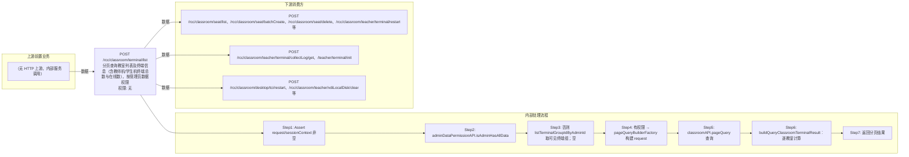

# POST /rcc/classroom/terminal/list

> 分页查询教室列表及终端信息（含教师机/学生机终端总数与在线数），按管理员数据权限过滤 ｜ 无特殊权限 ｜ sync

## 依赖关系全景图

## 接口基本信息

| 项目 | 内容 |
|---|---|
| URL | /rcc/classroom/terminal/list |
| Controller | RccClassroomTerminalController |
| 方法名 | getClassroomDetailInfoList |
| 权限注解 | 无 |
| 执行方式 | sync |
| 业务含义 | 分页查询教室列表及终端信息（含教师机/学生机终端总数与在线数），按管理员数据权限过滤 |

## 入参详情

### ClassroomPageQueryRequest

| 参数名 | 类型 | 必填 | 约束 | 说明 |
|---|---|---|---|---|
| page | Integer | 否 | @Range(min=0) 默认0 | 页码 |
| limit | Integer | 否 | @Range(min=1,max=2000) 默认1 | 每页条数 |
| matchArr | Match[] | 是 | @NotNull 非空（默认空数组） | 匹配条件 |
| sortArr | Sort[] | 是 | @NotNull 非空（默认空数组） | 排序条件 |
| customData | String | 否 | @Nullable 可空 | 自定义透传数据 |

## 出参详情

| 返回类型 | DefaultWebResponse（data=PageQueryResponse<ViewClassroomInfoEntity>） |
|---|---|

| 字段 | 类型 | 说明 |
|---|---|---|
| itemArr | ViewClassroomInfoEntity[] | 教室列表项（元素字段见下） |
| total | Integer | 总记录数 |
| classroomId | UUID | 教室ID |
| classroomName | String | 教室名称 |
| classroomState | ClassroomLessonStatusEnum | 教室上课状态 |
| studentType | String | 学生工作模式类型（JSON串，用于派生 studentModeArr） |
| studentModeArr | TerminalTypeEnum[] | 学生工作模式数组 |
| studentStartIp | String | 学生终端起始IP |
| studentEndIp | String | 学生终端结束IP |
| studentTerminalIpSegment | String | 学生终端IP段（由 studentStartIp/studentEndIp 生成） |
| currentLessonId | UUID | 当前上课ID |
| disableNetwork | Boolean | 是否禁网 |
| networkIds | String | 教室关联网络策略ID聚合串（逗号分隔） |
| teacherTerminalId | String | 教师机终端ID |
| teacherIp | String | 教师机IP |
| teacherType | String | 教师机工作模式类型（JSON串，用于派生 teacherModeArr） |
| teacherModeArr | TerminalTypeEnum[] | 教师机工作模式数组 |
| teacherDesktopId | UUID | 教师机云桌面ID |
| teacherDesktopName | String | 教师机云桌面名称 |
| teacherDesktopIp | String | 教师机云桌面IP |
| teacherId | UUID | 教师ID |
| teacherTerminalState | CbbTerminalStateEnums | 教师机终端状态 |
| teacherTerminalModel | String | 教师机终端型号 |
| teacherUpgradeVersion | String | 教师机终端升级版本 |
| teacherHardwareVersion | String | 教师机终端硬件版本 |
| teacherRainOsVersion | String | 教师机终端RainOS版本 |
| teacherSerialNumber | String | 教师机终端序列号 |
| teacherMac | String | 教师机终端MAC |
| teacherDiskSize | Long | 教师机终端磁盘大小 |
| teacherCpuType | String | 教师机终端CPU型号 |
| teacherMemory | Long | 教师机终端内存大小 |
| teacherTerminalOsType | String | 教师机终端操作系统类型 |
| terminalTotalNum | Integer | 终端总数（学生机+教师机，接口回填） |
| terminalOnlineNum | Integer | 在线终端数（接口回填） |
| desktopTotalNum | Integer | 云桌面总数 |
| desktopOnlineNum | Integer | 在线云桌面数 |
| vdiTeacherImageNum | Integer | 教师机VDI镜像数 |
| vdiStudentImageNum | Integer | 学生机VDI镜像数 |
| tciTeacherImageNum | Integer | 教师机TCI镜像数 |
| tciStudentImageNum | Integer | 学生机TCI镜像数 |
| teacherDesktopState | CbbCloudDeskState | 教师机云桌面状态 |
| teacherBootManageMode | CbbTerminalBootManageModeEnums | 教师机终端引导管理模式 |
| terminalNeedUpgrade | Boolean | 终端是否需要升级 |
| publishAsSpace | Boolean | 是否作为教学实训空间发布 |
| canTerminalInit | Boolean | 是否支持终端初始化 |
| terminalGroupId | UUID | 关联终端组ID |
| teacherLockStatus | Boolean | 教师机终端锁定状态 |
| teacherTerminalIp | String | 教师机绑定的终端IP |
| deployMode | String | 终端部署模式 |
| teacherPlatformStatus | CloudPlatformStatus | 教师机镜像使用的云平台状态 |

## 上游前置业务

（无上游数据依赖）
## 内部处理流程

### 处理流程

1. Assert request/sessionContext 非空
2. adminDataPermissionAPI.isAdminHasAllDataPermissions(userId) 为真 → 直接 classroomAPI.pageQuery 并回填统计
3. 否则 listTerminalGroupIdByAdminId 取可见终端组；空 → 返回空分页
4. 有权限 → pageQueryBuilderFactory 构建 requestBuilder，requestBuilder.in("terminalGroupId", 组ID数组) 改写 matchArr
5. classroomAPI.pageQuery 查询
6. buildQueryClassroomTerminalResult：逐教室计算 terminalTotalNum（学生机总数+教师机0/1）与 terminalOnlineNum（学生机在线+教师机在线0/1）
7. 返回分页结果

## 下游消费方

### 消费1：POST /rcc/classroom/seat/list、/rcc/classroom/seat/batchCreate、/rcc/classroom/seat/delete、/rcc/classroom/teacher/terminal/restart等

教室终端列表出参ViewClassroomInfoEntity.classroomId（由 field_map 契约映射）

### 消费2：POST /rcc/classroom/teacher/terminal/collectLog/get、/teacher/terminal/init

教室终端列表出参ViewClassroomInfoEntity.teacherTerminalId（由 field_map 契约映射）

### 消费3：POST /rcc/classroom/desktop/tci/restart、/rcc/classroom/teacher/vdiLocalDisk/clear等

教室终端列表出参ViewClassroomInfoEntity.teacherDesktopId（由 field_map 契约映射）
## 接口参数约束分析

| 层级 | 参数 | 规则 | 失败结果 |
|---|---|---|---|
| request | page | @Range(min=0) | webmvc 参数校验异常 |
| request | limit | @Range(min=1,max=2000) | webmvc 参数校验异常 |
| request | matchArr/sortArr | @NotNull 非空 | webmvc 参数校验异常 |

## 参数取值策略

| 参数 | 策略 | 说明 |
|---|---|---|
| page | user_input/from_query | 按业务构造 |
| limit | user_input/from_query | 按业务构造 |
| matchArr | user_input/from_query | 按业务构造 |
| sortArr | user_input/from_query | 按业务构造 |
| customData | user_input/from_query | 按业务构造 |

## 成功/失败断言基准

### 成功场景

| 场景 | 断言点 |
|---|---|
| 管理员拥有全部数据权限 | 返回全部教室分页及终端统计 |
| 管理员无任何终端组权限 | 返回空分页（itemArr为空，total=0） |
| 管理员有部分权限 | 仅返回其可见终端组下教室并回填统计 |

### 失败场景

| 场景 | 触发条件 | 断言点 |
|---|---|---|
| 权限不足 | 无授权 | 403 |

## 环境清理机制

| 接口 | 说明 |
|---|---|
| 本接口创建的资源 | 通过对应 delete 接口清理 |

## 前置状态和幂等性标注

| 维度 | 结论 |
|---|---|
| 幂等性 | high |
| 说明 | 纯查询接口 |
