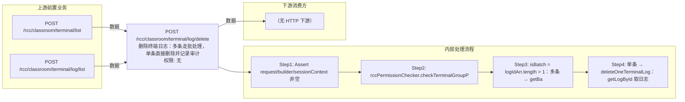

# POST /rcc/classroom/terminal/log/delete

> 删除终端日志：多条走批处理，单条直接删除并记录审计 ｜ 无特殊权限 ｜ async_batch

## 依赖关系全景图

## 接口基本信息

| 项目 | 内容 |
|---|---|
| URL | /rcc/classroom/terminal/log/delete |
| Controller | RccClassroomManageController |
| 方法名 | deleteTerminalLog |
| 权限注解 | 无 |
| 执行方式 | async_batch |
| 业务含义 | 删除终端日志：多条走批处理，单条直接删除并记录审计 |

## 入参详情

### TerminalLogIdRequest

| 参数名 | 类型 | 必填 | 约束 | 说明 |
|---|---|---|---|---|
| classroomId | UUID | 是 | @NotNull 非空 | 教室ID |
| logIdArr | UUID[] | 是 | @NotEmpty 非空 | 待删除的日志ID列表 |

## 出参详情

| 返回类型 | DefaultWebResponse<BatchTaskSubmitResult|String> |
|---|---|

| 字段 | 类型 | 说明 |
|---|---|---|
| taskId | UUID | 多条删除时的批处理任务ID |

## 上游前置业务

### 前置1：POST /rcc/classroom/terminal/list

教室ID在创建教室(POST /rcc/classroom/create)后经教室终端列表查询获得（ViewClassroomInfoEntity.classroomId）（由 field_map 契约映射）

### 前置2：POST /rcc/classroom/terminal/log/list

推断：终端日志ID数组来自终端日志列表查询出参（TerminalLogDTO.id），字段名为推断（由 field_map 契约映射）
## 内部处理流程

### 批量处理器：DeleteTerminalLogBatchTaskHandler

| 步骤 | 说明 |
|---|---|
| 1 | processItem：getLogById 取日志名 → deleteTerminalLog(logId)，记录成功/失败审计 |
| 2 | onFinish：全成功返回成功、全失败返回失败、否则部分成功 |

### 处理流程

1. Assert request/builder/sessionContext 非空
2. rccPermissionChecker.checkTerminalGroupPermissionByClassroomId(单教室) 校验权限
3. isBatch = logIdArr.length > 1：多条 → getBatchDeleteLogDefaultWebResponse 构造 DeleteTerminalLogBatchTaskHandler 提交批处理
4. 单条 → deleteOneTerminalLog：getLogById 取日志名 → deleteTerminalLog → 记录成功审计；异常记录失败审计并抛出

## 下游消费方

（本接口数据主要被自身/关联接口消费，或经 SPI 通知）
## 接口参数约束分析

| 层级 | 参数 | 规则 | 失败结果 |
|---|---|---|---|
| request | classroomId | @NotNull 非空 | webmvc 参数校验异常 |
| request | logIdArr | @NotEmpty 非空 | webmvc 参数校验异常 |
| business | classroomId | 管理员需具备该教室终端组数据权限 | rccPermissionChecker 抛出权限异常 |

## 参数取值策略

| 参数 | 策略 | 说明 |
|---|---|---|
| classroomId | user_input/from_query | 按业务构造 |
| logIdArr | user_input/from_query | 按业务构造 |

## 成功/失败断言基准

> ⚠️ 断言以 HTTP 响应为准（status + msgKey / BatchTaskSubmitResult），非服务端审计日志。

### 成功场景

| 场景 | 断言点 |
|---|---|
| 日志存在且删除成功 | 多条：$.status==SUCCESS && $.content.taskId 非空（批处理任务）；单条：$.status==SUCCESS（content 为空） |

### 失败场景

| 场景 | 触发条件 | 断言点 |
|---|---|---|
| 单条日志删除失败 | 日志不存在/文件被占用 | $.status==ERROR（记录 RCDC_RCC_TERMINAL_LOG_DELETE_SINGLE_FAIL_LOG 后抛出，msgKey 为底层日志删除异常） |
| 多条中部分失败 | 部分日志无效 | $.status==SUCCESS && $.content.taskId 非空（批任务终态 PARTIAL_SUCCESS） |
## 环境清理机制

| 接口 | 说明 |
|---|---|
| 本接口创建的资源 | 通过对应 delete 接口清理 |

## 前置状态和幂等性标注

| 维度 | 结论 |
|---|---|
| 幂等性 | medium |
| 说明 | 重复删除已删除的日志会失败（幂等性弱）；批处理逐条执行 |
