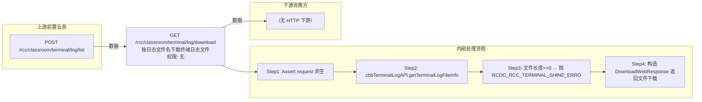

# GET /rcc/classroom/terminal/log/download

> 按日志文件名下载终端日志文件 ｜ 无特殊权限 ｜ sync

## 依赖关系全景图

## 接口基本信息

| 项目 | 内容 |
|---|---|
| URL | /rcc/classroom/terminal/log/download |
| Controller | RccClassroomManageController |
| 方法名 | downloadLog |
| 权限注解 | 无 |
| 执行方式 | sync |
| 业务含义 | 按日志文件名下载终端日志文件 |

## 入参详情

### TerminalLogDownLoadWebRequest

| 参数名 | 类型 | 必填 | 约束 | 说明 |
|---|---|---|---|---|
| logName | String | 是 | @NotBlank 非空 | 日志文件名 |

## 出参详情

| 返回类型 | DownloadWebResponse |
|---|---|

| 字段 | 类型 | 说明 |
|---|---|---|
| logName | String | 下载文件名 |
| suffix | String | 文件后缀 |
| file | File | 日志文件内容流 |

## 上游前置业务

### 前置1：POST /rcc/classroom/terminal/log/list

推断：日志文件名来自终端日志列表查询出参（TerminalLogDTO.logName），字段名为推断（由 field_map 契约映射）
## 内部处理流程

### 处理流程

1. Assert request 非空
2. cbbTerminalLogAPI.getTerminalLogFileInfo(logName) 取文件信息
3. 文件长度==0 → 抛 RCDC_RCC_TERMINAL_SHINE_ERROR_GET_SHINE_LOG_FAIL
4. 构造 DownloadWebResponse 返回文件下载

## 下游消费方

（本接口数据主要被自身/关联接口消费，或经 SPI 通知）
## 接口参数约束分析

| 层级 | 参数 | 规则 | 失败结果 |
|---|---|---|---|
| request | logName | @NotBlank 非空 | webmvc 参数校验异常 |
| business | file | 日志文件不能为空 | rcdc_rcc_terminal_shine_error_get_shine_log_fail |

## 参数取值策略

| 参数 | 策略 | 说明 |
|---|---|---|
| logName | user_input/from_query | 按业务构造 |

## 成功/失败断言基准

### 成功场景

| 场景 | 断言点 |
|---|---|
| 日志文件存在且非空 | HTTP 200，返回文件流（DownloadWebResponse 文件下载响应） |

### 失败场景

| 场景 | 触发条件 | 断言点 |
|---|---|---|
| 日志文件为空 | 文件长度0 | $.status==ERROR && $.msgKey==rcdc_rcc_terminal_shine_error_get_shine_log_fail |

## 环境清理机制

| 接口 | 说明 |
|---|---|
| 本接口创建的资源 | 通过对应 delete 接口清理 |

## 前置状态和幂等性标注

| 维度 | 结论 |
|---|---|
| 幂等性 | high |
| 说明 | 纯下载操作 |
