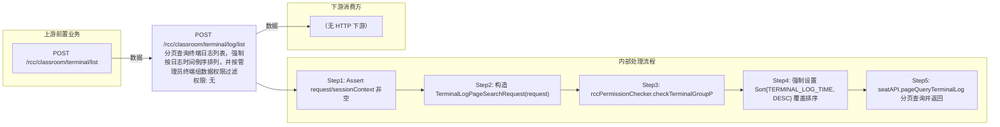

# POST /rcc/classroom/terminal/log/list

> 分页查询终端日志列表，强制按日志时间倒序排列，并按管理员终端组数据权限过滤 ｜ 无特殊权限 ｜ sync

## 依赖关系全景图

## 接口基本信息

| 项目 | 内容 |
|---|---|
| URL | /rcc/classroom/terminal/log/list |
| Controller | RccClassroomManageController |
| 方法名 | getTerminalLogList |
| 权限注解 | 无 |
| 执行方式 | sync |
| 业务含义 | 分页查询终端日志列表，强制按日志时间倒序排列，并按管理员终端组数据权限过滤 |

## 入参详情

### PageWebRequest

| 参数名 | 类型 | 必填 | 约束 | 说明 |
|---|---|---|---|---|
| page | Integer | 否 | 分页参数 | 页码 |
| limit | Integer | 否 | 分页参数 | 每页条数 |
| matchArr | Match[] | 否 | 查询条件 | 匹配条件（含教室过滤） |

## 出参详情

| 返回类型 | DefaultWebResponse（data=DefaultPageResponse<TerminalLogDTO>） |
|---|---|

| 字段 | 类型 | 说明 |
|---|---|---|
| itemArr | TerminalLogDTO[] | 终端日志列表（元素字段见下） |
| total | Long | 总数 |
| id | UUID | 日志ID |
| logName | String | 日志名称 |
| logTime | Date | 日志时间 |
| expireCleanTime | Date | 期望清理时间 |

## 上游前置业务

### 前置1：POST /rcc/classroom/terminal/list

推断：可选过滤条件：教室ID（TerminalLogPageSearchRequest查询条件），字段名为推断（由 field_map 契约映射）
## 内部处理流程

### 处理流程

1. Assert request/sessionContext 非空
2. 构造 TerminalLogPageSearchRequest(request)
3. rccPermissionChecker.checkTerminalGroupPermissionByQueryRequest 权限过滤
4. 强制设置 Sort{TERMINAL_LOG_TIME, DESC} 覆盖排序
5. seatAPI.pageQueryTerminalLog 分页查询并返回

## 下游消费方

（本接口数据主要被自身/关联接口消费，或经 SPI 通知）
## 接口参数约束分析

| 层级 | 参数 | 规则 | 失败结果 |
|---|---|---|---|
| request | request/sessionContext | 非空 | webmvc 参数校验异常 |

## 参数取值策略

| 参数 | 策略 | 说明 |
|---|---|---|
| page | user_input/from_query | 按业务构造 |
| limit | user_input/from_query | 按业务构造 |
| matchArr | user_input/from_query | 按业务构造 |

## 成功/失败断言基准

### 成功场景

| 场景 | 断言点 |
|---|---|
| 正常查询 | $.status==SUCCESS && $.content.itemArr 非空（DefaultPageResponse 分页框架字段为 itemArr/total，按时间倒序） |

### 失败场景

| 场景 | 触发条件 | 断言点 |
|---|---|---|

## 环境清理机制

| 接口 | 说明 |
|---|---|
| 本接口创建的资源 | 通过对应 delete 接口清理 |

## 前置状态和幂等性标注

| 维度 | 结论 |
|---|---|
| 幂等性 | high |
| 说明 | 纯查询接口 |
