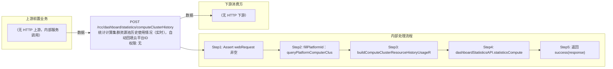

# POST /rcc/dashboard/statistics/computeClusterHistory

> 统计计算集群资源池历史使用情况（实时），自动回填云平台ID ｜ 无特殊权限 ｜ sync

## 依赖关系全景图

## 接口基本信息

| 项目 | 内容 |
|---|---|
| URL | /rcc/dashboard/statistics/computeClusterHistory |
| Controller | RccDashboardStatisticsController |
| 方法名 | statisticsComputeClusterHistory |
| 权限注解 | 无 |
| 执行方式 | sync |
| 业务含义 | 统计计算集群资源池历史使用情况（实时），自动回填云平台ID |

## 入参详情

### ComputeClusterResourceHistoryWebRequest

| 参数名 | 类型 | 必填 | 约束 | 说明 |
|---|---|---|---|---|
| serverResourceType | ServerResourceTypeEnum | 是 | @NotNull 非空 | 资源类型 |
| clusterId | UUID | 是 | @NotNull 非空 | 集群ID |
| timeQueryType | TimeQueryTypeEnum | 是 | @NotNull 非空 | 时间查询类型 |
| platformId | UUID | 否 | @Nullable 可空，接口自动回填 | 云平台ID |

## 出参详情

| 返回类型 | DefaultWebResponse<ObtainServerResourceHistoryUsageResponse> |
|---|---|

| 字段 | 类型 | 说明 |
|---|---|---|
| resultType | String | 结果类型（Prometheus 查询返回，JSON 名 resultType） |
| resultArr | ObtainServerResourceHistoryUsageDTO[] | 历史资源使用记录数组（JSON 名 result） |
| resultArr[].metricMap | Map<String,String> | 指标标签（JSON 名 metric） |
| resultArr[].valueArr | String[][] | 时序数据点（时间戳+值，JSON 名 values） |

## 上游前置业务

> 本接口上游为服务端内部调用（非 HTTP 端点）：
> - 
## 内部处理流程

### 处理流程

1. Assert webRequest 非空
2. fillPlatformId：queryPlatformComputerClusterList([clusterId])，非空则回填 webRequest.platformId
3. buildComputeClusterResourceHistoryUsageRequest 组装请求（含 clusterIdArr）
4. dashboardStatisticsAPI.statisticsComputeClusterResourceHistoryUsage 统计
5. 返回 success(response)

## 下游消费方

（本接口数据主要被自身/关联接口消费，或经 SPI 通知）
## 接口参数约束分析

| 层级 | 参数 | 规则 | 失败结果 |
|---|---|---|---|
| request | serverResourceType/clusterId/timeQueryType | @NotNull 非空 | webmvc 参数校验异常 |

## 参数取值策略

| 参数 | 策略 | 说明 |
|---|---|---|
| serverResourceType | user_input/from_query | 按业务构造 |
| clusterId | user_input/from_query | 按业务构造 |
| timeQueryType | user_input/from_query | 按业务构造 |
| platformId | user_input/from_query | 按业务构造 |

## 成功/失败断言基准

### 成功场景

| 场景 | 断言点 |
|---|---|
| 集群存在 | $.status==SUCCESS；$.content.resultArr 非空（实时统计记录） |

### 失败场景

| 场景 | 触发条件 | 断言点 |
|---|---|---|
| 集群不存在 | queryPlatformComputerClusterList 返回空 | platformId 保持 null，继续按原参数统计 |

## 环境清理机制

| 接口 | 说明 |
|---|---|
| 无对应 HTTP 清理接口 | 本接口为纯统计查询接口，不创建可清理资源；无对应 HTTP 删除接口 |

## 前置状态和幂等性标注

| 维度 | 结论 |
|---|---|
| 幂等性 | high |
| 说明 | 纯统计查询 |
