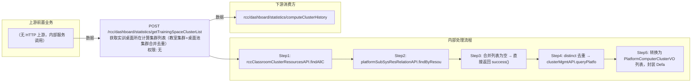

# POST /rcc/dashboard/statistics/getTrainingSpaceClusterList

> 获取实训桌面所在计算集群列表（教室集群+桌面池集群合并去重） ｜ 无特殊权限 ｜ sync

## 依赖关系全景图

## 接口基本信息

| 项目 | 内容 |
|---|---|
| URL | /rcc/dashboard/statistics/getTrainingSpaceClusterList |
| Controller | RccDashboardStatisticsController |
| 方法名 | statisticsGetTrainingSpaceClusterList |
| 权限注解 | 无 |
| 执行方式 | sync |
| 业务含义 | 获取实训桌面所在计算集群列表（教室集群+桌面池集群合并去重） |

## 入参详情

### 

| 参数名 | 类型 | 必填 | 约束 | 说明 |
|---|---|---|---|---|
| page | Integer | 否 | 分页页码 | 当前页（框架自动注入） |
| limit | Integer | 否 | 分页行数 | 每页条数（框架自动注入） |
## 出参详情

| 返回类型 | DefaultWebResponse<DefaultPageResponse<PlatformComputerClusterVO>>（$.content 为 DefaultPageResponse，字段 itemArr/total） |
|---|---|

| 字段 | 类型 | 说明 |
|---|---|---|
| itemArr | PlatformComputerClusterVO[] | 集群列表（DefaultPageResponse.itemArr，元素为 PlatformComputerClusterVO） |
| total | Long | 总数（DefaultPageResponse.total） |
| itemArr[].clusterId | UUID | 集群ID |
| itemArr[].clusterName | String | 集群名称 |
| itemArr[].platformId | UUID | 云平台ID |
| itemArr[].platformName | String | 云平台名称 |

## 上游前置业务

（无上游数据依赖）
## 内部处理流程

### 处理流程

1. rccClassroomClusterResourcesAPI.findAllClusterId() 取教室集群ID列表
2. platformSubSysResRelationAPI.findByResourceTypeInSpace(DESK_POOL) 取桌面池ID → desktopPoolMgmtAPI.getDesktopPoolInfoByIdList 取桌面池集群ID并合并
3. 合并列表为空 → 直接返回 success()
4. distinct 去重 → clusterMgmtAPI.queryPlatformComputerClusterList 查集群信息；空 → 返回 success()
5. 转换为 PlatformComputerClusterVO 列表，封装 DefaultPageResponse 返回

## 下游消费方

（本接口数据主要被自身/关联接口消费，或经 SPI 通知）
## 接口参数约束分析

| 层级 | 参数 | 规则 | 失败结果 |
|---|---|---|---|
| （本接口无请求体参数约束） | | | |

## 参数取值策略

| 参数 | 策略 | 说明 |
|---|---|---|

## 成功/失败断言基准

### 成功场景

| 场景 | 断言点 |
|---|---|
| 存在教室/桌面池集群 | $.status==SUCCESS；$.content.itemArr 非空（DefaultPageResponse.itemArr） |
| 无任何集群 | $.status==SUCCESS（content 为空，Builder.success() 无参） |

### 失败场景

| 场景 | 触发条件 | 断言点 |
|---|---|---|
| 权限不足 | 无授权 | 403 |

## 环境清理机制

| 接口 | 说明 |
|---|---|
| 无对应 HTTP 清理接口 | 本接口为纯查询接口，不创建可清理资源；无对应 HTTP 删除接口 |

## 前置状态和幂等性标注

| 维度 | 结论 |
|---|---|
| 幂等性 | high |
| 说明 | 纯查询接口 |
