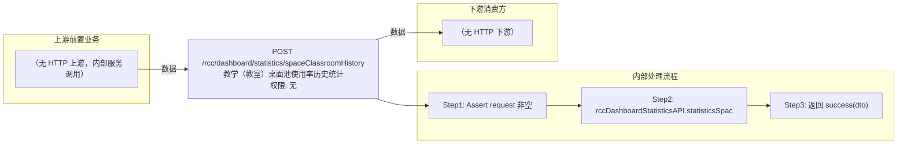

# POST /rcc/dashboard/statistics/spaceClassroomHistory

> 教学（教室）桌面池使用率历史统计 ｜ 无特殊权限 ｜ sync

## 依赖关系全景图

## 接口基本信息

| 项目 | 内容 |
|---|---|
| URL | /rcc/dashboard/statistics/spaceClassroomHistory |
| Controller | RccDashboardStatisticsController |
| 方法名 | statisticsSpaceClassroomHistory |
| 权限注解 | 无 |
| 执行方式 | sync |
| 业务含义 | 教学（教室）桌面池使用率历史统计 |

## 入参详情

### RccSpaceHistoryRequest

| 参数名 | 类型 | 必填 | 约束 | 说明 |
|---|---|---|---|---|
| id | UUID | 否 | @Nullable 可空 | 对象ID（教室/空间ID） |
| timeQueryType | TimeQueryTypeEnum | 是 | @NotNull 非空 | 时间查询类型 |

## 出参详情

| 返回类型 | DefaultWebResponse<RccSpaceAndClassroomHistoryDTO> |
|---|---|

| 字段 | 类型 | 说明 |
|---|---|---|
| maxUseRateList | List<RccSpaceDesktopUsageRecordDTO> | 最大使用率记录 |
| avgUseRateList | List<RccSpaceDesktopUsageRecordDTO> | 平均使用率记录 |
| maxUseRateList[].count | double | 使用率数值 |
| maxUseRateList[].dateTime | String | 统计时间点 |
| avgUseRateList[].count | double | 使用率数值 |
| avgUseRateList[].dateTime | String | 统计时间点 |

## 上游前置业务

> 本接口上游为服务端内部调用（非 HTTP 端点）：
> - 
## 内部处理流程

### 处理流程

1. Assert request 非空
2. rccDashboardStatisticsAPI.statisticsSpaceHistory(id, timeQueryType, BusinessTypeAndCreateSourceEnum.RCC_CLASSROOM)
3. 返回 success(dto)

## 下游消费方

（本接口数据主要被自身/关联接口消费，或经 SPI 通知）
## 接口参数约束分析

| 层级 | 参数 | 规则 | 失败结果 |
|---|---|---|---|
| request | timeQueryType | @NotNull 非空 | webmvc 参数校验异常 |

## 参数取值策略

| 参数 | 策略 | 说明 |
|---|---|---|
| id | user_input/from_query | 按业务构造 |
| timeQueryType | user_input/from_query | 按业务构造 |

## 成功/失败断言基准

### 成功场景

| 场景 | 断言点 |
|---|---|
| 正常统计 | $.status==SUCCESS；$.content.maxUseRateList 非空（RccSpaceAndClassroomHistoryDTO.maxUseRateList） |

### 失败场景

| 场景 | 触发条件 | 断言点 |
|---|---|---|
| 权限不足 | 无授权 | 403 |

## 环境清理机制

| 接口 | 说明 |
|---|---|
| POST /rcc/classroom/delete | 清理 setup 阶段创建用于造统计数据的教室（需先经 /rcc/classroom/list 获取 classroomId）；接口本身不创建资源 |

## 前置状态和幂等性标注

| 维度 | 结论 |
|---|---|
| 幂等性 | high |
| 说明 | 纯统计查询 |
