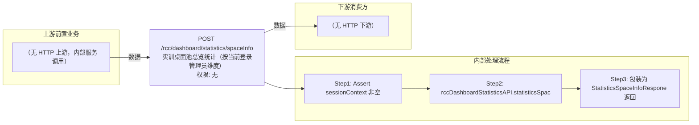

# POST /rcc/dashboard/statistics/spaceInfo

> 实训桌面池总览统计（按当前登录管理员维度） ｜ 无特殊权限 ｜ sync

## 依赖关系全景图

## 接口基本信息

| 项目 | 内容 |
|---|---|
| URL | /rcc/dashboard/statistics/spaceInfo |
| Controller | RccDashboardStatisticsController |
| 方法名 | statisticsSpaceInfo |
| 权限注解 | 无 |
| 执行方式 | sync |
| 业务含义 | 实训桌面池总览统计（按当前登录管理员维度） |

## 入参详情

### 

| 参数名 | 类型 | 必填 | 约束 | 说明 |
|---|---|---|---|---|
| page | Integer | 否 | 分页页码 | 当前页（框架自动注入） |
| limit | Integer | 否 | 分页行数 | 每页条数（框架自动注入） |
## 出参详情

| 返回类型 | DefaultWebResponse<StatisticsSpaceInfoRespone> |
|---|---|

| 字段 | 类型 | 说明 |
|---|---|---|
| spaceTotaDeskPoolNum | int | 实训桌面池总数 |
| spaceDeskTotalNum | int | 实训桌面总数 |
| runingSpaceDeskNum | int | 运行中实训桌面数量 |
| connectedSpaceDeskNum | int | 已连接实训桌面数量 |
| freeSpaceDeskNum | int | 未分配实训桌面数量 |
| faultSpaceDeskNum | int | 报障实训桌面数量 |

## 上游前置业务

（无上游数据依赖）
## 内部处理流程

### 处理流程

1. Assert sessionContext 非空
2. rccDashboardStatisticsAPI.statisticsSpaceInfo(sessionContext.getUserId()) 统计
3. 包装为 StatisticsSpaceInfoRespone 返回

## 下游消费方

（本接口数据主要被自身/关联接口消费，或经 SPI 通知）
## 接口参数约束分析

| 层级 | 参数 | 规则 | 失败结果 |
|---|---|---|---|
| request | sessionContext | 非空 | webmvc 校验异常 |

## 参数取值策略

| 参数 | 策略 | 说明 |
|---|---|---|

## 成功/失败断言基准

### 成功场景

| 场景 | 断言点 |
|---|---|
| 正常统计 | $.status==SUCCESS；$.content.spaceTotaDeskPoolNum 非空（>=0） |

### 失败场景

| 场景 | 触发条件 | 断言点 |
|---|---|---|
| 权限不足 | 无授权 | 403 |

## 环境清理机制

| 接口 | 说明 |
|---|---|
| POST /rcc/classroom/delete | 清理 setup 阶段创建用于造统计数据的教室（需先经 /rcc/classroom/list 获取 classroomId）；接口本身不创建资源 |

## 前置状态和幂等性标注

| 维度 | 结论 |
|---|---|
| 幂等性 | high |
| 说明 | 纯统计查询 |
