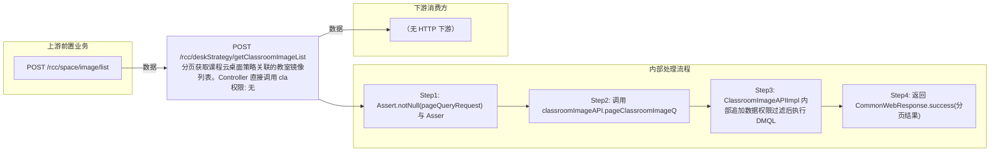

# POST /rcc/deskStrategy/getClassroomImageList

> 分页获取课程云桌面策略关联的教室镜像列表。Controller 直接调用 classroomImageAPI.pageClassroomImageQuery(pageQueryRequest, sessionContext.getUserId())，由 ClassroomImageAPIImpl 对请求追加数据权限过滤（管理员只能看到有权限的教室镜像）后经 ViewRccClassroomImageDTO 视图分页查询返回；用于课程策略配置页选择关联教室镜像。 ｜ 无特殊权限 ｜ 同步查询：DMQL 视图分页查询教室镜像列表（按管理员数据权限过滤）

## 依赖关系全景图

## 接口基本信息

| 项目 | 内容 |
|---|---|
| URL | /rcc/deskStrategy/getClassroomImageList |
| Controller | RccDeskStrategyController |
| 方法名 | getClassroomImageList |
| 权限注解 | 无 |
| 执行方式 | 同步查询：DMQL 视图分页查询教室镜像列表（按管理员数据权限过滤） |
| 业务含义 | 分页获取课程云桌面策略关联的教室镜像列表。Controller 直接调用 classroomImageAPI.pageClassroomImageQuery(pageQueryRequest, sessionContext.getUserId())，由 ClassroomImageAPIImpl 对请求追加数据权限过滤（管理员只能看到有权限的教室镜像）后经 ViewRccClassroomImageDTO 视图分页查询返回；用于课程策略配置页选择关联教室镜像。 |

## 入参详情

### PageQueryRequest (com.ruijie.rcos.sk.pagekit.api.PageQueryRequest，框架类)

| 参数名 | 类型 | 必填 | 约束 | 说明 |
|---|---|---|---|---|
| page | Integer | 是 | 分页页码（0 基） | pageQueryRequest.getPage() |
| limit | Integer | 是 | 每页条数上限 | pageQueryRequest.getLimit() |
| matchArr | Match[] | 否 | 精确匹配条件（字段=值） | 框架 DMQL 视图过滤条件 |
| sortArr | Sort[] | 否 | 排序条件数组 | 框架透传 |

## 出参详情

| 返回类型 | CommonWebResponse<PageQueryResponse<ViewRccClassroomImageDTO>> |
|---|---|

| 字段 | 类型 | 说明 |
|---|---|---|
| itemArr | ViewRccClassroomImageDTO[] | 教室镜像列表 |
| total | long | 总条数 |
| id | UUID | 教室镜像记录 id |
| classroomId | UUID | 关联教室 id |
| classroomName | String | 关联教室名称 |
| imageId | UUID | 镜像模板 id |
| rootImageName | String | 镜像根名称 |
| imageTemplateName | String | 镜像模板名称 |
| teacherImage | Boolean | 是否教师机镜像 |
| hide | Boolean | 是否隐藏 |
| deskStrategyId | UUID | 关联的课程策略 id |
| deskStrategyName | String | 关联的课程策略名称 |
| networkId | UUID | 关联网络策略 id |
| version | Integer | 乐观锁版本号 |

## 上游前置业务

### 前置1：POST /rcc/space/image/list

镜像模板ID筛选（可空）（由 field_map 契约映射）
## 内部处理流程

### 处理流程

1. Assert.notNull(pageQueryRequest) 与 Assert.notNull(sessionContext)
2. 调用 classroomImageAPI.pageClassroomImageQuery(pageQueryRequest, sessionContext.getUserId())
3. ClassroomImageAPIImpl 内部追加数据权限过滤后执行 DMQL 视图分页查询
4. 返回 CommonWebResponse.success(分页结果)

## 下游消费方

### 消费1：POST /rcc/deskStrategy/getClassroomImageList

课堂镜像ID，被策略 condition/list（classroomImageId）、lessonImage 分配消费（推断字段名 id/imageId）（由 field_map 契约映射）
## 接口参数约束分析

| 层级 | 参数 | 规则 | 失败结果 |
|---|---|---|---|
| PARAM | page/limit | 分页参数非空 | Assert.notNull 校验失败（400） |
| AUTH | sessionContext | 需登录携带 SessionContext | sessionContext 为空断言异常 |

## 参数取值策略

| 参数 | 策略 | 说明 |
|---|---|---|
| page | user_input/from_query | 按业务构造 |
| limit | user_input/from_query | 按业务构造 |
| matchArr | user_input/from_query | 按业务构造 |
| sortArr | user_input/from_query | 按业务构造 |

## 成功/失败断言基准

### 成功场景

| 场景 | 断言点 |
|---|---|
| 存在教室镜像数据 | 返回 200，itemArr 为符合权限的教室镜像分页列表 |
| 无任何教室镜像 | 返回 200，itemArr 空数组，total=0 |

### 失败场景

| 场景 | 触发条件 | 断言点 |
|---|---|---|
| pageQueryRequest 为 null | 请求体缺失 | Assert.notNull 抛异常（400） |

## 环境清理机制

| 接口 | 说明 |
|---|---|
| 无 | 只读查询接口，无需清理 |

## 前置状态和幂等性标注

| 维度 | 结论 |
|---|---|
| 幂等性 | HIGH |
| 说明 | 只读分页查询，无副作用 |
