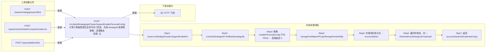

# POST /rcc/deskStrategy/getClusterSupportEnablePersonalConfig

> 计算计算集群是否支持浮动个性盘。先按 strategyId 查课程策略；若策略未启用 enablePersonalConfig 直接返回空 success；否则按 clusterId+platformId 查该计算集群关联存储池，无存储池返回 false；若任一存储池冗余策略含重复副本（RedundancyStrategyUtil.hasDuplicateCopy）则返回 true（浮动个性盘需多副本冗余）。 ｜ 无特殊权限 ｜ 同步计算：策略启用浮动个性 + 集群存储池含重复副本(RAID1 双副本) 才返回 true

## 依赖关系全景图

## 接口基本信息

| 项目 | 内容 |
|---|---|
| URL | /rcc/deskStrategy/getClusterSupportEnablePersonalConfig |
| Controller | RccDeskStrategyController |
| 方法名 | getClusterSupportEnablePersonalConfig |
| 权限注解 | 无 |
| 执行方式 | 同步计算：策略启用浮动个性 + 集群存储池含重复副本(RAID1 双副本) 才返回 true |
| 业务含义 | 计算计算集群是否支持浮动个性盘。先按 strategyId 查课程策略；若策略未启用 enablePersonalConfig 直接返回空 success；否则按 clusterId+platformId 查该计算集群关联存储池，无存储池返回 false；若任一存储池冗余策略含重复副本（RedundancyStrategyUtil.hasDuplicateCopy）则返回 true（浮动个性盘需多副本冗余）。 |

## 入参详情

### GetClusterSupportEnablePersonalConfigRequest

| 参数名 | 类型 | 必填 | 约束 | 说明 |
|---|---|---|---|---|
| strategyId | UUID | 是 | @NotNull | 课程策略 id，判断是否启用浮动个性配置 |
| clusterId | UUID | 是 | @NotNull | 计算集群 id，查询该集群关联存储池 |
| platformId | UUID | 否 | @Nullable | 平台 id，定位存储池所属平台 |

## 出参详情

| 返回类型 | CommonWebResponse<Boolean> |
|---|---|

| 字段 | 类型 | 说明 |
|---|---|---|
| content | Boolean | 集群是否支持浮动个性盘：策略未启用浮动个性时为空（success() 无 content），否则为 true/false |

## 上游前置业务

### 前置1：POST /space/strategygroup/vdi/list

VDI课程策略ID，来源为策略列表（由 field_map 契约映射）

### 前置2：POST /space/cluster/obtainComputeClusterList

计算集群ID，来源为集群列表（由 field_map 契约映射）

### 前置3：POST /space/platform/list

云平台ID，来源为平台列表（由 field_map 契约映射）
## 内部处理流程

### 处理流程

1. Assert.notNull(getClusterSupportEnablePersonalConfigRequest)
2. rccDeskStrategyAPI.findById(strategyId) 查询策略
3. 策略 enablePersonalConfig 不为 TRUE → 直接返回 CommonWebResponse.success()（空）
4. storagePoolMgmtAPI.getStoragePoolsInfoByComputeCluster(clusterId, platformId)；响应为 null → success(false)
5. 存储池列表为空 → success(false)
6. 遍历存储池，任一 RedundancyStrategyUtil.hasDuplicateCopy(冗余策略) 为 true → success(true)
7. 返回 success(hasExistDuplicateCopy)

## 下游消费方

（本接口数据主要被自身/关联接口消费，或经 SPI 通知）

> 📖 错误码/状态码对照表见 **code_map_all.md**（工程级全量）与 **error_code_map_tci_strategy.md**（TCI 接口级，含触发条件）。

## 接口参数约束分析

| 层级 | 参数 | 规则 | 失败结果 |
|---|---|---|---|
| PARAM | strategyId | 必填且策略必须存在 | findById 未找到抛业务异常（62100333 策略不存在） |
| BUSINESS | clusterId/storagePool | 集群无关联存储池或列表为空判定不支持 | 返回 false（接口不报错） |

## 参数取值策略

| 参数 | 策略 | 说明 |
|---|---|---|
| strategyId | user_input/from_query | 按业务构造 |
| clusterId | user_input/from_query | 按业务构造 |
| platformId | user_input/from_query | 按业务构造 |

## 成功/失败断言基准

### 成功场景

| 场景 | 断言点 |
|---|---|
| 策略未启用浮动个性 | 返回 200 且 content 为空 |
| 集群存储池含重复副本冗余策略 | 返回 content=true |
| 集群无存储池/无重复副本 | 返回 content=false |

### 失败场景

| 场景 | 触发条件 | 断言点 |
|---|---|---|
| strategyId 不存在 | 策略已删除或 id 错误 | 抛 62100333 策略不存在异常 |

## 环境清理机制

| 接口 | 说明 |
|---|---|
| 无 | 只读计算接口 |

## 前置状态和幂等性标注

| 维度 | 结论 |
|---|---|
| 幂等性 | HIGH |
| 说明 | 纯查询计算，相同入参结果一致 |
