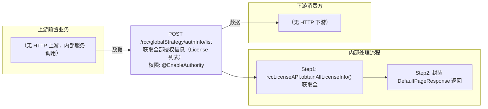

# POST /rcc/globalStrategy/authInfo/list

> 获取全部授权信息（License 列表） ｜ @EnableAuthority ｜ sync

## 依赖关系全景图

## 接口基本信息

| 项目 | 内容 |
|---|---|
| URL | /rcc/globalStrategy/authInfo/list |
| Controller | RccGlobalStrategyController |
| 方法名 | obtainAuthInfoList |
| 权限注解 | @EnableAuthority |
| 执行方式 | sync |
| 业务含义 | 获取全部授权信息（License 列表） |

## 入参详情

### 

| 参数名 | 类型 | 必填 | 约束 | 说明 |
|---|---|---|---|---|
| page | Integer | 否 | 分页页码 | 当前页（框架自动注入） |
| limit | Integer | 否 | 分页行数 | 每页条数（框架自动注入） |
## 出参详情

| 返回类型 | DefaultWebResponse<DefaultPageResponse<CbbAuthInfoDTO>> |
|---|---|

| 字段 | 类型 | 说明 |
|---|---|---|
| itemArr | CbbAuthInfoDTO[] | 授权信息列表 |
| total | Long | 授权信息总数 |
| itemArr[].authType | String | 授权类型 |
| itemArr[].licenseDurationType | String | 授权持续时间类型 |
| itemArr[].total | Integer | 总授权数 |
| itemArr[].used | Integer | 已使用授权数 |
| itemArr[].tip | String | 提示信息 |
| itemArr[].classifyOccupiedNumMap | Map<String,Integer> | 按分类统计的授权占用数 |
| itemArr[].trailRemainder | Long | 试用剩余天数 |
| itemArr[].hasExpired | Boolean | 是否已过期 |
## 上游前置业务

（无上游数据依赖）
## 内部处理流程

### 处理流程

1. rccLicenseAPI.obtainAllLicenseInfo() 获取全部授权信息
2. 封装 DefaultPageResponse 返回

## 下游消费方

（本接口数据主要被自身/关联接口消费，或经 SPI 通知）
## 接口参数约束分析

| 层级 | 参数 | 规则 | 失败结果 |
|---|---|---|---|
| （本接口无请求体参数约束） | | | |

## 参数取值策略

| 参数 | 策略 | 说明 |
|---|---|---|

## 成功/失败断言基准

### 成功场景

| 场景 | 断言点 |
|---|---|
| 正常查询 | $.content.itemArr 非空 |
### 失败场景

| 场景 | 触发条件 | 断言点 |
|---|---|---|
| 权限不足 | 无授权 | 403 |

## 环境清理机制

| 接口 | 说明 |
|---|---|
| 本接口创建的资源 | 通过对应 delete 接口清理 |

## 前置状态和幂等性标注

| 维度 | 结论 |
|---|---|
| 幂等性 | high |
| 说明 | 纯查询接口 |
