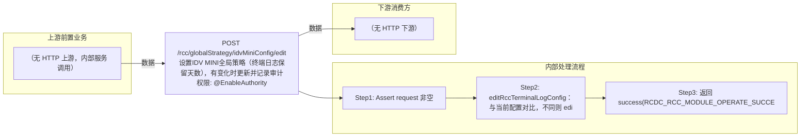

# POST /rcc/globalStrategy/idvMiniConfig/edit

> 设置IDV MINI全局策略（终端日志保留天数），有变化时更新并记录审计 ｜ @EnableAuthority ｜ sync

## 依赖关系全景图

## 接口基本信息

| 项目 | 内容 |
|---|---|
| URL | /rcc/globalStrategy/idvMiniConfig/edit |
| Controller | RccGlobalStrategyController |
| 方法名 | editIdvMiniConfig |
| 权限注解 | @EnableAuthority |
| 执行方式 | sync |
| 业务含义 | 设置IDV MINI全局策略（终端日志保留天数），有变化时更新并记录审计 |

## 入参详情

### RccGlobalStrategyIdvMiniRequest

| 参数名 | 类型 | 必填 | 约束 | 说明 |
|---|---|---|---|---|
| expireCleanDay | Integer | 是 | @NotNull 非空 + @Range(min=1,max=200) | 终端日志保留天数 |

## 出参详情

| 返回类型 | DefaultWebResponse |
|---|---|

| 字段 | 类型 | 说明 |
|---|---|---|
| content | null | 纯操作接口：content 为空（成功响应仅 status/message，msgKey=RCDC_RCC_MODULE_OPERATE_SUCCESS） |

## 上游前置业务

> 本接口上游为服务端内部调用（非 HTTP 端点）：
> - 
## 内部处理流程

### 处理流程

1. Assert request 非空
2. editRccTerminalLogConfig：与当前配置对比，不同则 editRccTerminalLogConfig(buildTerminalLogConfigDTO()) 并记录 RCDC_RCC_GLOBAL_STRATEGY_TERMINAL_LOG_CONFIG_SUCCESS 审计
3. 返回 success(RCDC_RCC_MODULE_OPERATE_SUCCESS)

## 下游消费方

（本接口数据主要被自身/关联接口消费，或经 SPI 通知）
## 接口参数约束分析

| 层级 | 参数 | 规则 | 失败结果 |
|---|---|---|---|
| request | expireCleanDay | @NotNull + @Range(1-200) | webmvc 参数校验异常 |

## 参数取值策略

| 参数 | 策略 | 说明 |
|---|---|---|
| expireCleanDay | user_input/from_query | 按业务构造 |

## 成功/失败断言基准

> ⚠️ 断言以 HTTP 响应为准（status + msgKey / BatchTaskSubmitResult），非服务端审计日志。

### 成功场景

| 场景 | 断言点 |
|---|---|
| 保留天数有变化 | $.status==SUCCESS |
| 保留天数无变化 | $.status==SUCCESS |
### 失败场景

| 场景 | 触发条件 | 断言点 |
|---|---|---|
| 权限不足 | 无授权 | 403 |
## 环境清理机制

| 接口 | 说明 |
|---|---|
| 本接口创建的资源 | 通过对应 delete 接口清理 |

## 前置状态和幂等性标注

| 维度 | 结论 |
|---|---|
| 幂等性 | high |
| 说明 | 值相同时跳过更新，重复提交幂等 |
