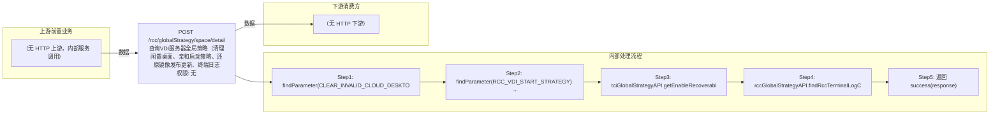

# POST /rcc/globalStrategy/space/detail

> 查询VDI服务器全局策略（清理闲置桌面、亲和启动策略、还原镜像发布更新、终端日志保留） ｜ 无特殊权限 ｜ sync

## 依赖关系全景图

## 接口基本信息

| 项目 | 内容 |
|---|---|
| URL | /rcc/globalStrategy/space/detail |
| Controller | RccGlobalStrategyController |
| 方法名 | getVdiConfigDetail |
| 权限注解 | 无 |
| 执行方式 | sync |
| 业务含义 | 查询VDI服务器全局策略（清理闲置桌面、亲和启动策略、还原镜像发布更新、终端日志保留） |

## 入参详情

### 

| 参数名 | 类型 | 必填 | 约束 | 说明 |
|---|---|---|---|---|
| page | Integer | 否 | 分页页码 | 当前页（框架自动注入） |
| limit | Integer | 否 | 分页行数 | 每页条数（框架自动注入） |
## 出参详情

| 返回类型 | DefaultWebResponse<RccGlobalStrategyVdiResponse> |
|---|---|

| 字段 | 类型 | 说明 |
|---|---|---|
| expireCleanDay | Integer | 终端日志保留天数 |
| enableClear | Boolean | 是否启用清理闲置桌面 |
| interval | Double | 闲置桌面清理间隔时长 |
| startStrategyType | RccDesktopStartStrategyType | VDI启动策略类型（负载均衡/聚集桌面） |
| gatherRatio | Integer | 聚集比例 |
| enableRecoverableImagePublishUpdate | Boolean | 是否启用还原镜像自动发布策略 |

## 上游前置业务

（无上游数据依赖）
## 内部处理流程

### 处理流程

1. findParameter(CLEAR_INVALID_CLOUD_DESKTOP) → JSON 解析 RccClearInvalidCloudDesktopVO → enableClear/interval
2. findParameter(RCC_VDI_START_STRATEGY) → startStrategyType；findParameter(RCC_AFFINITY_GATHER_RATIO) → gatherRatio
3. tciGlobalStrategyAPI.getEnableRecoverableImagePublishUpdateConfig() → enableRecoverableImagePublishUpdate
4. rccGlobalStrategyAPI.findRccTerminalLogConfigMustPrescent() → expireCleanDay
5. 返回 success(response)

## 下游消费方

（本接口数据主要被自身/关联接口消费，或经 SPI 通知）
## 接口参数约束分析

| 层级 | 参数 | 规则 | 失败结果 |
|---|---|---|---|
| （本接口无请求体参数约束） | | | |

## 参数取值策略

| 参数 | 策略 | 说明 |
|---|---|---|

## 成功/失败断言基准

### 成功场景

| 场景 | 断言点 |
|---|---|
| 全局参数与配置存在 | $.content.expireCleanDay 非空 且 $.content.startStrategyType 非空 |
### 失败场景

| 场景 | 触发条件 | 断言点 |
|---|---|---|
| 参数缺失/格式错误 | CLEAR_INVALID_CLOUD_DESKTOP JSON 解析失败或参数不存在 | $.status==ERROR |
## 环境清理机制

| 接口 | 说明 |
|---|---|
| 本接口创建的资源 | 通过对应 delete 接口清理 |

## 前置状态和幂等性标注

| 维度 | 结论 |
|---|---|
| 幂等性 | high |
| 说明 | 纯查询接口 |
