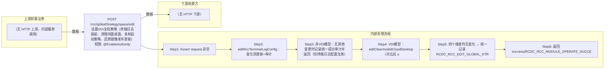

# POST /rcc/globalStrategy/space/edit

> 设置VDI全局策略（终端日志保留、清理闲置桌面、亲和启动策略、还原镜像发布更新），并同步更新各镜像云平台亲和性规则 ｜ @EnableAuthority ｜ sync

## 依赖关系全景图

## 接口基本信息

| 项目 | 内容 |
|---|---|
| URL | /rcc/globalStrategy/space/edit |
| Controller | RccGlobalStrategyController |
| 方法名 | editVdiConfig |
| 权限注解 | @EnableAuthority |
| 执行方式 | sync |
| 业务含义 | 设置VDI全局策略（终端日志保留、清理闲置桌面、亲和启动策略、还原镜像发布更新），并同步更新各镜像云平台亲和性规则 |

## 入参详情

### RccGlobalStrategyRequest

| 参数名 | 类型 | 必填 | 约束 | 说明 |
|---|---|---|---|---|
| expireCleanDay | Integer | 是 | @NotNull + @Range(1-200) | 终端日志保留天数 |
| enableClear | Boolean | 是 | @NotNull 默认false | 是否启用清理闲置桌面 |
| interval | Double | 否 | @Nullable 默认2.0 | 闲置桌面清理间隔时长 |
| startStrategyType | RccDesktopStartStrategyType | 是 | @NotNull 非空 | VDI启动策略类型 |
| enableRecoverableImagePublishUpdate | Boolean | 是 | @NotNull 非空 | 是否启用还原镜像自动发布策略 |
| gatherRatio | Integer | 是 | @NotNull + @Range(1-1000) | 聚集比例 |

## 出参详情

| 返回类型 | DefaultWebResponse |
|---|---|

| 字段 | 类型 | 说明 |
|---|---|---|
| content | null | 纯操作接口：content 为空（成功响应仅 status/message，msgKey=RCDC_RCC_MODULE_OPERATE_SUCCESS） |

## 上游前置业务

> 本接口上游为服务端内部调用（非 HTTP 端点）：
> - 
## 内部处理流程

### 处理流程

1. Assert request 非空
2. editRccTerminalLogConfig：变化则更新+审计
3. 非VDI模型：无其他变更时记录统一成功审计并返回（仅终端日志配置生效）
4. VDI模型：editClearInvalidCloudDesktop（对比后 updateParameter）+ editStartStrategy（更新启动策略参数 + updateRccpAffinityRule 遍历规则逐镜像逐平台 editDeskGroupAffinityRule，负载均衡时gatherRatio=1）+ editRecoverableImagePublishStrategy
5. 四个维度均无变化 → 统一记录 RCDC_RCC_EDIT_GLOBAL_STRATEGY_SUCCESS 审计
6. 返回 success(RCDC_RCC_MODULE_OPERATE_SUCCESS)

## 下游消费方

（本接口数据主要被自身/关联接口消费，或经 SPI 通知）
## 接口参数约束分析

| 层级 | 参数 | 规则 | 失败结果 |
|---|---|---|---|
| request | expireCleanDay | @Range(1-200) | webmvc 参数校验异常 |
| request | gatherRatio | @Range(1-1000) | webmvc 参数校验异常 |
| request | startStrategyType/enableClear/enableRecoverableImagePublishUpdate | @NotNull 非空 | webmvc 参数校验异常 |

## 参数取值策略

| 参数 | 策略 | 说明 |
|---|---|---|
| expireCleanDay | user_input/from_query | 按业务构造 |
| enableClear | user_input/from_query | 按业务构造 |
| interval | user_input/from_query | 按业务构造 |
| startStrategyType | user_input/from_query | 按业务构造 |
| enableRecoverableImagePublishUpdate | user_input/from_query | 按业务构造 |
| gatherRatio | user_input/from_query | 按业务构造 |

## 成功/失败断言基准

> ⚠️ 断言以 HTTP 响应为准（status + msgKey / BatchTaskSubmitResult），非服务端审计日志。

### 成功场景

| 场景 | 断言点 |
|---|---|
| VDI模型且存在变化 | $.status==SUCCESS |
| 非VDI模型 | $.status==SUCCESS |
| 无任何变化 | $.status==SUCCESS |
### 失败场景

| 场景 | 触发条件 | 断言点 |
|---|---|---|
| 亲和规则更新异常 | 某平台更新失败 | $.status==SUCCESS（亲和规则更新异常仅记录日志，接口仍成功） |
## 环境清理机制

| 接口 | 说明 |
|---|---|
| 本接口创建的资源 | 通过对应 delete 接口清理 |

## 前置状态和幂等性标注

| 维度 | 结论 |
|---|---|
| 幂等性 | low |
| 说明 | 每次提交都会重新遍历全部亲和性规则并逐平台更新（值相同也执行更新动作），参数本身有值对比；无事务回滚保护 |
