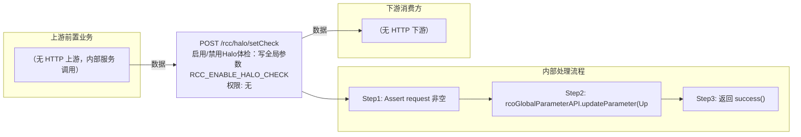

# POST /rcc/halo/setCheck

> 启用/禁用Halo体检：写全局参数 RCC_ENABLE_HALO_CHECK ｜ 无特殊权限 ｜ sync

## 依赖关系全景图

## 接口基本信息

| 项目 | 内容 |
|---|---|
| URL | /rcc/halo/setCheck |
| Controller | RccHaloController |
| 方法名 | disableHaloCheck |
| 权限注解 | 无 |
| 执行方式 | sync |
| 业务含义 | 启用/禁用Halo体检：写全局参数 RCC_ENABLE_HALO_CHECK |

## 入参详情

### SetHaloCheckRequest

| 参数名 | 类型 | 必填 | 约束 | 说明 |
|---|---|---|---|---|
| disableHaloCheck | Boolean | 是 | @NotNull 非空 | true=禁用Halo体检，false=启用 |

## 出参详情

| 返回类型 | DefaultWebResponse |
|---|---|
| 说明 | 成功返回 SUCCESS；失败返回 status/msgKey |

## 上游前置业务

> 本接口上游为服务端内部调用（非 HTTP 端点）：
> - 
## 内部处理流程

### 处理流程

1. Assert request 非空
2. rcoGlobalParameterAPI.updateParameter(UpdateParameterRequest(RCC_ENABLE_HALO_CHECK, disableHaloCheck.toString()))
3. 返回 success()

## 下游消费方

（本接口数据主要被自身/关联接口消费，或经 SPI 通知）
## 接口参数约束分析

| 层级 | 参数 | 规则 | 失败结果 |
|---|---|---|---|
| request | disableHaloCheck | @NotNull 非空 | webmvc 参数校验异常 |

## 参数取值策略

| 参数 | 策略 | 说明 |
|---|---|---|
| disableHaloCheck | user_input/from_query | 按业务构造 |

## 成功/失败断言基准

> 该接口为纯操作接口（Builder.success() 无 content body），断言以 HTTP 响应为准：status==SUCCESS + content 为空。无 content body（纯参数更新接口）

### 成功场景

| 场景 | 断言点 |
|---|---|
| 传入布尔开关 | $.status==SUCCESS；content 为空（Builder.success() 无参） |

### 失败场景

| 场景 | 触发条件 | 断言点 |
|---|---|---|
| 权限不足 | 无授权 | 403 |

## 环境清理机制

| 接口 | 说明 |
|---|---|
| 无对应 HTTP 清理接口 | 本接口为纯参数更新接口，不创建可清理资源；无对应 HTTP 删除接口 |

## 前置状态和幂等性标注

| 维度 | 结论 |
|---|---|
| 幂等性 | high |
| 说明 | 参数覆盖写入，重复设置同值幂等 |
