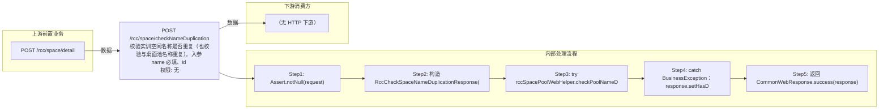

# POST /rcc/space/checkNameDuplication

> 校验实训空间名称是否重复（也校验与桌面池名称重复）。入参 name 必填、id 可空（编辑场景传当前空间ID以排除自身）；调 rccSpacePoolWebHelper.checkPoolNameDuplication(id, name) 底层 rccSpaceAPI.checkSpaceNameDuplicate 校验；有重复时 catch BusinessException 设置 hasDuplication=true 与 msgKey=i18n 消息，接口仍返回成功。 ｜ 无特殊权限 ｜ 同步

## 依赖关系全景图

## 接口基本信息

| 项目 | 内容 |
|---|---|
| URL | /rcc/space/checkNameDuplication |
| Controller | RccSpaceController |
| 方法名 | checkPoolNameDuplication |
| 权限注解 | 无 |
| 执行方式 | 同步 |
| 业务含义 | 校验实训空间名称是否重复（也校验与桌面池名称重复）。入参 name 必填、id 可空（编辑场景传当前空间ID以排除自身）；调 rccSpacePoolWebHelper.checkPoolNameDuplication(id, name) 底层 rccSpaceAPI.checkSpaceNameDuplicate 校验；有重复时 catch BusinessException 设置 hasDuplication=true 与 msgKey=i18n 消息，接口仍返回成功。 |

## 入参详情

### RccCheckSpaceNameDuplicationWebRequest

| 参数名 | 类型 | 必填 | 约束 | 说明 |
|---|---|---|---|---|
| id | UUID | 否 | @Nullable | 实训空间ID（编辑场景排除自身，创建场景可不传） |
| name | String | 是 | @NotBlank @TextShort @TextName | 待校验的实训空间名称 |

## 出参详情

| 返回类型 | CommonWebResponse<RccCheckSpaceNameDuplicationResponse> |
|---|---|

| 字段 | 类型 | 说明 |
|---|---|---|
| hasDuplication | Boolean | 名称是否重复（默认 false） |
| msgKey | String | 重复时携带的 i18n 错误消息 |

## 上游前置业务

### 前置1：POST /rcc/space/detail

编辑时传入空间ID，来源为 space detail 返回的 spaceId（由 field_map 契约映射）
## 内部处理流程

### 处理流程

1. Assert.notNull(request)
2. 构造 RccCheckSpaceNameDuplicationResponse(false)
3. try rccSpacePoolWebHelper.checkPoolNameDuplication(id, name)；重复时抛 RCDC_RCC_SPACE_POOL_NAME_EXIST
4. catch BusinessException：response.setHasDuplication(true)、setMsgKey(ex.getI18nMessage())
5. 返回 CommonWebResponse.success(response)

## 下游消费方

（本接口数据主要被自身/关联接口消费，或经 SPI 通知）
## 接口参数约束分析

| 层级 | 参数 | 规则 | 失败结果 |
|---|---|---|---|
| PARAM | name | @NotBlank @TextShort @TextName | 名称为空/超长/非法字符校验失败 |
| BUSINESS | name | 名称不得与已有实训空间或桌面池重复（编辑时排除自身） | 重复抛 RCDC_RCC_SPACE_POOL_NAME_EXIST，接口以 hasDuplication=true 返回 |

## 参数取值策略

| 参数 | 策略 | 说明 |
|---|---|---|
| id | user_input/from_query | 按业务构造 |
| name | user_input/from_query | 按业务构造 |

## 成功/失败断言基准

### 成功场景

| 场景 | 断言点 |
|---|---|
| 名称未被占用 | $.content.hasDuplication==false |
| 名称已存在 | $.content.hasDuplication==true 且 $.content.msgKey 非空 |

### 失败场景

| 场景 | 触发条件 | 断言点 |
|---|---|---|
| name 为空 | name 缺省 | $.status==ERROR（参数校验失败，HTTP 400） |

## 环境清理机制

| 接口 | 说明 |
|---|---|
| 本接口创建的资源 | 通过对应 delete 接口清理 |

## 前置状态和幂等性标注

| 维度 | 结论 |
|---|---|
| 幂等性 | HIGH |
| 说明 | 只读校验接口，无副作用 |
