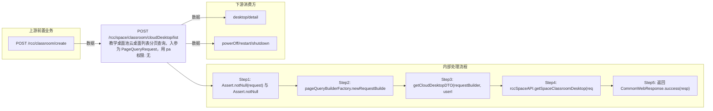

# POST /rcc/space/classroom/cloudDesktop/list

> 教学桌面池云桌面列表分页查询。入参为 PageQueryRequest，用 pageQueryBuilderFactory.newRequestBuilder 构造查询；若管理员非全组权限则通过 listTerminalGroupIdByAdminId 获取终端组权限并追加 in(classroomTerminalGroupId,...) 过滤（权限为空返回空页），最后调 rccSpaceAPI.getSpaceClassroomDesktop 返回云桌面分页。 ｜ 无特殊权限 ｜ 同步

## 依赖关系全景图

## 接口基本信息

| 项目 | 内容 |
|---|---|
| URL | /rcc/space/classroom/cloudDesktop/list |
| Controller | RccSpaceController |
| 方法名 | classroomCloudDesktopList |
| 权限注解 | 无 |
| 执行方式 | 同步 |
| 业务含义 | 教学桌面池云桌面列表分页查询。入参为 PageQueryRequest，用 pageQueryBuilderFactory.newRequestBuilder 构造查询；若管理员非全组权限则通过 listTerminalGroupIdByAdminId 获取终端组权限并追加 in(classroomTerminalGroupId,...) 过滤（权限为空返回空页），最后调 rccSpaceAPI.getSpaceClassroomDesktop 返回云桌面分页。 |

## 入参详情

### PageQueryRequest

| 参数名 | 类型 | 必填 | 约束 | 说明 |
|---|---|---|---|---|
| page | Integer | 是 | @NotNull @Range(0-2147483647) | 页码 |
| limit | Integer | 是 | @NotNull @Range(1-2147483647) | 每页条数 |
| searchKeyword | String | 否 | @Nullable | 搜索关键字 |
| matchArr | Match[] | 否 | @Nullable | 自定义匹配条件（含 classroomId 等过滤） |
| sortArr | Sort[] | 否 | @Nullable | 排序条件 |
| exactMatchArr | ExactMatch[] | 否 | @Nullable | 精确匹配条件 |
| customData | String | 否 | @Nullable | 扩展透传数据 |

## 出参详情

| 返回类型 | CommonWebResponse<DefaultPageResponse<CloudDesktopDTO>> |
|---|---|

| 字段 | 类型 | 说明 |
|---|---|---|
| itemArr | CloudDesktopDTO[] | 云桌面记录列表（space 模块 CloudDesktopDTO，继承 rco 模块 CloudDesktopDTO） |
| total | Integer | 总记录数 |
| itemArr[].desktopId | UUID | 桌面ID（本模块新增） |
| itemArr[].id | UUID | 桌面记录ID |
| itemArr[].cbbId | UUID | CBB桌面ID |
| itemArr[].desktopName | String | 桌面名称 |
| itemArr[].realName | String | 真实姓名/显示名 |
| itemArr[].userId | UUID | 用户ID |
| itemArr[].userName | String | 用户名 |
| itemArr[].userGroupId | UUID | 用户组ID |
| itemArr[].userGroup | String | 用户组名称 |
| itemArr[].desktopState | String | 桌面状态 |
| itemArr[].desktopType | String | 桌面类型 |
| itemArr[].sessionType | CbbDesktopSessionType | 会话类型 |
| itemArr[].memory | Double | 内存（GB） |
| itemArr[].cpu | Integer | CPU核数 |
| itemArr[].systemDisk | Integer | 系统盘大小（GB） |
| itemArr[].personDisk | Integer | 个人盘大小（GB） |
| itemArr[].imageName | String | 镜像名称 |
| itemArr[].osName | String | 操作系统名称 |
| itemArr[].desktopIp | String | 桌面IP |
| itemArr[].desktopIpv6Addr | String | 桌面IPv6地址 |
| itemArr[].desktopMac | String | 桌面MAC地址 |
| itemArr[].autoDeskDhcp | Boolean | 桌面是否自动获取IP（DHCP） |
| itemArr[].deskGateway | String | 桌面网关 |
| itemArr[].deskMask | String | 桌面子网掩码 |
| itemArr[].autoDeskDns | Boolean | 桌面是否自动获取DNS |
| itemArr[].deskDnsPrimary | String | 桌面主DNS |
| itemArr[].deskSecondDnsPrimary | String | 桌面备DNS |
| itemArr[].terminalId | String | 终端ID |
| itemArr[].terminalName | String | 终端名称 |
| itemArr[].terminalGroup | String | 终端分组 |
| itemArr[].terminalPlatform | String | 终端平台 |
| itemArr[].terminalIp | String | 终端IP |
| itemArr[].terminalMac | String | 终端MAC |
| itemArr[].terminalMask | String | 终端掩码 |
| itemArr[].terminalSystemDiskType | String | 终端系统盘类型 |
| itemArr[].userType | String | 用户类型 |
| itemArr[].deleteTime | Date | 删除时间 |
| itemArr[].isDelete | Boolean | 是否已删除 |
| itemArr[].latestLoginTime | Date | 最近登录时间 |
| itemArr[].latestRunningTime | Date | 最近运行时间 |
| itemArr[].beforeEditGuestToolVersion | String | 编辑前GuestTool版本 |
| itemArr[].isWindowsOsActive | Boolean | Windows系统是否已激活 |
| itemArr[].osActiveBySystem | Boolean | 系统是否自动激活 |
| itemArr[].physicalServerId | UUID | 物理服务器ID |
| itemArr[].physicalServerIp | String | 物理服务器IP |
| itemArr[].desktopRole | String | 桌面角色 |
| itemArr[].faultState | Boolean | 是否故障 |
| itemArr[].faultDescription | String | 故障描述 |
| itemArr[].userDescription | String | 用户描述 |
| itemArr[].faultTime | Date | 故障时间 |
| itemArr[].createTime | Date | 创建时间 |
| itemArr[].computerName | String | 计算机名 |
| itemArr[].networkAccessMode | CbbNetworkAccessModeEnums | 网络接入模式 |
| itemArr[].wirelessIp | String | 无线IP |
| itemArr[].wirelessIpv6Addr | String | 无线IPv6地址 |
| itemArr[].wirelessMacAddr | String | 无线MAC地址 |
| itemArr[].autoWirelessDhcp | Boolean | 无线是否自动获取IP |
| itemArr[].wirelessGateway | String | 无线网关 |
| itemArr[].wirelessMask | String | 无线掩码 |
| itemArr[].autoWirelessDns | Boolean | 无线是否自动获取DNS |
| itemArr[].wirelessDnsPrimary | String | 无线主DNS |
| itemArr[].wirelessSecondDnsPrimary | String | 无线备DNS |
| itemArr[].enableProxy | Boolean | 是否启用代理 |
| itemArr[].desktopCategory | String | 桌面分类 |
| itemArr[].desktopStrategyId | UUID | 桌面策略ID |
| itemArr[].groupNamePath | String | 用户组路径 |
| itemArr[].needRefreshStrategy | Boolean | 是否需要刷新策略 |
| itemArr[].hasAutoJoinDomain | Boolean | 是否自动加入域 |
| itemArr[].cbbImageType | String | 镜像类型 |
| itemArr[].vgpuType | VgpuType | vGPU类型 |
| itemArr[].vgpuDesktop | Boolean | 是否vGPU桌面 |
| itemArr[].vgpuModel | String | vGPU型号 |
| itemArr[].enableAgreementAgency | Boolean | 是否启用协议代理 |
| itemArr[].agreementAgencyLimitMode | AgreementAgencyLimitMode | 协议代理限制模式 |
| itemArr[].enableWebClient | Boolean | 是否启用Web客户端 |
| itemArr[].enableMobileClient | Boolean | 是否启用移动客户端 |
| itemArr[].enableUtilizeClient | Boolean | 是否启用利用客户端 |
| itemArr[].remark | String | 备注 |
| itemArr[].osVersion | String | 操作系统版本 |
| itemArr[].osType | String | 操作系统类型 |
| itemArr[].guestToolVersion | String | GuestTool版本 |
| itemArr[].enableCustom | Boolean | 是否自定义配置 |
| itemArr[].deskCreateMode | String | 桌面创建模式 |
| itemArr[].desktopImageType | CbbOsType | 桌面镜像操作系统类型 |
| itemArr[].downloadState | DownloadStateEnum | 镜像下载状态 |
| itemArr[].failCode | Integer | 失败码 |
| itemArr[].downloadPromptMessage | String | 下载提示信息 |
| itemArr[].downloadFinishTime | Date | 下载完成时间 |
| itemArr[].extraDiskList | List<CbbAddExtraDiskDTO> | 扩展磁盘列表 |
| itemArr[].enableFullSystemDisk | Boolean | 是否启用全盘 |
| itemArr[].desktopPoolType | String | 桌面池类型 |
| itemArr[].desktopPoolId | UUID | 桌面池ID |
| itemArr[].poolStrategyError | Boolean | 桌面池策略是否异常 |
| itemArr[].isOpenMaintenance | Boolean | 是否开启维护模式 |
| itemArr[].isOpenDeskMaintenance | Boolean | 是否开启桌面维护 |
| itemArr[].connectClosedTime | Date | 连接关闭时间 |
| itemArr[].userProfileStrategyId | UUID | 用户配置策略ID |
| itemArr[].userProfileStrategyName | String | 用户配置策略名称 |
| itemArr[].strategyName | String | 策略名称 |
| itemArr[].networkName | String | 网络名称 |
| itemArr[].imageUsage | ImageUsageTypeEnum | 镜像用途 |
| itemArr[].repairState | String | 修复状态 |
| itemArr[].clusterId | UUID | 计算集群ID |
| itemArr[].clusterName | String | 计算集群名称 |
| itemArr[].idvTerminalMode | String | IDV终端模式 |
| itemArr[].imageDiskInfoDTOList | List<CbbImageDiskInfoDTO> | 镜像磁盘信息列表 |
| itemArr[].imageId | UUID | 镜像ID |
| itemArr[].rootImageId | UUID | 根镜像ID |
| itemArr[].rootImageName | String | 根镜像名称 |
| itemArr[].imageRoleType | ImageRoleType | 镜像角色类型 |
| itemArr[].willApplyImageId | UUID | 待应用镜像ID |
| itemArr[].hasAppDisk | Boolean | 是否有应用盘 |
| itemArr[].hasAppDiskTest | Boolean | 是否有测试应用盘 |
| itemArr[].disabled | Boolean | 是否禁用 |
| itemArr[].gtAgentState | CbbGtAgentState | GuestTool代理状态 |
| itemArr[].userState | IacUserStateEnum | 用户状态 |
| itemArr[].userAccountExpireDate | String | 用户账户过期时间 |
| itemArr[].userInvalidRecoverTime | Date | 用户失效恢复时间 |
| itemArr[].userInvalidTime | Integer | 用户失效时长 |
| itemArr[].userInvalid | Boolean | 用户是否失效 |
| itemArr[].desktopPoolName | String | 桌面池名称 |
| itemArr[].showRootPwd | Boolean | 是否显示管理员密码 |
| itemArr[].platformId | UUID | 云平台ID |
| itemArr[].platformName | String | 云平台名称 |
| itemArr[].platformType | CloudPlatformType | 云平台类型 |
| itemArr[].platformStatus | CloudPlatformStatus | 云平台状态 |
| itemArr[].cloudPlatformId | String | 云平台实例ID |
| itemArr[].cpuArch | CbbCpuArchType | CPU架构 |
| itemArr[].snapshotCount | Integer | 快照数 |
| itemArr[].hasTranslateDesk | Boolean | 是否有转译桌面 |
| itemArr[].hasAllDiskInExtraStorage | Boolean | 是否所有磁盘均在扩展存储 |
| itemArr[].hasSession | Boolean | 是否有会话 |
| itemArr[].strategyType | String | 策略类型 |
| itemArr[].registerState | CbbDeskRegisterState | 注册状态 |
| itemArr[].registerMessage | String | 注册信息 |
| itemArr[].canUpgradeAgent | Integer | 是否可升级Agent |
| itemArr[].deskType | String | 桌面类型 |
| itemArr[].canSupportMultiSessionRemoteAssist | Boolean | 是否支持多会话远程协助 |
| itemArr[].isAllowCheckUsage | Boolean | 是否允许查看使用量 |
| itemArr[].adOu | String | AD组织单元 |
| itemArr[].cpuUsage | String | CPU使用率 |
| itemArr[].memUsage | String | 内存使用率 |
| itemArr[].diskUsage | String | 磁盘使用率 |
| itemArr[].ownerSystem | String | 所属系统 |
| itemArr[].desktopPoolOwnerSystem | String | 桌面池所属系统 |
| itemArr[].secLicenseType | String | 安全授权类型 |
| itemArr[].hasSecLicense | Boolean | 是否有安全授权 |
| itemArr[].extensionData | JSONObject | 扩展数据 |
## 上游前置业务

### 前置1：POST /rcc/classroom/create

教室ID筛选条件（可空），来源为教室创建返回（由 field_map 契约映射）
## 内部处理流程

### 处理流程

1. Assert.notNull(request) 与 Assert.notNull(sessionContext)
2. pageQueryBuilderFactory.newRequestBuilder(request) 构造分页查询 Builder
3. getCloudDesktopDTO(requestBuilder, userId)：非全组权限时追加 in(classroomTerminalGroupId, 权限终端组ID)，无权限返回空页
4. rccSpaceAPI.getSpaceClassroomDesktop(requestBuilder.build()) 执行查询
5. 返回 CommonWebResponse.success(resp)

## 下游消费方

### 消费1：POST /rcc/space/classroom/cloudDesktop/list

云桌面ID，被 desktop/detail、powerOff/restart/shutdown 消费（由 field_map 契约映射）
## 接口参数约束分析

| 层级 | 参数 | 规则 | 失败结果 |
|---|---|---|---|
| PARAM | request/sessionContext | 不能为 null | Assert 失败 |
| BUSINESS | classroomTerminalGroupId | 非超管按终端组数据权限过滤 | 无权限返回空列表 |

## 参数取值策略

| 参数 | 策略 | 说明 |
|---|---|---|
| page | user_input/from_query | 按业务构造 |
| limit | user_input/from_query | 按业务构造 |
| searchKeyword | user_input/from_query | 按业务构造 |
| matchArr | user_input/from_query | 按业务构造 |
| sortArr | user_input/from_query | 按业务构造 |
| exactMatchArr | user_input/from_query | 按业务构造 |
| customData | user_input/from_query | 按业务构造 |

## 成功/失败断言基准

### 成功场景

| 场景 | 断言点 |
|---|---|
| 传入课堂云桌面分页条件 | $.content.itemArr 非空 |

### 失败场景

| 场景 | 触发条件 | 断言点 |
|---|---|---|
| 无终端组权限 | 非超管且未分配权限 | $.status==SUCCESS 且 $.content.itemArr 为空 |
| 入参为 null | request 缺失 | $.status==ERROR |

## 环境清理机制

| 接口 | 说明 |
|---|---|
| 本接口创建的资源 | 通过对应 delete 接口清理 |

## 前置状态和幂等性标注

| 维度 | 结论 |
|---|---|
| 幂等性 | HIGH |
| 说明 | 只读分页查询，无副作用 |
