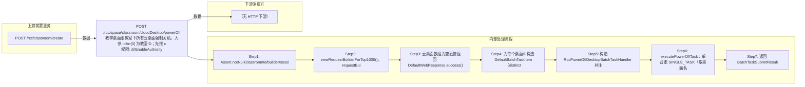

# POST /rcc/space/classroom/cloudDesktop/powerOff

> 教学桌面池教室下所有云桌面强制关机。入参 idArr[0] 为教室ID；先按 classroomId 查询该教室云桌面ID列表（含终端组数据权限过滤），无桌面则直接返回成功；为每个桌面构造 BatchTaskItem（RCDC_RCC_DESKTOP_POWEROFF_ITEM_NAME，distinct 去重），注册 RccPowerOffDesktopBatchTaskHandler 提交批量任务；1台桌面走单任务命名（RCDC_RCC_DESKTOP_POWEROFF_SINGLE_TASK_NAME/DESC），多台 enableParallel 批量任务（BATCH_TASK_NAME/DESC）。 ｜ @EnableAuthority ｜ 批量异步（BatchTask）

## 依赖关系全景图

## 接口基本信息

| 项目 | 内容 |
|---|---|
| URL | /rcc/space/classroom/cloudDesktop/powerOff |
| Controller | RccSpaceController |
| 方法名 | powerOff |
| 权限注解 | @EnableAuthority |
| 执行方式 | 批量异步（BatchTask） |
| 业务含义 | 教学桌面池教室下所有云桌面强制关机。入参 idArr[0] 为教室ID；先按 classroomId 查询该教室云桌面ID列表（含终端组数据权限过滤），无桌面则直接返回成功；为每个桌面构造 BatchTaskItem（RCDC_RCC_DESKTOP_POWEROFF_ITEM_NAME，distinct 去重），注册 RccPowerOffDesktopBatchTaskHandler 提交批量任务；1台桌面走单任务命名（RCDC_RCC_DESKTOP_POWEROFF_SINGLE_TASK_NAME/DESC），多台 enableParallel 批量任务（BATCH_TASK_NAME/DESC）。 |

## 入参详情

### IdArrWebRequest

| 参数名 | 类型 | 必填 | 约束 | 说明 |
|---|---|---|---|---|
| idArr | UUID[] | 是 | @NotNull @NotEmpty | 教室ID数组，取 idArr[0] 作为目标教室 |

## 出参详情

| 返回类型 | DefaultWebResponse（data=BatchTaskSubmitResult） |
|---|---|

| 字段 | 类型 | 说明 |
|---|---|---|
| taskId | UUID | 批量任务ID |
| taskStatus | String | 任务状态（PENDING/RUNNING 等） |

## 上游前置业务

### 前置1：POST /rcc/classroom/create

教室ID（IdArrWebRequest），来源为教室创建返回（由 field_map 契约映射）
## 内部处理流程

### 批量处理器：RccPowerOffDesktopBatchTaskHandler

| 步骤 | 说明 |
|---|---|
| 1 | desktopMgmtAPI.getDesktopById(itemId) 查询桌面并取名称 |
| 2 | 构造 ShutdownDesktopDTO{desktopId, shutdownByAdmin=true} |
| 3 | desktopOperateAPI.powerOff(shutdownDesktopDTO) 下发强制关机命令 |
| 4 | 成功：auditLogAPI.recordLog(RCDC_RCC_DESKTOP_POWEROFF_SUC_LOG) |
| 5 | 失败：recordLog(RCDC_RCC_DESKTOP_POWEROFF_FAIL_LOG)，返回 FAILURE 任务项 |
| 6 | onFinish：单台 RCDC_RCC_DESKTOP_POWEROFF_SINGLE_SUC/FAIL，多台 RCDC_RCC_DESKTOP_POWEROFF_BATCH_RESULT |

### 处理流程

1. Assert.notNull(classroomId/builder/sessionContext)
2. newRequestBuilderForTop1000()，requestBuilder.eq(classroomId, idArr[0])，getSpaceClassroomDesktopIds 查询教室云桌面ID数组
3. 云桌面数组为空直接返回 DefaultWebResponse.success()
4. 为每个桌面ID构造 DefaultBatchTaskItem（distinct 去重，itemName=RCDC_RCC_DESKTOP_POWEROFF_ITEM_NAME）
5. 构造 RccPowerOffDesktopBatchTaskHandler 并注入 desktopOperateAPI/desktopMgmtAPI
6. executePowerOffTask：单台走 SINGLE_TASK（取桌面名做 desc），多台 enableParallel 批量任务
7. 返回 BatchTaskSubmitResult

## 下游消费方

（本接口数据主要被自身/关联接口消费，或经 SPI 通知）
## 接口参数约束分析

| 层级 | 参数 | 规则 | 失败结果 |
|---|---|---|---|
| PARAM | idArr | @NotNull @NotEmpty，不能为空 | Assert 失败抛 IllegalArgumentException |
| BUSINESS | classroomId | 教室下无云桌面时直接成功 | 无桌面返回空任务 |
| BUSINESS | classroomTerminalGroupId | 非超管只对权限内终端组的教室桌面操作 | 权限外桌面不纳入任务 |

## 参数取值策略

| 参数 | 策略 | 说明 |
|---|---|---|
| idArr | user_input/from_query | 按业务构造 |

## 成功/失败断言基准

> ⚠️ 断言以 HTTP 响应为准（status + msgKey / BatchTaskSubmitResult），非服务端审计日志。

### 成功场景

| 场景 | 断言点 |
|---|---|
| 教室下存在多台云桌面 | 提交批量强制关机任务，返回 BatchTaskSubmitResult |
| 教室下仅1台桌面 | 提交单任务（SINGLE_TASK 命名），返回 BatchTaskSubmitResult |

### 失败场景

| 场景 | 触发条件 | 断言点 |
|---|---|---|
| 教室下无云桌面 | idArr[0] 教室无桌面 | $.status==SUCCESS（无 taskId） |
| 桌面已关机/不存在 | 任务执行时桌面状态异常 | 轮询 content.taskId 至终态 batchTaskItemStatus∈["FAILURE"] |
## 环境清理机制

| 接口 | 说明 |
|---|---|
| 本接口创建的资源 | 通过对应 delete 接口清理 |

## 前置状态和幂等性标注

| 维度 | 结论 |
|---|---|
| 幂等性 | LOW |
| 说明 | 每次调用都会重新下发强制关机命令，重复提交产生重复命令与重复审计日志 |
