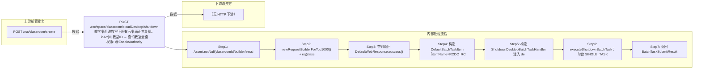

# POST /rcc/space/classroom/cloudDesktop/shutdown

> 教学桌面池教室下所有云桌面正常关机。idArr[0] 教室ID → 查询教室云桌面ID（含权限过滤）→ 空则成功返回 → ShutdownDesktopBatchTaskHandler 批量任务（单台 SINGLE_TASK / 多台 enableParallel，itemName=RCDC_RCC_DESKTOP_SHUTDOWN_ITEM_NAME）。 ｜ @EnableAuthority ｜ 批量异步（BatchTask）

## 依赖关系全景图

## 接口基本信息

| 项目 | 内容 |
|---|---|
| URL | /rcc/space/classroom/cloudDesktop/shutdown |
| Controller | RccSpaceController |
| 方法名 | shutdown |
| 权限注解 | @EnableAuthority |
| 执行方式 | 批量异步（BatchTask） |
| 业务含义 | 教学桌面池教室下所有云桌面正常关机。idArr[0] 教室ID → 查询教室云桌面ID（含权限过滤）→ 空则成功返回 → ShutdownDesktopBatchTaskHandler 批量任务（单台 SINGLE_TASK / 多台 enableParallel，itemName=RCDC_RCC_DESKTOP_SHUTDOWN_ITEM_NAME）。 |

## 入参详情

### IdArrWebRequest

| 参数名 | 类型 | 必填 | 约束 | 说明 |
|---|---|---|---|---|
| idArr | UUID[] | 是 | @NotNull @NotEmpty | 教室ID数组，取 idArr[0] |

## 出参详情

| 返回类型 | DefaultWebResponse（data=BatchTaskSubmitResult） |
|---|---|

| 字段 | 类型 | 说明 |
|---|---|---|
| taskId | UUID | 批量任务ID |
| taskStatus | String | 任务状态 |

## 上游前置业务

### 前置1：POST /rcc/classroom/create

教室ID（IdArrWebRequest），来源为教室创建返回（由 field_map 契约映射）
## 内部处理流程

### 批量处理器：ShutdownDesktopBatchTaskHandler

| 步骤 | 说明 |
|---|---|
| 1 | desktopMgmtAPI.getDesktopById(itemId) 取桌面名 |
| 2 | desktopMgmtAPI.getTerminalIdWhenDeskInAutoEdit(desktopId)：若桌面处于自动编辑，则 desktopOperateAPI.shutdownAutoEdit(ShutdownAutoEditDesktopDTO{desktopId, terminalId}) |
| 3 | 否则 desktopOperateAPI.shutdown(ShutdownDesktopDTO{desktopId, shutdownByAdmin=true}) 正常关机 |
| 4 | 成功：auditLogAPI.recordLog(RCDC_RCC_DESKTOP_SHUTDOWN_SUC_LOG) |
| 5 | 失败：recordLog(RCDC_RCC_DESKTOP_SHUTDOWN_FAIL_LOG)，返回 FAILURE |
| 6 | onFinish：单台 RCDC_RCC_DESKTOP_SHUTDOWN_SINGLE_SUC/FAIL，多台 RCDC_RCC_DESKTOP_SHUTDOWN_BATCH_RESULT |

### 处理流程

1. Assert.notNull(classroomId/builder/sessionContext)
2. newRequestBuilderForTop1000() + eq(classroomId, idArr[0])，getSpaceClassroomDesktopIds 获取桌面ID
3. 空则返回 DefaultWebResponse.success()
4. 构造 DefaultBatchTaskItem（itemName=RCDC_RCC_DESKTOP_SHUTDOWN_ITEM_NAME）
5. 构造 ShutdownDesktopBatchTaskHandler 注入 desktopOperateAPI/desktopMgmtAPI/desktopDiskMgmtAPI
6. executeShutdownBatchTask：单台 SINGLE_TASK 命名，多台 enableParallel 批量任务
7. 返回 BatchTaskSubmitResult

## 下游消费方

（本接口数据主要被自身/关联接口消费，或经 SPI 通知）
## 接口参数约束分析

| 层级 | 参数 | 规则 | 失败结果 |
|---|---|---|---|
| PARAM | idArr | @NotNull @NotEmpty | Assert 失败 |
| BUSINESS | classroomId | 无桌面直接成功 | 空任务 |
| BUSINESS | classroomTerminalGroupId | 非超管权限过滤 | 权限外桌面不操作 |

## 参数取值策略

| 参数 | 策略 | 说明 |
|---|---|---|
| idArr | user_input/from_query | 按业务构造 |

## 成功/失败断言基准

> ⚠️ 断言以 HTTP 响应为准（status + msgKey / BatchTaskSubmitResult），非服务端审计日志。

### 成功场景

| 场景 | 断言点 |
|---|---|
| 教室存在云桌面且未在自动编辑 | 提交正常关机批量任务 |
| 桌面处于自动编辑状态 | 任务项执行 shutdownAutoEdit 关机 |

### 失败场景

| 场景 | 触发条件 | 断言点 |
|---|---|---|
| 无桌面 | 教室下无云桌面 | $.status==SUCCESS（无 taskId） |
| 关机命令下发失败 | 桌面状态异常 | 轮询 content.taskId 至终态 batchTaskItemStatus∈["FAILURE"] |
## 环境清理机制

| 接口 | 说明 |
|---|---|
| 本接口创建的资源 | 通过对应 delete 接口清理 |

## 前置状态和幂等性标注

| 维度 | 结论 |
|---|---|
| 幂等性 | LOW |
| 说明 | 重复提交重复下发关机命令 |
