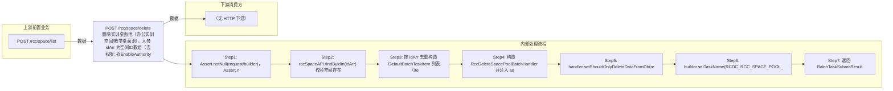

# POST /rcc/space/delete

> 删除实训桌面池（办公实训空间/教学桌面池）。入参 idArr 为空间ID数组（去重），shouldOnlyDeleteDataFromDb 为是否仅从数据库删除（平台不可用时的强制删除）；先 rccSpaceAPI.findByIdIn 校验空间均存在，再构造 RccDeleteSpacePoolBatchHandler 提交批量任务（setUniqueId=idArr[0]，enableParallel）。Handler 单条依次校验（强制删除时校验平台可强制删除；否则校验空间是否被使用，使用中抛 RCDC_RCC_SPACE_POOL_IN_USE_DELETE_FAIL）、删除云桌面/关联/空间/镜像记录、删除数据权限，并写审计日志。 ｜ @EnableAuthority ｜ 批量异步（BatchTask）

## 依赖关系全景图

## 接口基本信息

| 项目 | 内容 |
|---|---|
| URL | /rcc/space/delete |
| Controller | RccSpaceController |
| 方法名 | deleteRccSpace |
| 权限注解 | @EnableAuthority |
| 执行方式 | 批量异步（BatchTask） |
| 业务含义 | 删除实训桌面池（办公实训空间/教学桌面池）。入参 idArr 为空间ID数组（去重），shouldOnlyDeleteDataFromDb 为是否仅从数据库删除（平台不可用时的强制删除）；先 rccSpaceAPI.findByIdIn 校验空间均存在，再构造 RccDeleteSpacePoolBatchHandler 提交批量任务（setUniqueId=idArr[0]，enableParallel）。Handler 单条依次校验（强制删除时校验平台可强制删除；否则校验空间是否被使用，使用中抛 RCDC_RCC_SPACE_POOL_IN_USE_DELETE_FAIL）、删除云桌面/关联/空间/镜像记录、删除数据权限，并写审计日志。 |

## 入参详情

### RccDeleteSpaceRequest

| 参数名 | 类型 | 必填 | 约束 | 说明 |
|---|---|---|---|---|
| idArr | UUID[] | 是 | @NotEmpty | 实训空间ID数组（删除对象，去重后逐项删除） |
| shouldOnlyDeleteDataFromDb | Boolean | 否 | @Nullable | 是否仅从数据库删除数据（平台不可用时强制删除，跳过占用校验） |

## 出参详情

| 返回类型 | CommonWebResponse<BatchTaskSubmitResult> |
|---|---|

| 字段 | 类型 | 说明 |
|---|---|---|
| taskId | UUID | 批量删除任务ID |
| taskStatus | String | 任务状态 |

## 上游前置业务

### 前置1：POST /rcc/space/list

实训空间ID数组，来源为 space list（publish 后产生）（由 field_map 契约映射）
## 内部处理流程

### 批量处理器：RccDeleteSpacePoolBatchHandler

| 步骤 | 说明 |
|---|---|
| 1 | getSpaceDetailById(itemId) 获取空间详情并取空间名（区分办公实训空间/教室实训空间日志） |
| 2 | checkPoolBeforeDelete：shouldOnlyDeleteDataFromDb=true 时 classroomImageAPI.getClassroomPlatformId + platformStatusHelper.canForceDeleteIfUnavailable(platformId) 校验平台可强制删除；否则 spaceClassroomPoolUserMgmtAPI.checkIsDesktopInUse(classroomId)，使用中抛 RCDC_RCC_SPACE_POOL_IN_USE_DELETE_FAIL |
| 3 | rccSpaceAPI.deleteDesktopPoolAndSpaceInfo(spaceId) 删除云桌面、云桌面关联记录、实训空间记录、实训空间镜像记录 |
| 4 | adminDataPermissionAPI.deleteByPermissionDataId(spaceId) 删除该空间数据权限 |
| 5 | auditLogAPI.recordLog(删除成功日志)，返回 SUCCESS；BusinessException 时记录失败日志返回 FAILURE |
| 6 | onFinish：单条 RCDC_RCC_SPACE_POOL_DELETE_SINGLE_TASK_SUCCESS/FAIL，多条 RCDC_RCC_SPACE_POOL_DELETE_TASK_SUCCESS/FAIL |

### 处理流程

1. Assert.notNull(request/builder)，Assert.notEmpty(idArr)
2. rccSpaceAPI.findByIdIn(idArr) 校验空间存在
3. 按 idArr 去重构造 DefaultBatchTaskItem 列表（itemName=RCDC_RCC_SPACE_POOL_DELETE）
4. 构造 RccDeleteSpacePoolBatchHandler 并注入 adminDataPermissionAPI/rccSpaceAPI/auditLogAPI/spaceDeskVDIAPI/spaceClassroomPoolUserMgmtAPI/classroomImageAPI/platformStatusHelper
5. handler.setShouldOnlyDeleteDataFromDb(request.getShouldOnlyDeleteDataFromDb())
6. builder.setTaskName(RCDC_RCC_SPACE_POOL_DELETE).setTaskDesc(RCDC_RCC_SPACE_POOL_BATCH_DELETE_TASK_DESC).setUniqueId(idArr[0]).enableParallel().registerHandler(handler).start()
7. 返回 BatchTaskSubmitResult

## 下游消费方

### 消费1：POST /rcc/space/delete

删除后空间记录消失，detail/list 将查不到该 spaceId（由 field_map 契约映射）
## 接口参数约束分析

| 层级 | 参数 | 规则 | 失败结果 |
|---|---|---|---|
| PARAM | idArr | @NotEmpty，不能为空 | Assert.notEmpty 失败 |
| BUSINESS | idArr | 待删除空间必须存在 | rccSpaceAPI.findByIdIn 抛 RCDC_RCC_SPACE_NOT_FOUND |
| BUSINESS | classroomId | 非强制删除时空间桌面未被使用 | 使用中抛 RCDC_RCC_SPACE_POOL_IN_USE_DELETE_FAIL |
| BUSINESS | platformId | 强制删除时云平台不可用才允许（canForceDeleteIfUnavailable） | 平台可用状态下强制删除抛 RCDC_RCC_SPACE_POOL_UNAVAILABLE_DELETE_FAIL |

## 参数取值策略

| 参数 | 策略 | 说明 |
|---|---|---|
| idArr | user_input/from_query | 按业务构造 |
| shouldOnlyDeleteDataFromDb | user_input/from_query | 按业务构造 |

## 成功/失败断言基准

### 成功场景

| 场景 | 断言点 |
|---|---|
| 删除未被使用的空间（多个） | 提交 enableParallel 批量删除任务，返回 BatchTaskSubmitResult |
| 平台不可用且 shouldOnlyDeleteDataFromDb=true | 跳过占用校验直接删除数据库记录 |

### 失败场景

| 场景 | 触发条件 | 断言点 |
|---|---|---|
| 空间正在被使用 | 教室桌面被用户/座位使用 | 轮询 content.taskId 至终态 batchTaskItemStatus∈["FAILURE"]，任务项 msgKey==RCDC_RCC_SPACE_POOL_IN_USE_DELETE_FAIL |
| 空间不存在 | idArr 含无效空间ID | $.status==ERROR 且 $.msgKey==RCDC_RCC_SPACE_POOL_NOT_FOUND |
| 平台可用但强删 | shouldOnlyDeleteDataFromDb=true 且平台在线 | 轮询 content.taskId 至终态 batchTaskItemStatus∈["FAILURE"] |

## 环境清理机制

| 接口 | 说明 |
|---|---|
| 本接口创建的资源 | 通过对应 delete 接口清理 |

## 前置状态和幂等性标注

| 维度 | 结论 |
|---|---|
| 幂等性 | MEDIUM |
| 说明 | 批量任务 uniqueId=idArr[0] 防止同批重复提交；已删除的空间再次删除会因空间不存在而失败 |
