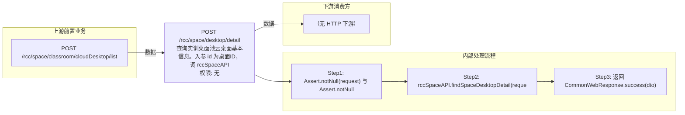

# POST /rcc/space/desktop/detail

> 查询实训桌面池云桌面基本信息。入参 id 为桌面ID，调 rccSpaceAPI.findSpaceDesktopDetail(id) 返回 RccSpaceCloudDesktopDetailDTO（含 classroomId/classroomName/vgpuType/vgpuDesktop/vgpuModel 及桌面详情字段）。 ｜ 无特殊权限 ｜ 同步

## 依赖关系全景图

## 接口基本信息

| 项目 | 内容 |
|---|---|
| URL | /rcc/space/desktop/detail |
| Controller | RccSpaceController |
| 方法名 | desktopDetail |
| 权限注解 | 无 |
| 执行方式 | 同步 |
| 业务含义 | 查询实训桌面池云桌面基本信息。入参 id 为桌面ID，调 rccSpaceAPI.findSpaceDesktopDetail(id) 返回 RccSpaceCloudDesktopDetailDTO（含 classroomId/classroomName/vgpuType/vgpuDesktop/vgpuModel 及桌面详情字段）。 |

## 入参详情

### IdWebRequest

| 参数名 | 类型 | 必填 | 约束 | 说明 |
|---|---|---|---|---|
| id | UUID | 是 | @NotNull | 云桌面ID |

## 出参详情

| 返回类型 | CommonWebResponse<RccSpaceCloudDesktopDetailDTO> |
|---|---|

| 字段 | 类型 | 说明 |
|---|---|---|
| classroomId | UUID | 所属教室ID |
| classroomName | String | 所属教室名称 |
| vgpuType | VgpuType | vgpu 类型 |
| vgpuDesktop | Boolean | 是否 vgpu 桌面（默认 false） |
| vgpuModel | String | vgpu 型号 |
| id | UUID | 云桌面ID |
| desktopName | String | 云桌面名称 |
| desktopState | String | 云桌面状态（在线/离线/休眠/重启中/关闭中等） |
| desktopType | String | 云桌面类型（个人/还原/应用分层，已废弃） |
| sessionType | CbbDesktopSessionType | 会话类型 |
| deskType | String | 云桌面类型（IDV/VDI） |
| desktopCategory | String | 云桌面模式（CbbCloudDeskPattern） |
| memory | Double | 内存大小（GB） |
| cpu | Integer | CPU核数 |
| systemDisk | Integer | 系统盘大小（GB） |
| personDisk | Integer | 个人盘大小（GB） |
| extraDiskList | List<CbbAddExtraDiskDTO> | 扩展磁盘列表 |
| desktopIp | String | 桌面IP |
| desktopIpv6Addr | String | 桌面IPv6地址 |
| desktopMac | String | 桌面MAC |
| desktopImageId | UUID | 桌面镜像ID |
| desktopImageName | String | 桌面镜像名称 |
| rootImageId | UUID | 根镜像ID |
| rootImageName | String | 根镜像名称 |
| imageRoleType | ImageRoleType | 镜像角色类型 |
| cbbImageType | String | 镜像类型（IDV/VOI/VDI） |
| desktopImageType | CbbOsType | 云桌面镜像系统类型 |
| desktopStrategyId | UUID | 云桌面策略ID（已废弃） |
| desktopStrategyGroupArr | StrategyGroupBaseFacadeDTO[] | 云桌面策略组数组 |
| desktopNetworkId | UUID | 网络策略ID |
| desktopNetworkName | String | 网络策略名称 |
| userId | UUID | 用户ID |
| userName | String | 用户名 |
| userRealName | String | 用户真实姓名 |
| userGroupId | UUID | 用户组ID |
| userGroupName | String | 用户组名称 |
| userGroupNameArr | String[] | 用户组名称数组 |
| terminalId | String | 终端ID |
| terminalName | String | 终端名称 |
| terminalGroupName | String | 终端组名称 |
| terminalGroupNameArr | String[] | 终端组名称数组 |
| terminalPlatform | String | 终端平台（IDV/VDI） |
| terminalIp | String | 终端IP |
| terminalMask | String | 终端掩码 |
| createTime | Date | 创建时间 |
| userType | String | 用户类型 |
| configIp | String | 配置IP |
| latestLoginTime | Date | 最近登录时间 |
| userCreateTime | Date | 用户创建时间 |
| lastOnlineTime | Date | 最后上线时间 |
| isWindowsOsActive | Boolean | 是否激活Windows |
| osActiveBySystem | Boolean | 系统激活状态 |
| terminalMac | String | 终端MAC |
| desktopRole | DesktopRole | 桌面角色 |
| serverName | String | 服务器名称 |
| physicalServerIp | String | 物理服务器IP |
| idvTerminalModel | String | IDV终端模式（绑定/公用终端） |
| computerName | String | 计算机名 |
| networkAccessMode | CbbNetworkAccessModeEnums | 网络接入模式 |
| wirelessIp | String | 无线IP |
| wirelessIpv6Addr | String | 无线IPv6地址 |
| wirelessMacAddr | String | 无线MAC地址 |
| enableCustom | Boolean | 是否独立配置规格 |
| remark | String | 云桌面标签 |
| deskCreateMode | String | 云桌面创建方式 |
| clusterInfo | ClusterInfoDTO | 计算集群信息 |
| desktopSoftwareStrategyId | UUID | 软件策略ID（已废弃） |
| desktopSoftwareStrategyName | String | 软件策略名称（已废弃） |
| vgpuItem | String | vGPU规格项 |
| vgpuModel | String | vGPU型号 |
| vgpuType | VgpuType | vGPU类型 |
| vgpuExtraInfo | String | vGPU附加信息JSON |
| downloadState | DownloadStateEnum | 镜像下载状态 |
| failCode | Integer | 下载错误码 |
| downloadPromptMessage | String | 镜像下载结果提示语 |
| downloadFinishTime | Date | 镜像下载时间 |
| agreementAgencyLimitMode | AgreementAgencyLimitMode | 协议代理策略类型 |
| enableAgreementAgency | Boolean | 是否开启协议代理 |
| enableWebClient | Boolean | 是否开启网页客户端接入 |
| enableMobileClient | Boolean | 是否开启移动客户端接入 |
| enableUtilizeClient | Boolean | 是否开启强制利旧客户端接入 |
| desktopPoolType | String | 桌面池类型 |
| desktopPoolId | UUID | 桌面池ID |
| userProfileStrategyId | UUID | 用户配置策略ID（已废弃） |
| userProfileStrategyName | String | 用户配置策略名称（已废弃） |
| userProfileStrategyStorageType | UserProfileStrategyStorageTypeEnum | 用户配置策略存储类型 |
| isOpenDeskMaintenance | Boolean | 云桌面维护模式 |
| clusterName | String | 计算集群名称 |
| deliveryGroupName | String | 关联交付组名称 |
| deliveryGroupAppArrName | String | 关联交付组的应用名称 |
| imageDiskList | List<CbbImageDiskInfoDTO> | 镜像磁盘信息列表 |
| osType | String | 操作系统类型 |
| osVersion | String | 操作系统版本 |
| desktopTempPermissionName | String | 云桌面临时权限名称 |
| desktopSyncLoginAccount | Boolean | 桌面登录账号同步 |
| desktopSyncLoginPassword | Boolean | 桌面登录密码同步 |
| desktopSyncLoginAccountPermission | CbbSyncLoginAccountPermissionEnums | 桌面登录账号权限 |
| enableHa | Boolean | 是否开启高可用 |
| haPriority | Integer | HA优先级 |
| desktopPoolName | String | 桌面池名称 |
| platformId | UUID | 云平台ID |
| platformName | String | 云平台名称 |
| platformType | CloudPlatformType | 云平台类型 |
| platformStatus | CloudPlatformStatus | 云平台状态 |
| cloudPlatformId | String | 云平台唯一标识 |
| estProtocolType | CbbEstProtocolType | 协议类型 |
| guestToolVersion | String | 客户机工具版本 |
| officeActive | KmsActiveState | Office激活状态 |
| imageUsage | ImageUsageTypeEnum | 镜像用途 |
| enableForceUseAgreementAgency | Boolean | 是否强制使用协议代理 |
| strategyType | String | 策略类型 |
| systemDiskStoragePoolName | String | 系统盘存储池名称 |
| systemDiskStoragePool | PlatformStoragePoolDTO | 系统盘存储池 |
| personDiskStoragePoolName | String | 个人盘存储池名称 |
| personDiskStoragePool | PlatformStoragePoolDTO | 个人盘存储池 |
| registerState | CbbDeskRegisterState | 注册状态 |
| registerMessage | String | 注册消息 |
| deskPattern | CbbCloudDeskPattern | 桌面模式 |
| adOu | String | AD组织单元 |
| deskAdvanceConfig | CbbDeskAdvanceConfigDTO | 桌面高级配置 |
| faultState | Boolean | 是否报障 |
| secLicenseType | String | 安全许可类型 |
| showRootPwd | Boolean | 是否在桌面右下角展示密码 |

## 上游前置业务

### 前置1：POST /rcc/space/classroom/cloudDesktop/list

云桌面ID（IdWebRequest），来源为教学桌面池云桌面列表（由 field_map 契约映射）
## 内部处理流程

### 处理流程

1. Assert.notNull(request) 与 Assert.notNull(request.getId())
2. rccSpaceAPI.findSpaceDesktopDetail(request.getId())
3. 返回 CommonWebResponse.success(dto)

## 下游消费方

### 消费1：POST /rcc/space/desktop/detail

桌面所属教室ID（由 field_map 契约映射）
## 接口参数约束分析

| 层级 | 参数 | 规则 | 失败结果 |
|---|---|---|---|
| PARAM | id | @NotNull，不能为 null | Assert 失败 |
| BUSINESS | id | 桌面必须存在 | 内部查询抛 RCDC_RCC_SPACE_NOT_FOUND 等异常 |

## 参数取值策略

| 参数 | 策略 | 说明 |
|---|---|---|
| id | user_input/from_query | 按业务构造 |

## 成功/失败断言基准

### 成功场景

| 场景 | 断言点 |
|---|---|
| 传入存在的桌面ID | $.content.desktopName 非空 |

### 失败场景

| 场景 | 触发条件 | 断言点 |
|---|---|---|
| 桌面ID为空 | id 缺省 | $.status==ERROR |
| 桌面不存在 | 无效桌面ID | $.status==ERROR（业务异常） |

## 环境清理机制

| 接口 | 说明 |
|---|---|
| 本接口创建的资源 | 通过对应 delete 接口清理 |

## 前置状态和幂等性标注

| 维度 | 结论 |
|---|---|
| 幂等性 | HIGH |
| 说明 | 只读查询，无副作用 |
