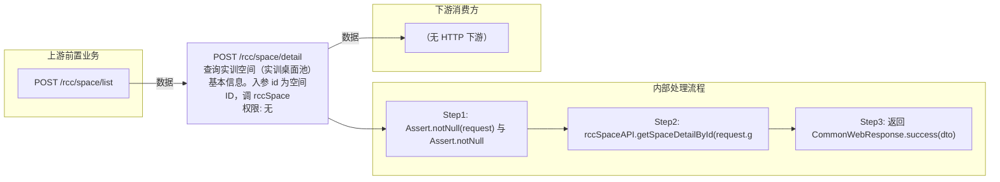

# POST /rcc/space/detail

> 查询实训空间（实训桌面池）基本信息。入参 id 为空间ID，调 rccSpaceAPI.getSpaceDetailById(id) 返回 RccSpaceDetailDTO（含空间信息、空间镜像信息 rccSpaceImageDTOList、桌面池信息与运行/空闲/关机/报障数量等统计）。 ｜ 无特殊权限 ｜ 同步

## 依赖关系全景图

## 接口基本信息

| 项目 | 内容 |
|---|---|
| URL | /rcc/space/detail |
| Controller | RccSpaceController |
| 方法名 | detail |
| 权限注解 | 无 |
| 执行方式 | 同步 |
| 业务含义 | 查询实训空间（实训桌面池）基本信息。入参 id 为空间ID，调 rccSpaceAPI.getSpaceDetailById(id) 返回 RccSpaceDetailDTO（含空间信息、空间镜像信息 rccSpaceImageDTOList、桌面池信息与运行/空闲/关机/报障数量等统计）。 |

## 入参详情

### IdWebRequest

| 参数名 | 类型 | 必填 | 约束 | 说明 |
|---|---|---|---|---|
| id | UUID | 是 | @NotNull | 实训空间ID |

## 出参详情

| 返回类型 | CommonWebResponse<RccSpaceDetailDTO> |
|---|---|

| 字段 | 类型 | 说明 |
|---|---|---|
| spaceId | UUID | 实训空间ID |
| classroomId | UUID | 绑定的教室ID |
| classroomName | String | 教室名称 |
| spaceName | String | 实训空间名称 |
| enableAllowMaxUseTime | Boolean | 是否开启单次允许接入最大时间配置 |
| allowMaxUseTime | Integer | 单次允许接入最大时间 |
| beforeRecycleNotifyTime | Integer | 断开连接前提示时间 |
| enableAllowUseTimeInfo | Boolean | 是否开启云桌面允许登录时间配置 |
| allowUseTimeInfoArr | RccAllowUseTimeInfoDTO[] | 云桌面允许登录时间配置 |
| rccSpaceImageDTOList | List<RccSpaceImageDTO> | 空间绑定的镜像列表 |
| spaceCreateTime | Date | 实训空间创建时间 |
| spaceUpdateTime | Date | 实训空间更新时间 |
| enableSpecifiedIpRange | Boolean | 是否开启指定终端IP访问 |
| running | Integer | 运行中桌面数量 |
| free | Integer | 空闲（未分配）桌面数量 |
| close | Integer | 关机桌面数量 |
| fault | Integer | 报障桌面数量 |
| bindUserNum | Integer | 关联的用户数量 |
| desktopAssignedNum | Integer | 已分配桌面数量 |
| conflictDeskNum | Integer | 池中配置不一致的桌面数量 |
| connectedNum | Integer | 连接数 |
| canUsed | Boolean | 是否可勾选（默认true） |
| canUsedMessage | String | canUsed=false 的提示语 |
| desktopNamePrefix | String | 云桌面名称前缀（null时采用桌面池名称） |
| idleDesktopRecover | Integer | 空闲桌面自动回收时间（分钟） |
| description | String | 备注 |
| imageTemplateId | UUID | 镜像模板ID |
| rootImageId | UUID | 多版本根镜像模板ID |
| rootImageName | String | 多版本根镜像模板名称 |
| imageRoleType | ImageRoleType | 多版本根镜像模板角色 |
| enableMultipleVersion | Boolean | 是否开启多版本 |
| strategyId | UUID | 云桌面策略ID |
| strategyName | String | 云桌面策略名称 |
| networkId | UUID | 网络策略ID |
| networkName | String | 网络策略名称 |
| poolState | CbbDesktopPoolState | 桌面池状态 |
| desktopNum | Integer | 桌面数量 |
| preStartDesktopNum | Integer | 维持预启动数 |
| isOpenMaintenance | Boolean | 是否开启维护模式 |
| desktopType | CbbCloudDeskPattern | 云桌面类型 |
| memory | Double | 内存大小（GB） |
| cpu | Integer | CPU核数 |
| systemDisk | Integer | 系统盘大小（GB） |
| deskCreateMode | DeskCreateMode | 创建方式 |
| imageTemplateName | String | 镜像模板名称 |
| osType | CbbOsType | 操作系统类型 |
| softwareStrategyId | UUID | 软件策略ID |
| softwareStrategyName | String | 软件策略名称 |
| userProfileStrategyId | UUID | 用户配置策略ID |
| userProfileStrategyName | String | 用户配置策略名称 |
| clusterId | UUID | 计算集群ID |
| platformId | UUID | 云平台ID |
| storagePoolId | UUID | 存储池ID |
| clusterInfo | ClusterInfoDTO | 计算集群信息 |
| storagePool | StoragePoolDetailDTO | 存储池详情 |
| businessType | BusinessType | 业务类型 |
| createSource | CreateSource | 创建来源 |
| desktopPoolCreateTime | Date | 桌面池创建时间 |
| desktopPoolUpdateTime | Date | 桌面池更新时间 |
| platformType | CloudPlatformType | 云平台类型（继承 RccPlatformBaseInfoDTO） |
| platformName | String | 云平台名称（继承 RccPlatformBaseInfoDTO） |
| platformStatus | CloudPlatformStatus | 云平台状态（继承 RccPlatformBaseInfoDTO） |

## 上游前置业务

### 前置1：POST /rcc/space/list

实训空间ID（IdWebRequest，入参即 spaceId），来源为 space list（由 field_map 契约映射）
## 内部处理流程

### 处理流程

1. Assert.notNull(request) 与 Assert.notNull(request.getId())
2. rccSpaceAPI.getSpaceDetailById(request.getId())
3. 返回 CommonWebResponse.success(dto)

## 下游消费方

### 消费1：POST /rcc/space/detail

空间ID，被 edit（RccUpdateSpaceWebRequest.id）消费（由 field_map 契约映射）
## 接口参数约束分析

| 层级 | 参数 | 规则 | 失败结果 |
|---|---|---|---|
| PARAM | id | @NotNull | Assert 失败 |
| BUSINESS | id | 空间必须存在 | 不存在抛 RCDC_RCC_SPACE_NOT_FOUND |

## 参数取值策略

| 参数 | 策略 | 说明 |
|---|---|---|
| id | user_input/from_query | 按业务构造 |

## 成功/失败断言基准

### 成功场景

| 场景 | 断言点 |
|---|---|
| 传入存在的空间ID | $.content.spaceId 非空 |

### 失败场景

| 场景 | 触发条件 | 断言点 |
|---|---|---|
| 空间不存在 | 无效空间ID | $.status==ERROR 且 $.msgKey==RCDC_RCC_SPACE_NOT_FOUND |
| id 为空 | id 缺省 | $.status==ERROR |

## 环境清理机制

| 接口 | 说明 |
|---|---|
| 本接口创建的资源 | 通过对应 delete 接口清理 |

## 前置状态和幂等性标注

| 维度 | 结论 |
|---|---|
| 幂等性 | HIGH |
| 说明 | 只读查询，无副作用 |
