# POST /rcc/space/edit

> 编辑实训桌面池基本信息（办公实训空间/教学桌面池共用）。流程：查空间详情→校验名称重复（RCDC_RCC_SPACE_POOL_NAME_EXIST）→对允许登录时间星期排序→enableSpecifiedIpRange 缺省时沿用库中值→validateUpdateClassroomSpaceBaseInfoParam 校验教学桌面池参数（镜像数组非空 RCDC_RCC_SPACE_CLASSROOM_POOL_NOT_SUPPORT_NULL_VDI_CONFIG、在用镜像不可移除 RCDC_RCC_SPACE_DESKTOP_POOL_IN_USE_DELETE_FAIL、提示时间不大于最大访问时长、允许登录时间合法性）→rccSpaceAPI.updateSpaceAndSpaceImage→refreshTerminalEnableAllowTime/refreshTerminalBeforeRecycleNotifyTime 刷新终端策略→写审计日志并返回成功（办公/教室池不同 i18n key）；异常时记录失败审计并返回 fail key。 ｜ @EnableAuthority ｜ 同步

## 依赖关系全景图

```mermaid
graph LR
    subgraph 上游前置业务
        A1["POST /rcc/space/list"]
        A2["POST /rcc/space/image/list"]
        A3["POST /space/cluster/obtainComputeClusterList"]
        A4["POST /space/storagePool/list"]
    end
    B["POST /rcc/space/edit<br>编辑实训桌面池基本信息（办公实训空间/教学桌面池共用）。流程：查空间详情→校验名<br>权限: @EnableAuthority"]
    A1 -->|数据| B
    A2 -->|数据| B
    A3 -->|数据| B
    A4 -->|数据| B
    subgraph 内部处理流程
        C1["Step1: Assert.notNull(request)"]
        C2["Step2: rccSpaceAPI.getSpaceDetailById(request.g"]
        C3["Step3: rccSpacePoolWebHelper.checkPoolNameDupli"]
        C4["Step4: enableAllowUseTimeInfo && allowUseTimeIn"]
        C5["Step5: enableSpecifiedIpRange==null 时沿用旧值"]
        C6["Step6: rccSpacePoolWebHelper.validateUpdateClas"]
        C1 --> C2
        C7["Step7: BeanUtils.copyProperties → UpdateSpaceIn"]
        C8["Step8: rccSpaceAPI.refreshTerminalEnableAllowTi"]
        C9["Step9: rccSpaceAPI.refreshTerminalBeforeRecycle"]
        C10["Step10: 重新 getSpaceDetailById；recordEditSpaceLog"]
        C6 --> C7
        C7 --> C8
        C8 --> C9
        C9 --> C10
        C2 --> C3
        C3 --> C4
        C4 --> C5
        C5 --> C6
    end
    B --> C1
    subgraph 下游消费方
        D1["（无 HTTP 下游）"]
    end
    B -->|数据| D1
```

## 接口基本信息

| 项目 | 内容 |
|---|---|
| URL | /rcc/space/edit |
| Controller | RccSpaceController |
| 方法名 | edit |
| 权限注解 | @EnableAuthority |
| 执行方式 | 同步 |
| 业务含义 | 编辑实训桌面池基本信息（办公实训空间/教学桌面池共用）。流程：查空间详情→校验名称重复（RCDC_RCC_SPACE_POOL_NAME_EXIST）→对允许登录时间星期排序→enableSpecifiedIpRange 缺省时沿用库中值→validateUpdateClassroomSpaceBaseInfoParam 校验教学桌面池参数（镜像数组非空 RCDC_RCC_SPACE_CLASSROOM_POOL_NOT_SUPPORT_NULL_VDI_CONFIG、在用镜像不可移除 RCDC_RCC_SPACE_DESKTOP_POOL_IN_USE_DELETE_FAIL、提示时间不大于最大访问时长、允许登录时间合法性）→rccSpaceAPI.updateSpaceAndSpaceImage→refreshTerminalEnableAllowTime/refreshTerminalBeforeRecycleNotifyTime 刷新终端策略→写审计日志并返回成功（办公/教室池不同 i18n key）；异常时记录失败审计并返回 fail key。 |

## 入参详情

### RccUpdateSpaceWebRequest

| 参数名 | 类型 | 必填 | 约束 | 说明 |
|---|---|---|---|---|
| id | UUID | 是 | @NotNull | 桌面池/实训空间ID |
| name | String | 是 | @NotBlank @TextShort @TextName | 桌面池名称/实训空间名称 |
| preStartDesktopNum | Integer | 否 | @Nullable @Range(0-1000) | 维持预启动数 |
| desktopNum | Integer | 否 | @Nullable @Range(0-1000) | 桌面数 |
| idleDesktopRecover | Integer | 否 | @Nullable @Range(0-99999999) | 空闲桌面自动回收时间（分钟） |
| description | String | 否 | @Nullable @TextMedium | 描述 |
| vdiDesktopConfig | RccSpaceDesktopConfigVO | 否 | @Nullable | VDI 桌面配置（image/strategy/network/cluster/assignedStoragePool/userProfileStrategy） |
| enableAllowMaxUseTime | Boolean | 是 | @NotNull | 是否开启单次允许接入最大时间配置 |
| allowMaxUseTime | Integer | 否 | @Nullable @Range(30-144000) | 单次允许接入最大时间 |
| beforeRecycleNotifyTime | Integer | 否 | @Nullable @Range(1-144000) | 断开连接前提示时间 |
| enableAllowUseTimeInfo | Boolean | 是 | @NotNull | 是否开启云桌面允许登录时间 |
| allowUseTimeInfoArr | RccAllowUseTimeInfoDTO[] | 否 | @Nullable | 云桌面允许登录时间段数组（startTime/endTime/weekArr） |
| imageTemplateIdArr | UUID[] | 否 | @Nullable（教学桌面池逻辑必填） | 教学桌面池发布的镜像ID集合 |
| enableSpecifiedIpRange | Boolean | 否 | @Nullable | 是否开启指定终端IP访问 |

## 出参详情

| 返回类型 | CommonWebResponse<?>（data 为 i18n 成功 key 字符串） |
|---|---|

| 字段 | 类型 | 说明 |
|---|---|---|
| data | String | 纯操作接口：content 为空（data 为 i18n 成功 key：RCDC_RCC_SPACE_POOL_EDIT_SUCCESS_LOG 或 RCDC_RCC_SPACE_CLASSROOM_POOL_EDIT_SUCCESS_LOG） |

## 上游前置业务

### 前置1：POST /rcc/space/list

实训空间ID（RccUpdateSpaceWebRequest.id=spaceId），来源为 space list（由 field_map 契约映射）

### 前置2：POST /rcc/space/image/list

绑定镜像ID数组，来源为本地镜像模板列表（由 field_map 契约映射）

### 前置3：POST /space/cluster/obtainComputeClusterList

计算集群ID（推断：编辑桌面配置时选择集群）（由 field_map 契约映射）

### 前置4：POST /space/storagePool/list

存储池ID（推断：编辑桌面配置时选择存储池）（由 field_map 契约映射）
## 内部处理流程

### 处理流程

1. Assert.notNull(request)
2. rccSpaceAPI.getSpaceDetailById(request.getId()) 查旧空间详情
3. rccSpacePoolWebHelper.checkPoolNameDuplication(id, name) 校验名称重复，重复抛 RCDC_RCC_SPACE_POOL_NAME_EXIST
4. enableAllowUseTimeInfo && allowUseTimeInfoArr!=null 时 sortWeekForAllowUseTimeInfo 对星期排序
5. enableSpecifiedIpRange==null 时沿用旧值
6. rccSpacePoolWebHelper.validateUpdateClassroomSpaceBaseInfoParam(request, detail) 校验教学桌面池参数
7. BeanUtils.copyProperties → UpdateSpaceInfoRequest；rccSpaceAPI.updateSpaceAndSpaceImage(updateRequest)
8. rccSpaceAPI.refreshTerminalEnableAllowTime(spaceId) 刷新允许登录时间
9. rccSpaceAPI.refreshTerminalBeforeRecycleNotifyTime(detail) 刷新最大访问时长通知
10. 重新 getSpaceDetailById；recordEditSpaceLog 审计成功日志
11. 办公空间返回 RCDC_RCC_SPACE_POOL_EDIT_SUCCESS_LOG，教学桌面池返回 RCDC_RCC_SPACE_CLASSROOM_POOL_EDIT_SUCCESS_LOG
12. catch：recordEditSpaceLog 审计失败，返回对应 FAIL_LOG key

## 下游消费方

（本接口数据主要被自身/关联接口消费，或经 SPI 通知）
## 接口参数约束分析

| 层级 | 参数 | 规则 | 失败结果 |
|---|---|---|---|
| PARAM | id | @NotNull | Assert 失败 |
| PARAM | name | @NotBlank @TextShort @TextName | 名称为空/超长/非法字符校验失败 |
| BUSINESS | name | 名称不得与已有空间/桌面池重复 | 抛 RCDC_RCC_SPACE_POOL_NAME_EXIST |
| BUSINESS | imageTemplateIdArr | 教学桌面池镜像数组不能为空 | 抛 RCDC_RCC_SPACE_CLASSROOM_POOL_NOT_SUPPORT_NULL_VDI_CONFIG |
| BUSINESS | imageTemplateIdArr | 用户正在使用的镜像不可从池中移除 | 抛 RCDC_RCC_SPACE_DESKTOP_POOL_IN_USE_DELETE_FAIL |
| BUSINESS | beforeRecycleNotifyTime/allowMaxUseTime | enableAllowMaxUseTime 时提示时间不超过最大访问时长 | 抛 RCDC_RCC_SPACE_POOL_NOTIFY_TIME_GREATER_MAX_USE_TIME |
| BUSINESS | allowUseTimeInfoArr | enableAllowUseTimeInfo 时登录时间非空/不超50条/星期1-7/时间合法/结束大于开始 | 抛 RCDC_RCC_SPACE_LOGIN_TIME_* / RCDC_RCC_TIME_FORMAT_ERROR / RCDC_RCC_START_TIME_LATER_THAN_END_TIME |

## 参数取值策略

| 参数 | 策略 | 说明 |
|---|---|---|
| id | user_input/from_query | 按业务构造 |
| name | user_input/from_query | 按业务构造 |
| preStartDesktopNum | user_input/from_query | 按业务构造 |
| desktopNum | user_input/from_query | 按业务构造 |
| idleDesktopRecover | user_input/from_query | 按业务构造 |
| description | user_input/from_query | 按业务构造 |
| vdiDesktopConfig | user_input/from_query | 按业务构造 |
| enableAllowMaxUseTime | user_input/from_query | 按业务构造 |
| allowMaxUseTime | user_input/from_query | 按业务构造 |
| beforeRecycleNotifyTime | user_input/from_query | 按业务构造 |
| enableAllowUseTimeInfo | user_input/from_query | 按业务构造 |
| allowUseTimeInfoArr | user_input/from_query | 按业务构造 |
| imageTemplateIdArr | user_input/from_query | 按业务构造 |
| enableSpecifiedIpRange | user_input/from_query | 按业务构造 |

## 成功/失败断言基准

### 成功场景

| 场景 | 断言点 |
|---|---|
| 编辑办公实训空间基本信息 | $.status==SUCCESS |
| 编辑教学桌面池并变更镜像 | $.status==SUCCESS |

### 失败场景

| 场景 | 触发条件 | 断言点 |
|---|---|---|
| 名称重复 | name 与已有空间同名 | $.status==ERROR 且 $.msgKey∈{RCDC_RCC_SPACE_POOL_EDIT_FAIL_LOG, RCDC_RCC_SPACE_CLASSROOM_POOL_EDIT_FAIL_LOG} |
| 教学桌面池移除在用镜像 | imageTemplateIdArr 不含用户正在使用的镜像 | $.status==ERROR 且 $.msgKey∈{RCDC_RCC_SPACE_POOL_EDIT_FAIL_LOG, RCDC_RCC_SPACE_CLASSROOM_POOL_EDIT_FAIL_LOG} |
| 空间不存在 | id 无效 | $.status==ERROR 且 $.msgKey∈{RCDC_RCC_SPACE_POOL_EDIT_FAIL_LOG, RCDC_RCC_SPACE_CLASSROOM_POOL_EDIT_FAIL_LOG} |

## 环境清理机制

| 接口 | 说明 |
|---|---|
| 本接口创建的资源 | 通过对应 delete 接口清理 |

## 前置状态和幂等性标注

| 维度 | 结论 |
|---|---|
| 幂等性 | MEDIUM |
| 说明 | 同名同配置重复提交结果趋于幂等，但会重复触发终端策略刷新与审计日志 |
