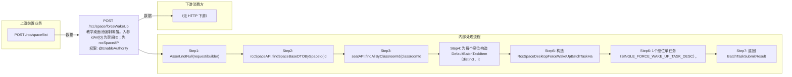

# POST /rcc/space/forceWakeUp

> 教学桌面池强制唤醒。入参 idArr[0] 为空间ID；先 rccSpaceAPI.findSpaceBaseDTOBySpaceId 查询空间，若 classroomId 为空（非教学桌面池）抛 CLASSROOM_TIP_RCDC_CLASSROOM_NOT_FOUND；再 seatAPI.findAllByClassroomId 获取教室座位列表，为每个座位构造 BatchTaskItem（RCDC_RCC_SPACE_DESKTOP_POOL_FORCE_WAKE_UP_ITEM_NAME）注册 RccSpaceDesktopForceWakeUpBatchTaskHandler 提交任务（1个座位单任务，多个 enableParallel）。Handler 中校验桌面状态必须为 SLEEP（否则抛 RCDC_RCC_SPACE_CLASSROOM_POOL_FORCE_WAKE_FAIL_DESKTOP_STATE_NOT_SATISFIED），然后 seatAPI.wakeUpDesktop 唤醒。 ｜ @EnableAuthority ｜ 批量异步（BatchTask）

## 依赖关系全景图

## 接口基本信息

| 项目 | 内容 |
|---|---|
| URL | /rcc/space/forceWakeUp |
| Controller | RccSpaceController |
| 方法名 | desktopPoolForceWakeUp |
| 权限注解 | @EnableAuthority |
| 执行方式 | 批量异步（BatchTask） |
| 业务含义 | 教学桌面池强制唤醒。入参 idArr[0] 为空间ID；先 rccSpaceAPI.findSpaceBaseDTOBySpaceId 查询空间，若 classroomId 为空（非教学桌面池）抛 CLASSROOM_TIP_RCDC_CLASSROOM_NOT_FOUND；再 seatAPI.findAllByClassroomId 获取教室座位列表，为每个座位构造 BatchTaskItem（RCDC_RCC_SPACE_DESKTOP_POOL_FORCE_WAKE_UP_ITEM_NAME）注册 RccSpaceDesktopForceWakeUpBatchTaskHandler 提交任务（1个座位单任务，多个 enableParallel）。Handler 中校验桌面状态必须为 SLEEP（否则抛 RCDC_RCC_SPACE_CLASSROOM_POOL_FORCE_WAKE_FAIL_DESKTOP_STATE_NOT_SATISFIED），然后 seatAPI.wakeUpDesktop 唤醒。 |

## 入参详情

### IdArrWebRequest

| 参数名 | 类型 | 必填 | 约束 | 说明 |
|---|---|---|---|---|
| idArr | UUID[] | 是 | @NotNull | 桌面池/实训空间ID数组，取 idArr[0] |

## 出参详情

| 返回类型 | CommonWebResponse<?>（data=BatchTaskSubmitResult） |
|---|---|

| 字段 | 类型 | 说明 |
|---|---|---|
| taskId | UUID | 批量唤醒任务ID |
| taskStatus | String | 任务状态 |

## 上游前置业务

### 前置1：POST /rcc/space/list

实训空间ID（IdArrWebRequest），来源为 space list（由 field_map 契约映射）
## 内部处理流程

### 批量处理器：RccSpaceDesktopForceWakeUpBatchTaskHandler

| 步骤 | 说明 |
|---|---|
| 1 | seatAPI.getSeatInfo(seatId) 查询座位 |
| 2 | cbbDeskMgmtAPI.findById(seatInfoDTO.getVdiDesktopId()) 查询 VDI 桌面 |
| 3 | 桌面状态非 SLEEP：抛 RCDC_RCC_SPACE_CLASSROOM_POOL_FORCE_WAKE_FAIL_DESKTOP_STATE_NOT_SATISFIED（带桌面名与状态） |
| 4 | seatAPI.wakeUpDesktop(seatId) 下发唤醒 |
| 5 | 成功：auditLogAPI.recordLog(RCDC_RCC_SPACE_DESKTOP_POOL_FORCE_WAKE_UP_SUC_LOG) |
| 6 | 失败：recordLog(RCDC_RCC_SPACE_DESKTOP_POOL_FORCE_WAKE_UP_FAIL_LOG)，返回 FAILURE |
| 7 | onFinish：单台 RCDC_RCC_SPACE_DESKTOP_POOL_FORCE_WAKE_UP_SINGLE_SUC/FAIL，多台 RCDC_RCC_SPACE_DESKTOP_POOL_FORCE_WAKE_UP_BATCH_RESULT |

### 处理流程

1. Assert.notNull(request/builder)
2. rccSpaceAPI.findSpaceBaseDTOBySpaceId(idArr[0])；classroomId==null 抛 CLASSROOM_TIP_RCDC_CLASSROOM_NOT_FOUND
3. seatAPI.findAllByClassroomId(classroomId) 查询座位列表
4. 为每个座位构造 DefaultBatchTaskItem（distinct，itemName=RCDC_RCC_SPACE_DESKTOP_POOL_FORCE_WAKE_UP_ITEM_NAME）
5. 构造 RccSpaceDesktopForceWakeUpBatchTaskHandler 注入 cbbDeskMgmtAPI/auditLogAPI/seatAPI
6. 1个座位单任务（SINGLE_FORCE_WAKE_UP_TASK_DESC），多个 enableParallel 批量任务（FORCE_WAKE_UP_TASK_DESC）
7. 返回 BatchTaskSubmitResult

## 下游消费方

（本接口数据主要被自身/关联接口消费，或经 SPI 通知）
## 接口参数约束分析

| 层级 | 参数 | 规则 | 失败结果 |
|---|---|---|---|
| PARAM | idArr | @NotNull，不能为 null | Assert 失败 |
| BUSINESS | idArr[0] | 目标空间必须是教学桌面池（classroomId 非空） | 办公实训空间抛 CLASSROOM_TIP_RCDC_CLASSROOM_NOT_FOUND |
| BUSINESS | vdiDesktopState | 仅 SLEEP 状态桌面可强制唤醒 | 非 SLEEP 抛 RCDC_RCC_SPACE_CLASSROOM_POOL_FORCE_WAKE_FAIL_DESKTOP_STATE_NOT_SATISFIED |

## 参数取值策略

| 参数 | 策略 | 说明 |
|---|---|---|
| idArr | user_input/from_query | 按业务构造 |

## 成功/失败断言基准

> ⚠️ 断言以 HTTP 响应为准（status + msgKey / BatchTaskSubmitResult），非服务端审计日志。

### 成功场景

| 场景 | 断言点 |
|---|---|
| 教室下存在多台睡眠桌面 | 提交批量唤醒任务，返回 BatchTaskSubmitResult |
| 仅1台睡眠桌面 | 提交单任务并返回 BatchTaskSubmitResult |

### 失败场景

| 场景 | 触发条件 | 断言点 |
|---|---|---|
| 空间非教学桌面池 | 办公实训空间ID | $.status==ERROR 且 $.msgKey==CLASSROOM_TIP_RCDC_CLASSROOM_NOT_FOUND |
| 桌面不在睡眠状态 | 桌面 RUNNING/CLOSE | 轮询 content.taskId 至终态 batchTaskItemStatus∈["FAILURE"] |
## 环境清理机制

| 接口 | 说明 |
|---|---|
| 本接口创建的资源 | 通过对应 delete 接口清理 |

## 前置状态和幂等性标注

| 维度 | 结论 |
|---|---|
| 幂等性 | LOW |
| 说明 | 重复提交重复下发唤醒命令 |
