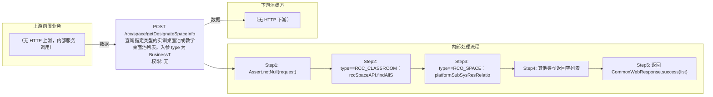

# POST /rcc/space/getDesignateSpaceInfo

> 查询指定类型的实训桌面池或教学桌面池列表。入参 type 为 BusinessTypeAndCreateSourceEnum：RCC_CLASSROOM（教学桌面池）时返回 rccSpaceAPI.findAllSpace() 全部教学实训空间；RCO_SPACE（实训桌面池）时经 platformSubSysResRelationAPI.findByResourceTypeInSpace(ResourceType.DESK_POOL) 找到关联桌面池ID，再 desktopPoolMgmtAPI.getDesktopPoolInfoByIdList 查询并转换为 RccSpaceInfoDTO；其他类型返回空列表。 ｜ 无特殊权限 ｜ 同步

## 依赖关系全景图

## 接口基本信息

| 项目 | 内容 |
|---|---|
| URL | /rcc/space/getDesignateSpaceInfo |
| Controller | RccSpaceController |
| 方法名 | getDesignateSpaceInfo |
| 权限注解 | 无 |
| 执行方式 | 同步 |
| 业务含义 | 查询指定类型的实训桌面池或教学桌面池列表。入参 type 为 BusinessTypeAndCreateSourceEnum：RCC_CLASSROOM（教学桌面池）时返回 rccSpaceAPI.findAllSpace() 全部教学实训空间；RCO_SPACE（实训桌面池）时经 platformSubSysResRelationAPI.findByResourceTypeInSpace(ResourceType.DESK_POOL) 找到关联桌面池ID，再 desktopPoolMgmtAPI.getDesktopPoolInfoByIdList 查询并转换为 RccSpaceInfoDTO；其他类型返回空列表。 |

## 入参详情

### RccSpaceBusinessTypeAndCreateSourceRequest

| 参数名 | 类型 | 必填 | 约束 | 说明 |
|---|---|---|---|---|
| type | BusinessTypeAndCreateSourceEnum | 是 | @NotNull | 业务类型与创建来源：RCC_CLASSROOM=教学桌面池、RCO_SPACE=实训桌面池、RCO_COMMON=办公桌面 |

## 出参详情

| 返回类型 | CommonWebResponse<List<RccSpaceInfoDTO>> |
|---|---|

| 字段 | 类型 | 说明 |
|---|---|---|
| id | UUID | 记录ID |
| name | String | 名称 |
| spaceId | UUID | 实训空间ID |
| spaceName | String | 实训空间名称 |
| classroomId | UUID | 绑定的教室ID |
| enableAllowMaxUseTime | Boolean | 是否开启单次允许接入最大时间配置 |
| allowMaxUseTime | Integer | 单次允许接入最大时间 |
| beforeRecycleNotifyTime | Integer | 断开连接前提示时间 |
| enableAllowUseTimeInfo | Boolean | 是否开启实训桌面池接入控制策略 |
| allowUseTimeInfo | String | 云桌面允许登录时间（字符串） |
| allowUseTimeInfoDTOArr | RccAllowUseTimeInfoDTO[] | 云桌面允许登录时间配置 |
| spaceCreateTime | Date | 实训空间创建时间 |
| spaceUpdateTime | Date | 实训空间更新时间 |
| desktopPoolId | UUID | 桌面池ID |
| desktopPoolName | String | 桌面池名称 |
| desktopPoolNamePrefix | String | 云桌面名称前缀（null时采用桌面池名称） |
| poolModel | CbbDesktopPoolModel | 池模式 |
| idleDesktopRecover | Integer | 空闲桌面自动回收时间（分钟） |
| description | String | 备注 |
| strategyId | UUID | 云桌面策略ID |
| strategyName | String | 云桌面策略名称 |
| networkId | UUID | 网络策略ID |
| networkName | String | 网络策略名称 |
| poolState | CbbDesktopPoolState | 桌面池状态 |
| preStartDesktopNum | Integer | 维持预启动数 |
| isOpenMaintenance | Boolean | 是否开启维护模式 |
| desktopPoolCreateTime | Date | 桌面池创建时间 |
| desktopPoolUpdateTime | Date | 桌面池更新时间 |
| softwareStrategyId | UUID | 软件策略ID |
| softwareStrategyName | String | 软件策略名称 |
| userProfileStrategyId | UUID | 用户配置策略ID |
| userProfileStrategyName | String | 用户配置策略名称 |
| clusterId | UUID | 计算集群ID |
| platformId | UUID | 云平台ID |
| storagePoolId | UUID | 存储池ID |
| businessType | BusinessType | 业务类型 |
| createSource | CreateSource | 创建来源 |
| enableSpecifiedIpRange | Boolean | 是否开启特定终端IP允许访问 |
| canUsed | Boolean | 是否可勾选（默认true） |
| canUsedMessage | String | canUsed=false 的提示语 |
| conflictDeskNum | Integer | 池中配置不一致的桌面数量 |
| clusterInfo | ClusterInfoDTO | 计算集群信息 |
| storagePool | StoragePoolDetailDTO | 存储池详情 |
| classroomName | String | 教室名称 |
| desktopType | CbbCloudDeskPattern | 云桌面类型 |
| memory | Double | 内存大小（GB） |
| cpu | Integer | CPU核数 |
| systemDisk | Integer | 系统盘大小（GB） |
| deskCreateMode | DeskCreateMode | 创建方式 |
| imageTemplateId | UUID | 镜像模板ID |
| imageTemplateName | String | 镜像模板名称 |
| rootImageId | UUID | 根镜像ID |
| rootImageName | String | 根镜像名称 |
| osType | CbbOsType | 操作系统类型 |
| desktopNum | Integer | 桌面数量 |
| connectedNum | Integer | 连接数 |
| platformType | CloudPlatformType | 云平台类型（继承 RccPlatformBaseInfoDTO） |
| platformName | String | 云平台名称（继承 RccPlatformBaseInfoDTO） |
| platformStatus | CloudPlatformStatus | 云平台状态（继承 RccPlatformBaseInfoDTO） |

## 上游前置业务

> 本接口上游为服务端内部调用（非 HTTP 端点）：
> - 
## 内部处理流程

### 处理流程

1. Assert.notNull(request)
2. type==RCC_CLASSROOM：rccSpaceAPI.findAllSpace() 返回教学实训空间列表
3. type==RCO_SPACE：platformSubSysResRelationAPI.findByResourceTypeInSpace(DESK_POOL) 查关联 → desktopPoolMgmtAPI.getDesktopPoolInfoByIdList → convertToRccSpaceInfoDTO 转换（BeanUtils 拷贝并设置 desktopPoolId/desktopPoolName）
4. 其他类型返回空列表
5. 返回 CommonWebResponse.success(list)

## 下游消费方

### 消费1：POST /rcc/space/getDesignateSpaceInfo

指定类型空间ID列表，可被下拉选择后用于 detail/edit/delete（由 field_map 契约映射）
## 接口参数约束分析

| 层级 | 参数 | 规则 | 失败结果 |
|---|---|---|---|
| PARAM | type | @NotNull | 缺失时校验失败 |
| BUSINESS | type | 仅处理 RCC_CLASSROOM 与 RCO_SPACE 两类 | 其他枚举返回空列表 |

## 参数取值策略

| 参数 | 策略 | 说明 |
|---|---|---|
| type | user_input/from_query | 按业务构造 |

## 成功/失败断言基准

### 成功场景

| 场景 | 断言点 |
|---|---|
| type=RCC_CLASSROOM | $.content 非空 |
| type=RCO_SPACE 且存在关联桌面池 | $.content 非空 |

### 失败场景

| 场景 | 触发条件 | 断言点 |
|---|---|---|
| type 缺失 | type 未传 | $.status==ERROR |
| RCO_SPACE 无关联资源 | 无子系统关联桌面池 | $.status==SUCCESS 且 $.content 为空 |

## 环境清理机制

| 接口 | 说明 |
|---|---|
| 本接口创建的资源 | 通过对应 delete 接口清理 |

## 前置状态和幂等性标注

| 维度 | 结论 |
|---|---|
| 幂等性 | HIGH |
| 说明 | 只读查询，无副作用 |
