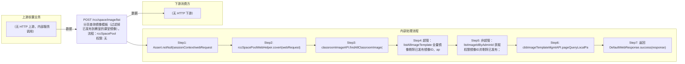

# POST /rcc/space/image/list

> 分页查询镜像模板（过滤掉已发布到教室的课堂镜像）。流程：rccSpacePoolWebHelper.covert 将请求转 LocalImageTemplatePageRequest；classroomImageAPI.findAllClassroomImage 查出教室已发布镜像并从结果排除；超管（isAllGroupPermission）用 listAllImageTemplate 全量镜像剔除已发布后按 id 过滤；非超管经 adminDataPermissionAPI.listImageIdByAdminId 获取权限镜像（无权限直接返回空），并按 exactMatch 中 imageRoleType 是否为 VERSION 决定按 rootImageId 或 id 过滤；最后 cbbImageTemplateMgmtAPI.pageQueryLocalPageImageTemplate 分页返回。 ｜ 无特殊权限 ｜ 同步

## 依赖关系全景图

## 接口基本信息

| 项目 | 内容 |
|---|---|
| URL | /rcc/space/image/list |
| Controller | RccSpaceController |
| 方法名 | listImageTemplate |
| 权限注解 | 无 |
| 执行方式 | 同步 |
| 业务含义 | 分页查询镜像模板（过滤掉已发布到教室的课堂镜像）。流程：rccSpacePoolWebHelper.covert 将请求转 LocalImageTemplatePageRequest；classroomImageAPI.findAllClassroomImage 查出教室已发布镜像并从结果排除；超管（isAllGroupPermission）用 listAllImageTemplate 全量镜像剔除已发布后按 id 过滤；非超管经 adminDataPermissionAPI.listImageIdByAdminId 获取权限镜像（无权限直接返回空），并按 exactMatch 中 imageRoleType 是否为 VERSION 决定按 rootImageId 或 id 过滤；最后 cbbImageTemplateMgmtAPI.pageQueryLocalPageImageTemplate 分页返回。 |

## 入参详情

### RccSpaceListImageWebRequest

| 参数名 | 类型 | 必填 | 约束 | 说明 |
|---|---|---|---|---|
| page | Integer | 是 | @NotNull @Range(0-2147483647) | 页码，默认0 |
| limit | Integer | 是 | @NotNull @Range(1-2147483647) | 每页条数，默认1 |
| searchKeyword | String | 否 | @Nullable | 搜索关键字 |
| noPermission | Boolean | 否 | @Nullable | 是否不需要数据权限（管理员管理侧放行） |
| exactMatchArr | ExactMatch[] | 否 | @Nullable | 精确匹配条件（支持 imageRoleType 等） |
| sortArr | Sort[] | 否 | @Nullable | 排序条件 |
| customMatchArr | Match[] | 否 | @Nullable | 自定义匹配条件（保留 CompositeMatch） |
| customData | String | 否 | @Nullable | 扩展透传数据 |

## 出参详情

| 返回类型 | DefaultWebResponse（content=DefaultPageResponse<CbbImageTemplateDetailDTO>） |
|---|---|

| 字段 | 类型 | 说明 |
|---|---|---|
| itemArr | CbbImageTemplateDetailDTO[] | 镜像模板分页记录（位于 content 下：$.content.itemArr） |
| total | Integer | 总记录数（$.content.total） |
| itemArr[].id | UUID | 镜像模板ID |
| itemArr[].cpu | Integer | CPU核数 |
| itemArr[].memory | Integer | 内存（GB） |
| itemArr[].systemDisk | Integer | 系统盘大小（GB） |
| itemArr[].network | CbbImageTemplateNetworkDTO | 镜像模板网络 |
| itemArr[].imageName | String | 镜像名称 |
| itemArr[].imageFileName | String | 镜像文件名 |
| itemArr[].note | String | 备注 |
| itemArr[].osType | CbbOsType | 操作系统类型 |
| itemArr[].imageState | ImageTemplateState | 镜像状态 |
| itemArr[].cbbImageType | CbbImageType | 镜像类型 |
| itemArr[].tempVmId | UUID | 临时虚拟机ID |
| itemArr[].tempVmIp | String | 临时虚拟机IP |
| itemArr[].vmPhysicsServerId | UUID | 虚拟机物理服务器ID |
| itemArr[].imageSystemSize | Integer | 镜像系统盘大小 |
| itemArr[].clouldDeskopNumOfRecoverable | Integer | 还原桌面数 |
| itemArr[].clouldDeskopNumOfPersonal | Integer | 个性化桌面数 |
| itemArr[].clouldDeskopNumOfAppLayer | Integer | 应用分层桌面数 |
| itemArr[].clouldDeskopNumOfFullCloneRecoverable | Integer | 全克隆还原桌面数 |
| itemArr[].clouldDeskopNumOfFullClonePersonal | Integer | 全克隆个性化桌面数 |
| itemArr[].clouldDeskopNumOfFullCloneAppLayer | Integer | 全克隆应用分层桌面数 |
| itemArr[].editErrorMessage | String | 编辑错误信息 |
| itemArr[].editErrorMessageKey | String | 编辑错误信息Key |
| itemArr[].supportGoldenImage | Boolean | 是否支持黄金镜像 |
| itemArr[].canUsed | Boolean | 是否可用 |
| itemArr[].canUsedMessage | String | 不可用原因 |
| itemArr[].vmState | ExternalImageVmState | 虚拟机状态 |
| itemArr[].guesttoolState | ImageTemplateGuestToolState | GuestTool状态 |
| itemArr[].canEditSystemDiskSize | Boolean | 是否可编辑系统盘大小 |
| itemArr[].terminalId | String | 终端ID |
| itemArr[].enableNested | Boolean | 是否启用嵌套虚拟化 |
| itemArr[].enableSoftwareDecode | Boolean | 是否启用软件解码 |
| itemArr[].imageVmHost | ImageVmHost | 镜像虚拟机宿主机 |
| itemArr[].vgpuInfoDTO | VgpuInfoDTO | vGPU信息 |
| itemArr[].vgpuInfoDTOHistoryList | List<VgpuInfoDTO> | vGPU历史信息列表 |
| itemArr[].loaderPatitionNumber | Integer | 加载器分区数 |
| itemArr[].loaderPath | String | 加载器路径 |
| itemArr[].partType | PartType | 分区类型 |
| itemArr[].ftpUploadState | FtpUploadState | FTP上传状态 |
| itemArr[].controlState | ControlStateEnum | 控制状态 |
| itemArr[].imageDiskList | List<CbbImageDiskInfoDTO> | 镜像磁盘列表 |
| itemArr[].createTime | Date | 创建时间 |
| itemArr[].lastEditTime | Date | 最后编辑时间 |
| itemArr[].guestToolVersion | String | GuestTool版本 |
| itemArr[].lastRecoveryPointId | UUID | 最后还原点ID |
| itemArr[].hasInstallScsiController | Boolean | 是否安装SCSI控制器 |
| itemArr[].storageDriverVersion | String | 存储驱动版本 |
| itemArr[].beforeStorageDriverVersion | String | 编辑前存储驱动版本 |
| itemArr[].enableVirtualEmulation | Boolean | 是否启用虚拟化仿真 |
| itemArr[].beforeEditEnableVirtualEmulation | Boolean | 编辑前是否启用虚拟化仿真 |
| itemArr[].vmSystemDiskSn | String | 虚拟机系统盘序列号 |
| itemArr[].remoteTerminalImageEditState | CbbRemoteTerminalImageEditEnum | 远程终端镜像编辑状态 |
| itemArr[].editUploadDownloadPercentage | String | 编辑上传下载进度百分比 |
| itemArr[].createMode | CbbImageTemplateCreateMode | 镜像创建模式 |
| itemArr[].isAd | Boolean | 是否AD域 |
| itemArr[].computerName | String | 计算机名 |
| itemArr[].imageUsage | ImageUsageTypeEnum | 镜像用途 |
| itemArr[].terminalImageDownloadProgressInfo | CbbTerminalImageDownloadProgressDTO | 终端镜像下载进度 |
| itemArr[].totalImageFileSize | Integer | 镜像文件总大小 |
| itemArr[].clusterInfo | ClusterInfoDTO | 集群信息 |
| itemArr[].storagePool | PlatformStoragePoolDTO | 存储池信息 |
| itemArr[].enableUamAgent | Boolean | 是否启用UAM代理 |
| itemArr[].vmClusterId | UUID | 虚拟机集群ID |
| itemArr[].vmStoragePoolId | UUID | 虚拟机存储池ID |
| itemArr[].cbbImageFormat | ImageFormat | 镜像格式 |
| itemArr[].editErrorMessageList | List<String> | 编辑错误信息列表 |
| itemArr[].imageDriverList | List<DriverWithImageDTO> | 镜像驱动列表 |
| itemArr[].hasImportDriverPackage | Boolean | 是否导入驱动包 |
| itemArr[].isGlobalImage | Boolean | 是否全局镜像 |
| itemArr[].enableGlobalImage | Boolean | 是否启用全局镜像 |
| itemArr[].osIsoFileId | UUID | 操作系统ISO文件ID |
| itemArr[].osVersion | String | 操作系统版本 |
| itemArr[].enableMultipleVersion | Boolean | 是否启用多版本 |
| itemArr[].isNewestVersion | Boolean | 是否最新版本 |
| itemArr[].rootImageId | UUID | 根镜像ID |
| itemArr[].rootImageName | String | 根镜像名称 |
| itemArr[].sourceSnapshotId | UUID | 源快照ID |
| itemArr[].imageRoleType | ImageRoleType | 镜像角色类型 |
| itemArr[].terminalLocalEditType | ImageTerminalLocalEditType | 终端本地编辑类型 |
| itemArr[].diskController | String | 磁盘控制器 |
| itemArr[].cpuArch | CbbCpuArchType | CPU架构 |
| itemArr[].enableDesktopUpgrade | Boolean | 是否启用桌面升级 |
| itemArr[].baseFileSize | Long | 基础文件大小 |
| itemArr[].diff1FileSize | Long | 差异文件1大小 |
| itemArr[].diff2FileSize | Long | 差异文件2大小 |
| itemArr[].publishedSlimmingVersion | Integer | 已发布瘦身版本 |
| itemArr[].currentSlimmingVersion | Integer | 当前瘦身版本 |
| itemArr[].hasImageSlimming | Boolean | 是否已镜像瘦身 |
| itemArr[].slimFlag | Integer | 瘦身标记 |
| itemArr[].platformId | UUID | 云平台ID（父类） |
| itemArr[].platformType | CloudPlatformType | 云平台类型（父类） |
| itemArr[].platformName | String | 云平台名称（父类） |
| itemArr[].platformStatus | CloudPlatformStatus | 云平台状态（父类） |
## 上游前置业务

> 本接口上游为服务端内部调用（非 HTTP 端点）：
> - 
## 内部处理流程

### 处理流程

1. Assert.notNull(sessionContext/webRequest)
2. rccSpacePoolWebHelper.covert(webRequest) 转换为 LocalImageTemplatePageRequest（保留 CompositeMatch）
3. classroomImageAPI.findAllClassroomImage() 获取教室已发布镜像ID，从查询条件中移除
4. 超管：listAllImageTemplate 全量镜像剔除已发布镜像ID，appendImageIdMatchEqual(pageSearchRequest, 剩余ID, IMAGE_ID)
5. 非超管：listImageIdByAdminId 获取权限镜像ID并剔除已发布；为空直接返回空 itemArr；exactMatch 中 imageRoleType==VERSION 时按 ROOT_IMAGE_ID 过滤否则按 IMAGE_ID 过滤
6. cbbImageTemplateMgmtAPI.pageQueryLocalPageImageTemplate(pageSearchRequest) 分页查询
7. 返回 DefaultWebResponse.success(response)

## 下游消费方

### 消费1：POST /rcc/space/image/list

镜像模板ID，被 space publish/edit 的 imageTemplateIdArr 消费（由 field_map 契约映射）
## 接口参数约束分析

| 层级 | 参数 | 规则 | 失败结果 |
|---|---|---|---|
| PARAM | sessionContext/webRequest | 不能为 null | Assert 失败 |
| PARAM | page/limit | @NotNull @Range 校验 | 越界校验失败 |
| BUSINESS | imageId | 教室已发布镜像不展示；非超管仅展示权限内镜像 | 无权限时返回空列表 |

## 参数取值策略

| 参数 | 策略 | 说明 |
|---|---|---|
| page | user_input/from_query | 按业务构造 |
| limit | user_input/from_query | 按业务构造 |
| searchKeyword | user_input/from_query | 按业务构造 |
| noPermission | user_input/from_query | 按业务构造 |
| exactMatchArr | user_input/from_query | 按业务构造 |
| sortArr | user_input/from_query | 按业务构造 |
| customMatchArr | user_input/from_query | 按业务构造 |
| customData | user_input/from_query | 按业务构造 |

## 成功/失败断言基准

### 成功场景

| 场景 | 断言点 |
|---|---|
| 超管查询镜像列表 | $.content.itemArr 非空 |
| 非超管带权限查询 | $.content.itemArr 非空 |
| 多版本镜像（imageRoleType=VERSION） | $.content.itemArr 非空 |

### 失败场景

| 场景 | 触发条件 | 断言点 |
|---|---|---|
| 非超管无镜像权限 | 管理员无镜像数据权限 | $.status==SUCCESS 且 $.content.itemArr 为空 |
| 入参为 null | webRequest 缺省 | $.status==ERROR |

## 环境清理机制

| 接口 | 说明 |
|---|---|
| 本接口创建的资源 | 通过对应 delete 接口清理 |

## 前置状态和幂等性标注

| 维度 | 结论 |
|---|---|
| 幂等性 | HIGH |
| 说明 | 只读分页查询，无副作用 |
