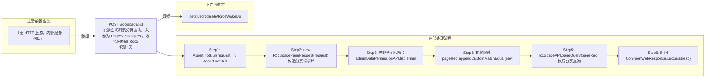

# POST /rcc/space/list

> 实训空间列表分页查询。入参为 PageWebRequest，方法内构造 RccSpacePageRequest 并做精确匹配枚举转换（poolModel/createSource/businessType/poolState/platformType/platformStatus/isOpenMaintenance）；若当前管理员非全组权限，先调 adminDataPermissionAPI.listTerminalGroupIdByAdminId 获取终端组数据权限，权限组为空则直接返回空分页结果，否则追加 MatchEqual(terminalGroupId,...) 过滤条件，最后调 rccSpaceAPI.pageQuery 分页查询并返回。 ｜ 无特殊权限 ｜ 同步

## 依赖关系全景图

## 接口基本信息

| 项目 | 内容 |
|---|---|
| URL | /rcc/space/list |
| Controller | RccSpaceController |
| 方法名 | list |
| 权限注解 | 无 |
| 执行方式 | 同步 |
| 业务含义 | 实训空间列表分页查询。入参为 PageWebRequest，方法内构造 RccSpacePageRequest 并做精确匹配枚举转换（poolModel/createSource/businessType/poolState/platformType/platformStatus/isOpenMaintenance）；若当前管理员非全组权限，先调 adminDataPermissionAPI.listTerminalGroupIdByAdminId 获取终端组数据权限，权限组为空则直接返回空分页结果，否则追加 MatchEqual(terminalGroupId,...) 过滤条件，最后调 rccSpaceAPI.pageQuery 分页查询并返回。 |

## 入参详情

### PageWebRequest（方法内转换为 RccSpacePageRequest）

| 参数名 | 类型 | 必填 | 约束 | 说明 |
|---|---|---|---|---|
| page | Integer | 是 | @NotNull @Range(0-2147483647) | 页码，默认0 |
| limit | Integer | 是 | @NotNull @Range(1-2147483647) | 每页条数 |
| searchKeyword | String | 否 | @Nullable | 模糊搜索关键字 |
| exactMatchArr | ExactMatch[] | 否 | @Nullable | 精确匹配条件；支持 poolModel/createSource/businessType/poolState/platformType/platformStatus/isOpenMaintenance 的枚举转换 |
| sortArr | Sort[] | 否 | @Nullable | 排序条件 |

## 出参详情

| 返回类型 | CommonWebResponse<DefaultPageResponse<RccSpaceInfoDTO>> |
|---|---|

| 字段 | 类型 | 说明 |
|---|---|---|
| itemArr | RccSpaceInfoDTO[] | 实训空间分页记录（位于 content 下：$.content.itemArr） |
| total | Integer | 符合条件的总记录数（$.content.total） |
| itemArr[].id | UUID | 桌面池ID |
| itemArr[].name | String | 名称 |
| itemArr[].spaceId | UUID | 实训空间ID |
| itemArr[].spaceName | String | 实训空间名称 |
| itemArr[].classroomId | UUID | 绑定的教室ID |
| itemArr[].enableAllowMaxUseTime | Boolean | 是否开启单次最大访问时长 |
| itemArr[].allowMaxUseTime | Integer | 单次最大访问时长（分钟） |
| itemArr[].beforeRecycleNotifyTime | Integer | 断开连接前提示时间 |
| itemArr[].enableAllowUseTimeInfo | Boolean | 是否开启登录时间限制 |
| itemArr[].allowUseTimeInfo | String | 允许登录时间限制说明 |
| itemArr[].spaceCreateTime | Date | 空间创建时间 |
| itemArr[].spaceUpdateTime | Date | 空间更新时间 |
| itemArr[].desktopPoolId | UUID | 桌面池ID |
| itemArr[].desktopPoolName | String | 桌面池名称 |
| itemArr[].desktopPoolNamePrefix | String | 桌面池名称前缀 |
| itemArr[].poolModel | CbbDesktopPoolModel | 桌面池模式 |
| itemArr[].idleDesktopRecover | Integer | 空闲桌面回收时间 |
| itemArr[].description | String | 描述 |
| itemArr[].strategyId | UUID | 策略ID |
| itemArr[].networkId | UUID | 网络ID |
| itemArr[].poolState | CbbDesktopPoolState | 桌面池状态 |
| itemArr[].preStartDesktopNum | Integer | 预启动桌面数 |
| itemArr[].isOpenMaintenance | Boolean | 是否开启维护模式 |
| itemArr[].desktopPoolCreateTime | Date | 桌面池创建时间 |
| itemArr[].desktopPoolUpdateTime | Date | 桌面池更新时间 |
| itemArr[].softwareStrategyId | UUID | 软件策略ID |
| itemArr[].userProfileStrategyId | UUID | 用户配置策略ID |
| itemArr[].clusterId | UUID | 计算集群ID |
| itemArr[].platformId | UUID | 云平台ID |
| itemArr[].storagePoolId | UUID | 存储池ID |
| itemArr[].businessType | BusinessType | 业务类型 |
| itemArr[].createSource | CreateSource | 创建来源 |
| itemArr[].enableSpecifiedIpRange | Boolean | 是否开启指定终端IP访问 |
| itemArr[].canUsed | Boolean | 是否可用 |
| itemArr[].canUsedMessage | String | 不可用原因 |
| itemArr[].conflictDeskNum | Integer | 冲突桌面数 |
| itemArr[].clusterInfo | ClusterInfoDTO | 集群信息 |
| itemArr[].storagePool | StoragePoolDetailDTO | 存储池信息 |
| itemArr[].classroomName | String | 教室名称 |
| itemArr[].strategyName | String | 策略名称 |
| itemArr[].desktopType | CbbCloudDeskPattern | 桌面类型 |
| itemArr[].memory | Double | 内存（GB） |
| itemArr[].cpu | Integer | CPU核数 |
| itemArr[].systemDisk | Integer | 系统盘大小（GB） |
| itemArr[].deskCreateMode | DeskCreateMode | 桌面创建模式 |
| itemArr[].networkName | String | 网络名称 |
| itemArr[].imageTemplateId | UUID | 镜像模板ID |
| itemArr[].imageTemplateName | String | 镜像模板名称 |
| itemArr[].rootImageId | UUID | 根镜像ID |
| itemArr[].rootImageName | String | 根镜像名称 |
| itemArr[].osType | CbbOsType | 操作系统类型 |
| itemArr[].desktopNum | Integer | 桌面总数 |
| itemArr[].softwareStrategyName | String | 软件策略名称 |
| itemArr[].userProfileStrategyName | String | 用户配置策略名称 |
| itemArr[].connectedNum | Integer | 已连接桌面数 |
| itemArr[].allowUseTimeInfoDTOArr | RccAllowUseTimeInfoDTO[] | 允许登录时间范围数组 |
| itemArr[].platformType | CloudPlatformType | 云平台类型（父类） |
| itemArr[].platformName | String | 云平台名称（父类） |
| itemArr[].platformStatus | CloudPlatformStatus | 云平台状态（父类） |
## 上游前置业务

（无上游数据依赖）
## 内部处理流程

### 处理流程

1. Assert.notNull(request) 与 Assert.notNull(sessionContext) 校验非空
2. new RccSpacePageRequest(request) 构造分页请求并转换精确匹配枚举
3. 若非全组权限：adminDataPermissionAPI.listTerminalGroupIdByAdminId(userId) 查询终端组权限；权限列表为空则直接返回空分页
4. 有权限时 pageReq.appendCustomMatchEqual(new MatchEqual(terminalGroupId, terminalGroupIdArr)) 追加权限过滤
5. rccSpaceAPI.pageQuery(pageReq) 执行分页查询
6. 返回 CommonWebResponse.success(resp)

## 下游消费方

### 消费1：POST /rcc/space/list

实训空间ID（列表主键），被 detail/edit/delete/forceWakeUp 消费（由 field_map 契约映射）
## 接口参数约束分析

| 层级 | 参数 | 规则 | 失败结果 |
|---|---|---|---|
| PARAM | request/sessionContext | 均不能为 null | Assert 失败抛 IllegalArgumentException |
| PARAM | page/limit | @NotNull @Range 校验 | 越界/缺失校验失败 |
| BUSINESS | terminalGroupId | 非超管管理员必须拥有终端组数据权限，查询按权限过滤 | 无权限时返回空列表而非报错 |

## 参数取值策略

| 参数 | 策略 | 说明 |
|---|---|---|
| page | user_input/from_query | 按业务构造 |
| limit | user_input/from_query | 按业务构造 |
| searchKeyword | user_input/from_query | 按业务构造 |
| exactMatchArr | user_input/from_query | 按业务构造 |
| sortArr | user_input/from_query | 按业务构造 |

## 成功/失败断言基准

### 成功场景

| 场景 | 断言点 |
|---|---|
| 超管调用，返回全量实训空间分页 | $.content.itemArr 非空 |
| 非超管带终端组权限调用 | $.content.itemArr 非空 |

### 失败场景

| 场景 | 触发条件 | 断言点 |
|---|---|---|
| 非超管无任何终端组权限 | 管理员未分配终端组数据权限 | $.status==SUCCESS 且 $.content.itemArr 为空 |
| 入参缺失 | request 或 sessionContext 为 null | $.status==ERROR |

## 环境清理机制

| 接口 | 说明 |
|---|---|
| 本接口创建的资源 | 通过对应 delete 接口清理 |

## 前置状态和幂等性标注

| 维度 | 结论 |
|---|---|
| 幂等性 | HIGH |
| 说明 | 只读分页查询，重复调用无副作用 |
