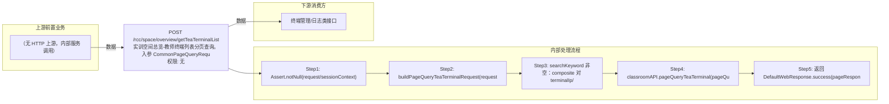

# POST /rcc/space/overview/getTeaTerminalList

> 实训空间总览-教师终端列表分页查询。入参 CommonPageQueryRequest；buildPageQueryTeaTerminalRequest：非超管时按终端组数据权限换算教室ID并追加 in(classroomId,...) 过滤；searchKeyword 非空时对 terminalIp 或 terminalName 做 like 的 composite or 查询；最后 classroomAPI.pageQueryTeaTerminal 分页返回。 ｜ 无特殊权限 ｜ 同步

## 依赖关系全景图

## 接口基本信息

| 项目 | 内容 |
|---|---|
| URL | /rcc/space/overview/getTeaTerminalList |
| Controller | RccSpaceOverviewController |
| 方法名 | listTeaTerminal |
| 权限注解 | 无 |
| 执行方式 | 同步 |
| 业务含义 | 实训空间总览-教师终端列表分页查询。入参 CommonPageQueryRequest；buildPageQueryTeaTerminalRequest：非超管时按终端组数据权限换算教室ID并追加 in(classroomId,...) 过滤；searchKeyword 非空时对 terminalIp 或 terminalName 做 like 的 composite or 查询；最后 classroomAPI.pageQueryTeaTerminal 分页返回。 |

## 入参详情

### CommonPageQueryRequest

| 参数名 | 类型 | 必填 | 约束 | 说明 |
|---|---|---|---|---|
| page | Integer | 是 | @NotNull @Range(0-2147483647) | 页码 |
| limit | Integer | 是 | @NotNull @Range(1-2147483647) | 每页条数 |
| searchKeyword | String | 否 | @Nullable | 搜索关键字（匹配终端IP或终端名称） |
| matchArr | Match[] | 否 | @Nullable | 匹配条件 |
| sortArr | Sort[] | 否 | @Nullable | 排序条件 |
| exactMatchArr | ExactMatch[] | 否 | @Nullable | 精确匹配条件 |
| noPermission | Boolean | 否 | @Nullable | 是否不需要权限 |
| customData | String | 否 | @Nullable | 扩展透传数据 |

## 出参详情

| 返回类型 | DefaultWebResponse（content=PageQueryResponse<TeaTerminalDTO>） |
|---|---|

| 字段 | 类型 | 说明 |
|---|---|---|
| itemArr | List<TeaTerminalDTO> | 教师终端记录列表（位于 content 下：$.content.itemArr） |
| total | Integer | 总记录数（$.content.total） |
| itemArr[].teacherId | UUID | 教师ID |
| itemArr[].classroomId | UUID | 教室ID |
| itemArr[].classroomName | String | 教室名称 |
| itemArr[].teacherIp | String | 教师终端IP |
| itemArr[].teacherType | String | 教师类型 |
| itemArr[].teacherTerminalId | String | 教师终端ID |
| itemArr[].terminalIp | String | 终端IP |
| itemArr[].terminalName | String | 终端名称 |
| itemArr[].terminalState | String | 终端状态 |
| itemArr[].deployMode | String | 部署模式 |
## 上游前置业务

> 本接口上游为服务端内部调用（非 HTTP 端点）：
> - 
## 内部处理流程

### 处理流程

1. Assert.notNull(request/sessionContext)
2. buildPageQueryTeaTerminalRequest(request, userId)：非超管时 in(classroomId, 权限教室ID)
3. searchKeyword 非空：composite 对 terminalIp/terminalName 做 or like 查询
4. classroomAPI.pageQueryTeaTerminal(pageQueryRequest)
5. 返回 DefaultWebResponse.success(pageResponse)

## 下游消费方

### 消费1：POST /rcc/space/overview/getTeaTerminalList

教师终端ID，可被终端管理/日志类接口消费（由 field_map 契约映射）
## 接口参数约束分析

| 层级 | 参数 | 规则 | 失败结果 |
|---|---|---|---|
| PARAM | request/sessionContext | 不能为 null | Assert 失败 |
| BUSINESS | classroomId | 非超管按终端组权限过滤教室 | 权限外教室不返回 |
| BUSINESS | searchKeyword | 模糊匹配终端IP或终端名称 | 不满足条件不返回 |

## 参数取值策略

| 参数 | 策略 | 说明 |
|---|---|---|
| page | user_input/from_query | 按业务构造 |
| limit | user_input/from_query | 按业务构造 |
| searchKeyword | user_input/from_query | 按业务构造 |
| matchArr | user_input/from_query | 按业务构造 |
| sortArr | user_input/from_query | 按业务构造 |
| exactMatchArr | user_input/from_query | 按业务构造 |
| noPermission | user_input/from_query | 按业务构造 |
| customData | user_input/from_query | 按业务构造 |

## 成功/失败断言基准

### 成功场景

| 场景 | 断言点 |
|---|---|
| 超管分页查询教师终端 | $.content.itemArr 非空 |
| 带关键字查询 | $.content.itemArr 非空 |

### 失败场景

| 场景 | 触发条件 | 断言点 |
|---|---|---|
| 非超管无权限 | 管理员无终端组权限 | $.status==SUCCESS 且 $.content.itemArr 为空 |
| 入参为 null | request 缺省 | $.status==ERROR |

## 环境清理机制

| 接口 | 说明 |
|---|---|
| 本接口创建的资源 | 通过对应 delete 接口清理 |

## 前置状态和幂等性标注

| 维度 | 结论 |
|---|---|
| 幂等性 | HIGH |
| 说明 | 只读分页查询，无副作用 |
