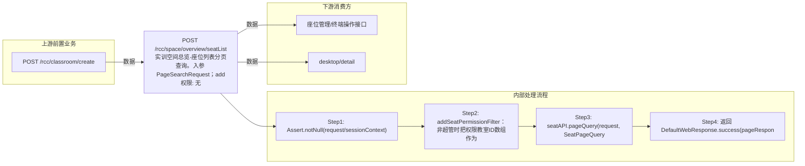

# POST /rcc/space/overview/seatList

> 实训空间总览-座位列表分页查询。入参 PageSearchRequest；addSeatPermissionFilter 在非超管时向 matchEqualArr 追加 MatchEqual(classroomId, 权限教室ID数组)；最后 seatAPI.pageQuery(request, SeatPageQueryTypeEnum.QUERY_BY_OVERVIEW) 分页返回座位信息。 ｜ 无特殊权限 ｜ 同步

## 依赖关系全景图

## 接口基本信息

| 项目 | 内容 |
|---|---|
| URL | /rcc/space/overview/seatList |
| Controller | RccSpaceOverviewController |
| 方法名 | listSeat |
| 权限注解 | 无 |
| 执行方式 | 同步 |
| 业务含义 | 实训空间总览-座位列表分页查询。入参 PageSearchRequest；addSeatPermissionFilter 在非超管时向 matchEqualArr 追加 MatchEqual(classroomId, 权限教室ID数组)；最后 seatAPI.pageQuery(request, SeatPageQueryTypeEnum.QUERY_BY_OVERVIEW) 分页返回座位信息。 |

## 入参详情

### PageSearchRequest

| 参数名 | 类型 | 必填 | 约束 | 说明 |
|---|---|---|---|---|
| page | Integer | 是 | @NotNull @Range(0-2147483647) | 页码 |
| limit | Integer | 是 | @NotNull @Range(1-2147483647) | 每页条数 |
| searchKeyword | String | 否 | @Nullable | 搜索关键字 |
| matchEqualArr | MatchEqual[] | 否 | @Nullable（非超管追加 classroomId 过滤） | 等值匹配条件 |
| sortArr | Sort[] | 否 | @Nullable | 排序条件 |

## 出参详情

| 返回类型 | DefaultWebResponse（content=DefaultPageResponse<SeatInfoDTO>） |
|---|---|

| 字段 | 类型 | 说明 |
|---|---|---|
| itemArr | SeatInfoDTO[] | 座位记录列表（位于 content 下：$.content.itemArr） |
| total | Integer | 总记录数（$.content.total） |
| itemArr[].id | UUID | 座位ID |
| itemArr[].classroomId | UUID | 教室ID |
| itemArr[].classroomName | String | 教室名称 |
| itemArr[].desktopName | String | 桌面名称 |
| itemArr[].studentModeArr | TerminalTypeEnum[] | 学生端模式数组 |
| itemArr[].terminalModeArr | TerminalTypeEnum[] | 终端模式数组 |
| itemArr[].imageTemplateName | String | 镜像模板名称 |
| itemArr[].vdiDesktopId | UUID | VDI桌面ID |
| itemArr[].vdiDesktopIp | String | VDI桌面IP |
| itemArr[].vdiDesktopGateway | String | VDI桌面网关 |
| itemArr[].vdiDesktopMask | String | VDI桌面掩码 |
| itemArr[].vdiDesktopDnsPrimary | String | VDI桌面主DNS |
| itemArr[].vdiDesktopDnsSecondary | String | VDI桌面备DNS |
| itemArr[].idvDesktopId | UUID | IDV桌面ID |
| itemArr[].idvDesktopIp | String | IDV桌面IP |
| itemArr[].idvDesktopGateway | String | IDV桌面网关 |
| itemArr[].idvDesktopMask | String | IDV桌面掩码 |
| itemArr[].idvDesktopDns | String | IDV桌面DNS |
| itemArr[].idvDesktopState | CbbCloudDeskState | IDV桌面状态 |
| itemArr[].seatNum | Integer | 座位号 |
| itemArr[].disableNetwork | Boolean | 是否禁用网络 |
| itemArr[].terminalId | String | 终端ID |
| itemArr[].terminalName | String | 终端名称 |
| itemArr[].terminalRainOsVersion | String | 终端RainOS版本 |
| itemArr[].terminalHardwareVersion | String | 终端硬件版本 |
| itemArr[].terminalUpgradeVersion | String | 终端升级版本 |
| itemArr[].terminalMac | String | 终端MAC |
| itemArr[].terminalIp | String | 终端IP |
| itemArr[].terminalCpu | String | 终端CPU |
| itemArr[].terminalMemory | Long | 终端内存 |
| itemArr[].terminalProductModel | String | 终端产品型号 |
| itemArr[].terminalSerialNum | String | 终端序列号 |
| itemArr[].terminalPlatform | CbbTerminalPlatformEnums | 终端平台 |
| itemArr[].terminalState | CbbTerminalStateEnums | 终端状态 |
| itemArr[].desktopState | CbbCloudDeskState | 桌面状态 |
| itemArr[].classroomState | ClassroomLessonStatusEnum | 教室上课状态 |
| itemArr[].terminalType | String | 终端类型 |
| itemArr[].productId | String | 产品ID |
| itemArr[].terminalStartMode | CbbTerminalStartMode | 终端启动模式 |
| itemArr[].terminalResolution | String | 终端分辨率 |
| itemArr[].isTerminalLocked | Boolean | 终端是否锁定 |
| itemArr[].lastOnlineTime | Date | 最后上线时间 |
| itemArr[].seatDownloadState | SeatDownloadStateEnum | 座位镜像下载状态 |
| itemArr[].vdiDesktopState | CbbCloudDeskState | VDI桌面状态 |
| itemArr[].bootManageMode | CbbTerminalBootManageModeEnums | 终端启动管理模式 |
| itemArr[].seatStatus | SeatStateEnums | 座位状态 |
| itemArr[].vdiLocalDiskId | UUID | VDI本地磁盘ID |
| itemArr[].terminalNeedUpgrade | Boolean | 终端是否需要升级 |
| itemArr[].deployMode | String | 部署模式 |
| itemArr[].canTerminalInit | Boolean | 终端是否可初始化 |
| itemArr[].softwareVersion | String | 软件版本 |
| itemArr[].sourceIp | String | 源IP |
| itemArr[].platformStatus | CloudPlatformStatus | 云平台状态 |
## 上游前置业务

### 前置1：POST /rcc/classroom/create

教室ID筛选（可空），来源为教室创建返回（由 field_map 契约映射）
## 内部处理流程

### 处理流程

1. Assert.notNull(request/sessionContext)
2. addSeatPermissionFilter：非超管时把权限教室ID数组作为 MatchEqual(classroomId, ...) 追加到 matchEqualArr
3. seatAPI.pageQuery(request, SeatPageQueryTypeEnum.QUERY_BY_OVERVIEW)
4. 返回 DefaultWebResponse.success(pageResponse)

## 下游消费方

### 消费1：POST /rcc/space/overview/seatList

座位ID，可被座位管理/终端操作接口消费（由 field_map 契约映射）
## 接口参数约束分析

| 层级 | 参数 | 规则 | 失败结果 |
|---|---|---|---|
| PARAM | request/sessionContext | 不能为 null | Assert 失败 |
| BUSINESS | classroomId | 非超管仅返回权限教室的座位 | 权限外座位不返回 |

## 参数取值策略

| 参数 | 策略 | 说明 |
|---|---|---|
| page | user_input/from_query | 按业务构造 |
| limit | user_input/from_query | 按业务构造 |
| searchKeyword | user_input/from_query | 按业务构造 |
| matchEqualArr | user_input/from_query | 按业务构造 |
| sortArr | user_input/from_query | 按业务构造 |

## 成功/失败断言基准

### 成功场景

| 场景 | 断言点 |
|---|---|
| 超管查询座位列表 | $.content.itemArr 非空 |
| 非超管查询 | $.content.itemArr 非空 |

### 失败场景

| 场景 | 触发条件 | 断言点 |
|---|---|---|
| 非超管无权限 | 权限教室为空 | $.status==SUCCESS 且 $.content.itemArr 为空 |
| 入参为 null | request 缺省 | $.status==ERROR |

## 环境清理机制

| 接口 | 说明 |
|---|---|
| 本接口创建的资源 | 通过对应 delete 接口清理 |

## 前置状态和幂等性标注

| 维度 | 结论 |
|---|---|
| 幂等性 | HIGH |
| 说明 | 只读分页查询，无副作用 |
