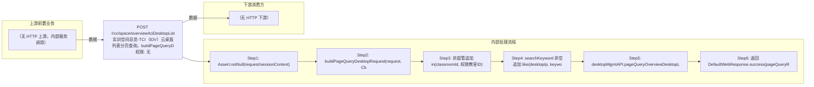

# POST /rcc/space/overview/tciDesktopList

> 实训空间总览-TCI（IDV）云桌面列表分页查询。buildPageQueryDesktopRequest 固定追加 eq(desktopType, IDV)；非超管追加 in(classroomId, 权限教室ID)；searchKeyword 非空时 like(desktopIp, keyword)；最后 desktopMgmtAPI.pageQueryOverviewDesktopList 分页返回。 ｜ 无特殊权限 ｜ 同步

## 依赖关系全景图

## 接口基本信息

| 项目 | 内容 |
|---|---|
| URL | /rcc/space/overview/tciDesktopList |
| Controller | RccSpaceOverviewController |
| 方法名 | listTCIDesktop |
| 权限注解 | 无 |
| 执行方式 | 同步 |
| 业务含义 | 实训空间总览-TCI（IDV）云桌面列表分页查询。buildPageQueryDesktopRequest 固定追加 eq(desktopType, IDV)；非超管追加 in(classroomId, 权限教室ID)；searchKeyword 非空时 like(desktopIp, keyword)；最后 desktopMgmtAPI.pageQueryOverviewDesktopList 分页返回。 |

## 入参详情

### CommonPageQueryRequest

| 参数名 | 类型 | 必填 | 约束 | 说明 |
|---|---|---|---|---|
| page | Integer | 是 | @NotNull @Range(0-2147483647) | 页码 |
| limit | Integer | 是 | @NotNull @Range(1-2147483647) | 每页条数 |
| searchKeyword | String | 否 | @Nullable | 搜索关键字（匹配桌面IP） |
| matchArr | Match[] | 否 | @Nullable | 匹配条件 |
| sortArr | Sort[] | 否 | @Nullable | 排序条件 |
| exactMatchArr | ExactMatch[] | 否 | @Nullable | 精确匹配条件 |
| customData | String | 否 | @Nullable | 扩展透传数据 |

## 出参详情

| 返回类型 | DefaultWebResponse（content=PageQueryResponse<OverviewDesktopDTO>） |
|---|---|

| 字段 | 类型 | 说明 |
|---|---|---|
| itemArr | List<OverviewDesktopDTO> | TCI（IDV）云桌面总览记录列表（位于 content 下：$.content.itemArr） |
| total | Integer | 总记录数（$.content.total） |
| itemArr[].desktopId | UUID | 桌面ID |
| itemArr[].computerName | String | 计算机名 |
| itemArr[].desktopState | CbbCloudDeskState | 桌面状态 |
| itemArr[].desktopRole | DesktopRoleEnum | 桌面角色 |
| itemArr[].desktopType | CbbCloudDeskType | 桌面类型（VDI/IDV/TCI） |
| itemArr[].imageType | CbbImageType | 镜像类型 |
| itemArr[].terminalState | CbbTerminalStateEnums | 终端状态 |
| itemArr[].desktopIp | String | 桌面IP |
| itemArr[].classroomId | UUID | 教室ID |
| itemArr[].classroomName | String | 教室名称 |
| itemArr[].terminalIp | String | 终端IP |
| itemArr[].platformId | UUID | 云平台ID |
| itemArr[].platformType | CloudPlatformType | 云平台类型 |
| itemArr[].platformName | String | 云平台名称 |
| itemArr[].platformStatus | CloudPlatformStatus | 云平台状态 |
| itemArr[].createTime | Date | 创建时间 |
## 上游前置业务

> 本接口上游为服务端内部调用（非 HTTP 端点）：
> - 
## 内部处理流程

### 处理流程

1. Assert.notNull(request/sessionContext)
2. buildPageQueryDesktopRequest(request, CbbCloudDeskType.IDV, userId)：eq(desktopType, IDV)
3. 非超管追加 in(classroomId, 权限教室ID)
4. searchKeyword 非空追加 like(desktopIp, keyword)
5. desktopMgmtAPI.pageQueryOverviewDesktopList(pageQueryRequest)
6. 返回 DefaultWebResponse.success(pageQueryResponse)

## 下游消费方

### 消费1：POST /rcc/space/overview/tciDesktopList

TCI云桌面ID，被桌面操作接口消费（由 field_map 契约映射）
## 接口参数约束分析

| 层级 | 参数 | 规则 | 失败结果 |
|---|---|---|---|
| PARAM | request/sessionContext | 不能为 null | Assert 失败 |
| BUSINESS | desktopType | 固定为 IDV（TCI） | 自动追加过滤 |
| BUSINESS | classroomId | 非超管按权限教室过滤 | 权限外桌面不返回 |

## 参数取值策略

| 参数 | 策略 | 说明 |
|---|---|---|
| page | user_input/from_query | 按业务构造 |
| limit | user_input/from_query | 按业务构造 |
| searchKeyword | user_input/from_query | 按业务构造 |
| matchArr | user_input/from_query | 按业务构造 |
| sortArr | user_input/from_query | 按业务构造 |
| exactMatchArr | user_input/from_query | 按业务构造 |
| customData | user_input/from_query | 按业务构造 |

## 成功/失败断言基准

### 成功场景

| 场景 | 断言点 |
|---|---|
| 超管查询 TCI 桌面 | $.content.itemArr 非空 |
| 带桌面IP关键字 | $.content.itemArr 非空 |

### 失败场景

| 场景 | 触发条件 | 断言点 |
|---|---|---|
| 非超管无权限 | 权限教室为空 | $.status==SUCCESS 且 $.content.itemArr 为空 |
| 入参为 null | request 缺省 | $.status==ERROR |

## 环境清理机制

| 接口 | 说明 |
|---|---|
| 本接口创建的资源 | 通过对应 delete 接口清理 |

## 前置状态和幂等性标注

| 维度 | 结论 |
|---|---|
| 幂等性 | HIGH |
| 说明 | 只读分页查询，无副作用 |
