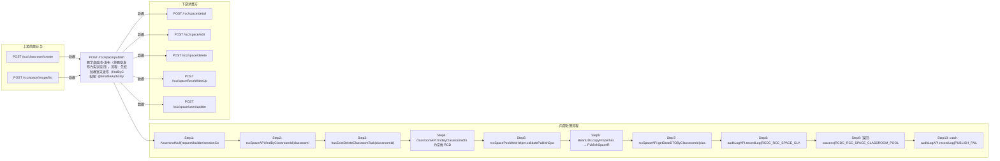

# POST /rcc/space/publish

> 教学桌面池-发布（将教室发布为实训空间）。流程：先校验教室未发布（findByClassroomId 非空抛 RCDC_RCC_SPACE_PUBLISH_FAIL_CLASSROOM_HAS_PUBLISH）、无运行中的删除状态机（stateMachineFactory.findByResourceId 存在抛 RCDC_RCC_SPACE_PUBLISH_FAIL_CLASSROOM_HAS_RUNNING_STATE_MACHINE）、教室存在（classroomAPI.findByClassroomIdIn 为空抛 RCDC_RCC_SPACE_PUBLISH_FAIL_CLASSROOM_NOT_FOUND）；随后 validatePublishSpaceParam 校验名称重复/镜像非空/登录时间/访问时长/镜像归属教室，调 rccSpaceAPI.publishSpace 创建教学桌面池与用户桌面记录，saveAdminGroupPermission 添加 DESKTOP_POOL 数据权限，写成功审计并返回 i18n key；异常写失败审计并返回 fail key。 ｜ @EnableAuthority ｜ 同步

## 依赖关系全景图

## 接口基本信息

| 项目 | 内容 |
|---|---|
| URL | /rcc/space/publish |
| Controller | RccSpaceController |
| 方法名 | publish |
| 权限注解 | @EnableAuthority |
| 执行方式 | 同步 |
| 业务含义 | 教学桌面池-发布（将教室发布为实训空间）。流程：先校验教室未发布（findByClassroomId 非空抛 RCDC_RCC_SPACE_PUBLISH_FAIL_CLASSROOM_HAS_PUBLISH）、无运行中的删除状态机（stateMachineFactory.findByResourceId 存在抛 RCDC_RCC_SPACE_PUBLISH_FAIL_CLASSROOM_HAS_RUNNING_STATE_MACHINE）、教室存在（classroomAPI.findByClassroomIdIn 为空抛 RCDC_RCC_SPACE_PUBLISH_FAIL_CLASSROOM_NOT_FOUND）；随后 validatePublishSpaceParam 校验名称重复/镜像非空/登录时间/访问时长/镜像归属教室，调 rccSpaceAPI.publishSpace 创建教学桌面池与用户桌面记录，saveAdminGroupPermission 添加 DESKTOP_POOL 数据权限，写成功审计并返回 i18n key；异常写失败审计并返回 fail key。 |

## 入参详情

### RccPublicClassroomSpaceWebRequest

| 参数名 | 类型 | 必填 | 约束 | 说明 |
|---|---|---|---|---|
| name | String | 是 | @NotBlank @TextShort @TextName | 实训空间名称 |
| classroomId | UUID | 是 | @NotNull | 绑定的教室ID |
| imageTemplateIdArr | UUID[] | 是 | @NotNull（逻辑上不能为空数组） | 绑定的镜像ID数组 |
| idleDesktopRecover | Integer | 否 | @Nullable @Range(0-99999999) | 空闲桌面自动回收时间（分钟） |
| enableAllowMaxUseTime | Boolean | 是 | @NotNull | 是否开启单次允许接入最大时间配置 |
| allowMaxUseTime | Integer | 否 | @Nullable @Range(30-144000) | 单次允许接入最大时间 |
| beforeRecycleNotifyTime | Integer | 否 | @Nullable @Range(1-144000) | 断开连接前提示时间 |
| enableAllowUseTimeInfo | Boolean | 是 | @NotNull | 是否开启云桌面允许登录时间 |
| allowUseTimeInfoArr | RccAllowUseTimeInfoDTO[] | 否 | @Nullable | 云桌面允许登录时间段数组 |
| description | String | 否 | @Nullable @TextMedium | 描述 |
| enableSpecifiedIpRange | Boolean | 否 | @Nullable（默认 false） | 是否开启指定终端IP访问 |

## 出参详情

| 返回类型 | CommonWebResponse<?>（data 为 i18n key 字符串） |
|---|---|

| 字段 | 类型 | 说明 |
|---|---|---|
| data | String | 纯操作接口：content 为空（成功 RCDC_RCC_SPACE_CLASSROOM_POOL_PUBLISH_OPERATE_SUCCESS / 失败 RCDC_RCC_SPACE_CLASSROOM_POOL_PUBLISH_OPERATE_FAIL） |

## 上游前置业务

### 前置1：POST /rcc/classroom/create

教室ID，来源为教室创建返回（由 field_map 契约映射）

### 前置2：POST /rcc/space/image/list

绑定镜像ID数组，来源为本地镜像模板列表（已过滤课堂镜像）（由 field_map 契约映射）
## 内部处理流程

### 处理流程

1. Assert.notNull(request/builder/sessionContext)
2. rccSpaceAPI.findByClassroomId(classroomId) 非空抛 RCDC_RCC_SPACE_PUBLISH_FAIL_CLASSROOM_HAS_PUBLISH
3. hasExistDeleteClassroomTask(classroomId)：stateMachineFactory.findByResourceId 存在则抛 RCDC_RCC_SPACE_PUBLISH_FAIL_CLASSROOM_HAS_RUNNING_STATE_MACHINE
4. classroomAPI.findByClassroomIdIn 为空抛 RCDC_RCC_SPACE_PUBLISH_FAIL_CLASSROOM_NOT_FOUND
5. rccSpacePoolWebHelper.validatePublishSpaceParam(request)：名称重复抛 RCDC_RCC_SPACE_CLASSROOM_POOL_NAME_HAS_EXIST；镜像数组空抛 RCDC_RCC_SPACE_PUBLISH_FAIL_IMAGETEMPLATE_NOT_ALLOW_NULL；登录时间/访问时长/镜像归属教室校验
6. BeanUtils.copyProperties → PublishSpaceRequest；rccSpaceAPI.publishSpace(publishSpaceRequest)
7. rccSpaceAPI.getBaseDTOByClassroomId(classroomId)；permissionHelper.saveAdminGroupPermission(desktopPoolId, DESKTOP_POOL) 添加数据权限
8. auditLogAPI.recordLog(RCDC_RCC_SPACE_CLASSROOM_POOL_PUBLISH_SUCCESS_LOG)
9. 返回 success(RCDC_RCC_SPACE_CLASSROOM_POOL_PUBLISH_OPERATE_SUCCESS)
10. catch：auditLogAPI.recordLog(PUBLISH_FAIL_LOG)，返回 fail(PUBLISH_OPERATE_FAIL)

## 下游消费方

### 消费1：POST /rcc/space/publish

发布产出教学桌面池空间ID（经 /rcc/space/list 按 classroomId 查询获得），被 detail/edit/delete/forceWakeUp/user/update 消费（由 field_map 契约映射）
## 接口参数约束分析

| 层级 | 参数 | 规则 | 失败结果 |
|---|---|---|---|
| PARAM | name | @NotBlank @TextShort @TextName | 名称校验失败 |
| PARAM | classroomId | @NotNull | 缺失校验失败 |
| PARAM | imageTemplateIdArr | @NotNull 且非空数组 | 空数组抛 RCDC_RCC_SPACE_PUBLISH_FAIL_IMAGETEMPLATE_NOT_ALLOW_NULL |
| BUSINESS | classroomId | 教室未发布 | 已发布抛 RCDC_RCC_SPACE_PUBLISH_FAIL_CLASSROOM_HAS_PUBLISH |
| BUSINESS | classroomId | 无运行中的删除/状态机任务 | 存在抛 RCDC_RCC_SPACE_PUBLISH_FAIL_CLASSROOM_HAS_RUNNING_STATE_MACHINE |
| BUSINESS | classroomId | 教室必须存在 | 抛 RCDC_RCC_SPACE_PUBLISH_FAIL_CLASSROOM_NOT_FOUND |
| BUSINESS | imageTemplateIdArr | 镜像必须归属该教室且已发布 | 抛 RCDC_RCC_SPACE_CLASSROOM_POOL_IMAGE_NOT_BELONG_CLASSROOM |
| BUSINESS | name | 名称不得与已有空间重复 | 抛 RCDC_RCC_SPACE_CLASSROOM_POOL_NAME_HAS_EXIST |

## 参数取值策略

| 参数 | 策略 | 说明 |
|---|---|---|
| name | user_input/from_query | 按业务构造 |
| classroomId | user_input/from_query | 按业务构造 |
| imageTemplateIdArr | user_input/from_query | 按业务构造 |
| idleDesktopRecover | user_input/from_query | 按业务构造 |
| enableAllowMaxUseTime | user_input/from_query | 按业务构造 |
| allowMaxUseTime | user_input/from_query | 按业务构造 |
| beforeRecycleNotifyTime | user_input/from_query | 按业务构造 |
| enableAllowUseTimeInfo | user_input/from_query | 按业务构造 |
| allowUseTimeInfoArr | user_input/from_query | 按业务构造 |
| description | user_input/from_query | 按业务构造 |
| enableSpecifiedIpRange | user_input/from_query | 按业务构造 |

## 成功/失败断言基准

### 成功场景

| 场景 | 断言点 |
|---|---|
| 教室未发布且镜像已分配给学生 | $.status==SUCCESS |
| 允许登录时间/最大时长已配置 | $.status==SUCCESS |

### 失败场景

| 场景 | 触发条件 | 断言点 |
|---|---|---|
| 教室已发布 | findByClassroomId 非空 | $.status==ERROR 且 $.msgKey==RCDC_RCC_SPACE_PUBLISH_FAIL_CLASSROOM_HAS_PUBLISH |
| 教室不存在 | classroomId 无效 | $.status==ERROR 且 $.msgKey==RCDC_RCC_SPACE_PUBLISH_FAIL_CLASSROOM_NOT_FOUND |
| 镜像不属于该教室 | imageTemplateIdArr 含未分配镜像 | $.status==ERROR 且 $.msgKey==RCDC_RCC_SPACE_CLASSROOM_POOL_IMAGE_NOT_BELONG_CLASSROOM |

## 环境清理机制

| 接口 | 说明 |
|---|---|
| 本接口创建的资源 | 通过对应 delete 接口清理 |

## 前置状态和幂等性标注

| 维度 | 结论 |
|---|---|
| 幂等性 | LOW |
| 说明 | 重复发布同一教室会因 HAS_PUBLISH 失败；发布成功不可重复 |
