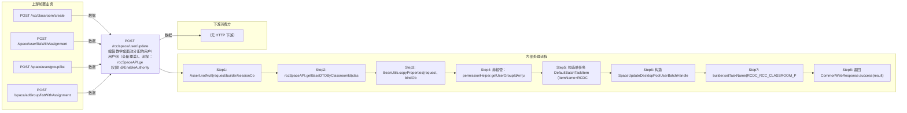

# POST /rcc/space/user/update

> 编辑教学桌面池分配的用户/用户组（全量覆盖）。流程：rccSpaceAPI.getBaseDTOByClassroomId 校验空间存在（失败审计并返回 RCDC_RCC_CLASSROOM_POOL_UPDATE_BIND_OBJ_FAIL）；BeanUtils.copyProperties → SpaceUpdatePoolBindObjectDTO；非超管时 getUserGroupIdArr 获取管理员用户组权限并 desktopPoolWebHelper.checkGroupPermission 校验（RCDC_RCC_CLASSROOM_POOL_NO_USER_GROUP_AUTH/NO_USER_AUTH）；构造单任务项注册 SpaceUpdateDesktopPoolUserBatchHandler 提交（setUniqueId=classroomId）。Handler 执行 updatePoolBindObject 更新绑定关系（非超管会把权限外已绑定的用户组加回 selectedGroupIdList 防止误删）。 ｜ @EnableAuthority ｜ 批量异步（BatchTask）

## 依赖关系全景图

## 接口基本信息

| 项目 | 内容 |
|---|---|
| URL | /rcc/space/user/update |
| Controller | RccSpaceController |
| 方法名 | updatePoolBindObject |
| 权限注解 | @EnableAuthority |
| 执行方式 | 批量异步（BatchTask） |
| 业务含义 | 编辑教学桌面池分配的用户/用户组（全量覆盖）。流程：rccSpaceAPI.getBaseDTOByClassroomId 校验空间存在（失败审计并返回 RCDC_RCC_CLASSROOM_POOL_UPDATE_BIND_OBJ_FAIL）；BeanUtils.copyProperties → SpaceUpdatePoolBindObjectDTO；非超管时 getUserGroupIdArr 获取管理员用户组权限并 desktopPoolWebHelper.checkGroupPermission 校验（RCDC_RCC_CLASSROOM_POOL_NO_USER_GROUP_AUTH/NO_USER_AUTH）；构造单任务项注册 SpaceUpdateDesktopPoolUserBatchHandler 提交（setUniqueId=classroomId）。Handler 执行 updatePoolBindObject 更新绑定关系（非超管会把权限外已绑定的用户组加回 selectedGroupIdList 防止误删）。 |

## 入参详情

### UpdatePoolBindObjectWebRequest

| 参数名 | 类型 | 必填 | 约束 | 说明 |
|---|---|---|---|---|
| classroomId | UUID | 是 | @NotNull | 教室ID |
| addUserByIdList | List<UUID> | 否 | @Nullable | 新增用户ID列表 |
| deleteUserByIdList | List<UUID> | 否 | @Nullable | 删除用户ID列表 |
| deleteUserByGroupIdList | List<UUID> | 否 | @Nullable | 删除用户组下所有用户的用户组列表 |
| exceptList | List<GroupExceptUserDTO> | 否 | @Nullable | 新增用户组下用户时排除的用户列表 |
| selectedGroupIdList | List<UUID> | 否 | @Nullable | 全量桌面池分配的用户组列表 |
| selectedAdGroupIdList | List<UUID> | 否 | @Nullable | 全量桌面池分配的 AD 安全组列表 |
| selectedLdapGroupIdList | List<UUID> | 否 | @Nullable | 全量桌面池分配的 LDAP 组列表 |

## 出参详情

| 返回类型 | CommonWebResponse<?>（data=BatchTaskSubmitResult） |
|---|---|

| 字段 | 类型 | 说明 |
|---|---|---|
| taskId | UUID | 批量任务ID |
| taskStatus | String | 任务状态 |

## 上游前置业务

### 前置1：POST /rcc/classroom/create

教室ID，来源为教室创建返回（由 field_map 契约映射）

### 前置2：POST /space/user/listWithAssignment

新增用户ID列表，来源为用户分配信息列表（推断字段名 userId/id）（由 field_map 契约映射）

### 前置3：POST /space/user/group/list

全量分配的用户组ID列表，来源为用户组树（推断字段名 id/groupId）（由 field_map 契约映射）

### 前置4：POST /space/adGroup/listWithAssignment

全量分配的AD安全组ID列表（推断字段名 adGroupId/id）（由 field_map 契约映射）
## 内部处理流程

### 批量处理器：SpaceUpdateDesktopPoolUserBatchHandler

| 步骤 | 说明 |
|---|---|
| 1 | rccSpaceAPI.getBaseDTOByClassroomId(classroomId) 取名称 |
| 2 | checkGroupAuthAndAddDefaultGroup：非超管时把权限外的已绑定用户组（listClassroomPoolUser 中 relatedId 不在 groupIdArr 的组）追加回 selectedGroupIdList |
| 3 | spaceClassroomPoolUserMgmtAPI.updatePoolBindObject(bindObjectDTO) 全量更新绑定关系 |
| 4 | 成功：auditLogAPI.recordLog(RCDC_RCC_CLASSROOM_POOL_UPDATE_BIND_OBJ_ITEM_SUCCESS_DESC) |
| 5 | 失败：recordLog(ITEM_FAIL_DESC) 并抛 RCDC_RCC_CLASSROOM_POOL_UPDATE_BIND_OBJ_ITEM_FAIL_DESC |
| 6 | onFinish：RCDC_RCC_CLASSROOM_POOL_UPDATE_BIND_OBJ_TASK_SUCCESS/FAIL |

### 处理流程

1. Assert.notNull(request/builder/sessionContext)
2. rccSpaceAPI.getBaseDTOByClassroomId(classroomId) 查空间；失败审计 RCDC_RCC_CLASSROOM_POOL_UPDATE_BIND_OBJ_FAIL_LOG 并返回 fail RCDC_RCC_CLASSROOM_POOL_UPDATE_BIND_OBJ_FAIL
3. BeanUtils.copyProperties(request, bindObjectDTO)，setClassroomId
4. 非超管：permissionHelper.getUserGroupIdArr(userId)；desktopPoolWebHelper.checkGroupPermission(bindObjectDTO, groupIdArr)
5. 构造单任务 DefaultBatchTaskItem（itemName=RCDC_RCC_CLASSROOM_POOL_UPDATE_BIND_OBJ）
6. 构造 SpaceUpdateDesktopPoolUserBatchHandler 注入 rccSpaceAPI/auditLogAPI/spaceClassroomPoolUserMgmtAPI
7. builder.setTaskName(RCDC_RCC_CLASSROOM_POOL_UPDATE_BIND_OBJ_TASK_NAME).setTaskDesc(...).setUniqueId(classroomId).registerHandler(handler).start()
8. 返回 CommonWebResponse.success(result)

## 下游消费方

（本接口数据主要被自身/关联接口消费，或经 SPI 通知）

> 📖 错误码/状态码对照表见 **code_map_all.md**（工程级全量）与 **error_code_map_tci_strategy.md**（TCI 接口级，含触发条件）。

## 接口参数约束分析

| 层级 | 参数 | 规则 | 失败结果 |
|---|---|---|---|
| PARAM | classroomId | @NotNull | Assert 失败 |
| BUSINESS | classroomId | 空间必须存在 | getBaseDTOByClassroomId 失败返回 RCDC_RCC_CLASSROOM_POOL_UPDATE_BIND_OBJ_FAIL |
| BUSINESS | selectedGroupIdList/涉及用户组 | 非超管涉及的用户组必须在权限内 | 抛 RCDC_RCC_CLASSROOM_POOL_NO_USER_GROUP_AUTH（62100120） |
| BUSINESS | 涉及用户 | 非超管涉及用户的所属组必须在权限内 | 抛 RCDC_RCC_CLASSROOM_POOL_NO_USER_AUTH（62100121） |

## 参数取值策略

| 参数 | 策略 | 说明 |
|---|---|---|
| classroomId | user_input/from_query | 按业务构造 |
| addUserByIdList | user_input/from_query | 按业务构造 |
| deleteUserByIdList | user_input/from_query | 按业务构造 |
| deleteUserByGroupIdList | user_input/from_query | 按业务构造 |
| exceptList | user_input/from_query | 按业务构造 |
| selectedGroupIdList | user_input/from_query | 按业务构造 |
| selectedAdGroupIdList | user_input/from_query | 按业务构造 |
| selectedLdapGroupIdList | user_input/from_query | 按业务构造 |

## 成功/失败断言基准

### 成功场景

| 场景 | 断言点 |
|---|---|
| 超管更新绑定用户/用户组 | 提交任务并返回 BatchTaskSubmitResult，任务成功更新绑定关系 |
| 非超管更新 | 权限外已绑定用户组被保留，仅更新权限内部分 |

### 失败场景

| 场景 | 触发条件 | 断言点 |
|---|---|---|
| 空间不存在 | classroomId 无效 | $.status==ERROR 且 $.msgKey==RCDC_RCC_CLASSROOM_POOL_UPDATE_BIND_OBJ_FAIL |
| 越权操作用户组 | selectedGroupIdList 含权限外组 | $.status==ERROR 且 $.msgKey==RCDC_RCC_CLASSROOM_POOL_NO_USER_GROUP_AUTH |

## 环境清理机制

| 接口 | 说明 |
|---|---|
| 本接口创建的资源 | 通过对应 delete 接口清理 |

## 前置状态和幂等性标注

| 维度 | 结论 |
|---|---|
| 幂等性 | MEDIUM |
| 说明 | BatchTask uniqueId=classroomId 防止同教室并发重复任务；全量覆盖式更新，相同入参重复执行结果幂等但审计日志重复 |
