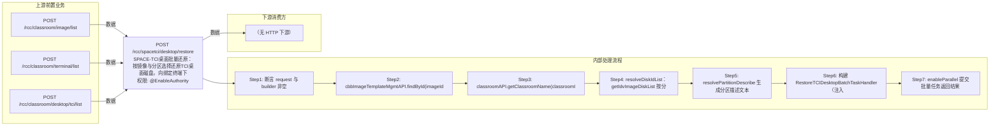

# POST /rcc/spacetci/desktop/restore

> SPACE-TCI桌面批量还原：按镜像与分区选择还原TCI桌面磁盘，向绑定终端下发 shine 还原指令。 ｜ @EnableAuthority ｜ batch

## 依赖关系全景图

## 接口基本信息

| 项目 | 内容 |
|---|---|
| URL | /rcc/spacetci/desktop/restore |
| Controller | RccSpaceTCIDesktopController |
| 方法名 | restoreTCIDesktop |
| 权限注解 | @EnableAuthority |
| 执行方式 | batch |
| 业务含义 | SPACE-TCI桌面批量还原：按镜像与分区选择还原TCI桌面磁盘，向绑定终端下发 shine 还原指令。 |

## 入参详情

### RestoreTCIDesktopRequest

| 参数名 | 类型 | 必填 | 约束 | 说明 |
|---|---|---|---|---|
| deskList | List<TCIDeskInfo> | 是 | @NotEmpty 非空 | 待还原TCI桌面信息列表 |
| deskList[].deskId | UUID | 是 | @NotNull 非空 | TCI桌面ID |
| deskList[].computerName | String | 是 | @NotNull 非空 | TCI桌面计算机名 |
| imageId | UUID | 是 | @NotNull 非空 | 目标镜像模板ID |
| partitionArr | Integer[] | 是 | @NotEmpty 非空，值为0(系统分区)/1(数据分区) | 待还原的分区数组 |
| classroomId | UUID | 是 | @NotNull 非空 | 教室ID |

## 出参详情

| 返回类型 | DefaultWebResponse |
|---|---|

| 字段 | 类型 | 说明 |
|---|---|---|
| content | BatchTaskSubmitResult | 批量任务提交结果（还原由后台异步执行） |

## 上游前置业务

### 前置1：POST /rcc/classroom/image/list

推断：镜像ID来源，字段名为推断（由 field_map 契约映射）

### 前置2：POST /rcc/classroom/terminal/list

教室ID在创建教室(POST /rcc/classroom/create)后经教室终端列表查询获得（ViewClassroomInfoEntity.classroomId）（由 field_map 契约映射）

### 前置3：POST /rcc/classroom/desktop/tci/list

推断：TCI桌面列表出参desktopId映射到deskList[].deskId（RestoreTCIDesktopRequest.TCIDeskInfo.deskId），字段名为推断（由 field_map 契约映射）
## 内部处理流程

### 批量处理器：RestoreTCIDesktopBatchTaskHandler

| 步骤 | 说明 |
|---|---|
| 1 | 取桌面名（deskIdNameMap） |
| 2 | getBindTerminalId：enableTeacher则取 classroomTeacherAPI.getTeacherByClassroomId 的 teacherTerminalId，否则 seatAPI.getSeatInfo 的 terminalId |
| 3 | 终端ID为空：记 RCC_RESTORE_TCI_DESKTOP_FAIL_NOT_FIND_TERMINAL 并返回 FAILURE |
| 4 | 构造 RccRestoreTCIDesktopDTO{imageId, diskIdList} |
| 5 | rccTerminalOperatorAPI.notifyTerminalRestoreTCIDesktop(terminalId, dto) 向终端下发 shine 还原指令 |
| 6 | 返回码0：记 RCC_RESTORE_TCI_DESKTOP_TASK_SUCCESS 成功；否则记默认失败日志并返回 FAILURE |

### 处理流程

1. 断言 request 与 builder 非空
2. cbbImageTemplateMgmtAPI.findById(imageId) 校验镜像存在并取镜像信息
3. classroomAPI.getClassroomName(classroomId) 取教室名
4. resolveDiskIdList：getIdvImageDiskList 按分区号（0系统/1数据）映射出磁盘ID列表
5. resolvePartitionDescribe 生成分区描述文本
6. 构建 RestoreTCIDesktopBatchTaskHandler（注入 classroomTeacherAPI/seatAPI/classroomDesktopRelationAPI/rccTerminalOperatorAPI/auditLogAPI）
7. enableParallel 提交批量任务返回结果

## 下游消费方

（本接口数据主要被自身/关联接口消费，或经 SPI 通知）
## 接口参数约束分析

| 层级 | 参数 | 规则 | 失败结果 |
|---|---|---|---|
| PARAM | deskList/imageId/partitionArr/classroomId | 全部非空 | 参数校验失败（@NotEmpty/@NotNull） |
| PARAM | partitionArr | 分区值必须为0(系统)或1(数据)且对应磁盘存在 | diskIdMap 中无对应分区时返回空导致磁盘ID为空 |
| BIZ | desktop | 桌面必须绑定终端（教师机配置或座位绑定） | RCC_RESTORE_TCI_DESKTOP_FAIL_NOT_FIND_TERMINAL（座位未绑定终端） |
| BIZ | imageId | 镜像必须存在 | cbbImageTemplateMgmtAPI.findById 抛异常 |

## 参数取值策略

| 参数 | 策略 | 说明 |
|---|---|---|
| deskList | user_input/from_query | 按业务构造 |
| deskList[].deskId | user_input/from_query | 按业务构造 |
| deskList[].computerName | user_input/from_query | 按业务构造 |
| imageId | user_input/from_query | 按业务构造 |
| partitionArr | user_input/from_query | 按业务构造 |
| classroomId | user_input/from_query | 按业务构造 |

## 成功/失败断言基准

### 成功场景

| 场景 | 断言点 |
|---|---|
| 镜像存在、桌面绑定终端且终端返回成功 | 批量任务提交成功，终端返回0，逐台还原成功 |

### 失败场景

| 场景 | 触发条件 | 断言点 |
|---|---|---|
| 桌面未绑定终端 | 教师机未配置或座位无终端 | 单项失败 rcc_restore_tci_desktop_fail_not_find_terminal |
| 终端执行还原失败 | shine 返回非0码或抛 BusinessException | 单项失败 rcc_restore_tci_desktop_task_default_fail_log / fail_log |

## 环境清理机制

| 接口 | 说明 |
|---|---|
| 本接口创建的资源 | 通过对应 delete 接口清理 |

## 前置状态和幂等性标注

| 维度 | 结论 |
|---|---|
| 幂等性 | low |
| 说明 | 还原会覆盖TCI本地磁盘，重复执行会再次还原；任务级不幂等 |
