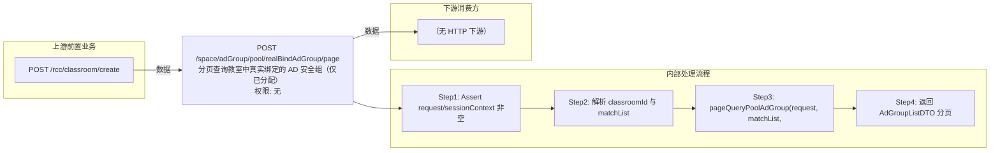

# POST /space/adGroup/pool/realBindAdGroup/page

> 分页查询教室中真实绑定的 AD 安全组（仅已分配） ｜ 无特殊权限 ｜ sync

## 依赖关系全景图

## 接口基本信息

| 项目 | 内容 |
|---|---|
| URL | /space/adGroup/pool/realBindAdGroup/page |
| Controller | SpaceAdUserController |
| 方法名 | pageDesktopPoolRealBindUser |
| 权限注解 | 无 |
| 执行方式 | sync |
| 业务含义 | 分页查询教室中真实绑定的 AD 安全组（仅已分配） |

## 入参详情

### PageQueryRequest

| 参数名 | 类型 | 必填 | 约束 | 说明 |
|---|---|---|---|---|
| page | Integer | 是 | pagekit 分页参数 | 页码 |
| limit | Integer | 是 | pagekit 分页参数 | 每页条数 |
| matchArr | Match[] | 是 | 需含 classroomId 匹配条件 | 查询条件 |

## 出参详情

| 返回类型 | CommonWebResponse<DefaultPageResponse<AdGroupListDTO>> |
|---|---|

| 字段 | 类型 | 说明 |
|---|---|---|
| itemArr | AdGroupListDTO[] | 真实绑定的AD安全组列表 |
| total | Long | 总数 |
| itemArr[].id | UUID | 安全组ID |
| itemArr[].name | String | 安全组名称 |
| itemArr[].email | String | 邮箱 |
| itemArr[].domain | String | 域（如 ruijiead.com.cn） |
| itemArr[].remark | String | 备注 |
| itemArr[].ou | String | 所在文件夹（部门1/部门2） |
| itemArr[].objectGuid | String | AD域组主键ID |
| itemArr[].serverType | DomainServerType | 域服务器类型 |
| itemArr[].createTime | Date | 创建时间 |
| itemArr[].updateTime | Date | 更新时间 |
| itemArr[].isAssigned | Boolean | 是否已分配 |
| itemArr[].disabled | Boolean | 是否需要禁用 |
## 上游前置业务

### 前置1：POST /rcc/classroom/create

教室ID（通过 exact match 字段 classroomId 传入），来源为教室创建返回（由 field_map 契约映射）
## 内部处理流程

### 处理流程

1. Assert request/sessionContext 非空
2. 解析 classroomId 与 matchList
3. pageQueryPoolAdGroup(request, matchList, classroomId, assigned=true, page)
4. 返回 AdGroupListDTO 分页

## 下游消费方

### 消费1：POST /space/adGroup/pool/realBindAdGroup/page

真实绑定AD安全组ID列表（由 field_map 契约映射）
## 接口参数约束分析

| 层级 | 参数 | 规则 | 失败结果 |
|---|---|---|---|
| request | request | 非空且需含 classroomId 匹配条件 | 缺少classroomId时 Assert 失败 |

## 参数取值策略

| 参数 | 策略 | 说明 |
|---|---|---|
| page | user_input/from_query | 按业务构造 |
| limit | user_input/from_query | 按业务构造 |
| matchArr | user_input/from_query | 按业务构造 |

## 成功/失败断言基准

### 成功场景

| 场景 | 断言点 |
|---|---|
| 正常查询 | $.content.itemArr 非空 |

### 失败场景

| 场景 | 触发条件 | 断言点 |
|---|---|---|
| 权限不足 | 无授权 | 403 |

## 环境清理机制

| 接口 | 说明 |
|---|---|
| 本接口创建的资源 | 通过对应 delete 接口清理 |

## 前置状态和幂等性标注

| 维度 | 结论 |
|---|---|
| 幂等性 | high |
| 说明 | 纯查询接口 |
