# POST /space/clouddesktop/deskNetwork/list

> 分页查询云桌面网络策略。从 matchArr 抽取 imageTemplateId/storagePoolId/cbbImageType（过滤掉 VDI 类型），经 PlatformNetworkMgmtAPI.pageQuery 查询网络策略分页；逐条 getDeskNetwork 补充 ipPoolArr 与 vswitch 关联集群（过滤不存在的集群并拼接集群名）；最后构造 DesktopNetworkResAdaptCheckRequest 调计算集群适配检查接口，将 canUsed/canUsedMessage 回填到每个网络策略后返回。 ｜ 无特殊权限 ｜ 同步分页：网络策略分页 + 关联集群/ip池装配 + 网络资源适配性检查回填可用性

## 依赖关系全景图

```mermaid
graph LR
    subgraph 上游前置业务
        A1["（无 HTTP 上游，内部服务调用）"]
    end
    B["POST /space/clouddesktop/deskNetwork/list<br>分页查询云桌面网络策略。从 matchArr 抽取 imageTemplateI<br>权限: 无"]
    A1 -->|数据| B
    subgraph 内部处理流程
        C1["Step1: Assert.notNull(pageQueryRequest)"]
        C2["Step2: 遍历 matchArr 抽取 imageTemplateId/storagePo"]
        C3["Step3: 构建分页请求并调 cbbNetworkMgmtAPI.pageQuery 查询网"]
        C4["Step4: 结果为空 → 返回 DefaultWebResponse.success()（空"]
        C5["Step5: clusterAPI.queryAllClusterInfoMap() 构建集群"]
        C6["Step6: buildNetworkStrategyVOArr：逐条 getDeskNetw"]
        C1 --> C2
        C7["Step7: 构造 DesktopNetworkResAdaptCheckRequest 调 "]
        C8["Step8: 按 deskNetworkId 建立 map，回填 canUsed/canUse"]
        C9["Step9: 返回 DefaultWebResponse.success(PageRespon"]
        C6 --> C7
        C7 --> C8
        C8 --> C9
        C2 --> C3
        C3 --> C4
        C4 --> C5
        C5 --> C6
    end
    B --> C1
    subgraph 下游消费方
        D1["空间/桌面池网络配置"]
    end
    B -->|数据| D1
```

## 接口基本信息

| 项目 | 内容 |
|---|---|
| URL | /space/clouddesktop/deskNetwork/list |
| Controller | SpaceDeskNetworkController |
| 方法名 | listDeskNetwork |
| 权限注解 | 无 |
| 执行方式 | 同步分页：网络策略分页 + 关联集群/ip池装配 + 网络资源适配性检查回填可用性 |
| 业务含义 | 分页查询云桌面网络策略。从 matchArr 抽取 imageTemplateId/storagePoolId/cbbImageType（过滤掉 VDI 类型），经 PlatformNetworkMgmtAPI.pageQuery 查询网络策略分页；逐条 getDeskNetwork 补充 ipPoolArr 与 vswitch 关联集群（过滤不存在的集群并拼接集群名）；最后构造 DesktopNetworkResAdaptCheckRequest 调计算集群适配检查接口，将 canUsed/canUsedMessage 回填到每个网络策略后返回。 |

## 入参详情

### PageQueryRequest（框架类，matchArr 支持 imageTemplateId/storagePoolId/cbbImageType 特殊字段）

| 参数名 | 类型 | 必填 | 约束 | 说明 |
|---|---|---|---|---|
| page | Integer | 是 | 分页页码（0 基） | pageQueryRequest.getPage() |
| limit | Integer | 是 | 每页条数上限 | pageQueryRequest.getLimit() |
| matchArr[].fieldName=imageTemplateId | UUID[] | 否 | EXACT 匹配 | 镜像模板 id 数组，用于适配性检查 |
| matchArr[].fieldName=storagePoolId | UUID[] | 否 | EXACT 匹配 | 存储池 id 数组，用于适配性检查 |
| matchArr[].fieldName=cbbImageType | CbbImageType[] | 否 | EXACT 匹配，VDI 被过滤 | 镜像类型数组，VDI 类型剔除不参与适配性检查 |
| sortArr | Sort[] | 否 | 排序条件 | 透传 |

## 出参详情

| 返回类型 | DefaultWebResponse<PageResponseContent<NetworkStrategyDetailVO>> |
|---|---|

| 字段 | 类型 | 说明 |
|---|---|---|
| itemArr | NetworkStrategyDetailVO[] | 网络策略详情数组 |
| total | long | 总条数 |
| cbbDeskNetworkBasicInfoDTO | CbbDeskNetworkBasicInfoDTO | 网络策略基础信息（id/name/ip 等） |
| rcoNetworkStrategyDetailDTO.ipPoolArr | IpPoolDTO[] | IP 池信息，getDeskNetwork 获取 |
| canUsed | Boolean | 适配性检查结果（默认 true，失败置 false） |
| canUsedMessage | String | 不可用原因（适配性检查回填） |
| clusterIdArr | UUID[] | vswitch 关联且仍存在的计算集群 id（过滤不存在集群） |
| clusterInfoDTO.clusterName | String | 关联集群名称（逗号拼接） |

## 上游前置业务

（无上游数据依赖）
## 内部处理流程

### 处理流程

1. Assert.notNull(pageQueryRequest)
2. 遍历 matchArr 抽取 imageTemplateId/storagePoolId/cbbImageType（过滤 VDI），其余 match 保留
3. 构建分页请求并调 cbbNetworkMgmtAPI.pageQuery 查询网络策略
4. 结果为空 → 返回 DefaultWebResponse.success()（空响应）
5. clusterAPI.queryAllClusterInfoMap() 构建集群 map
6. buildNetworkStrategyVOArr：逐条 getDeskNetwork 取 ipPoolArr；解析 vswitch clusterIdArr 过滤存在集群并拼接集群名
7. 构造 DesktopNetworkResAdaptCheckRequest 调 clusterAPI.desktopNetworkResAdaptCheck
8. 按 deskNetworkId 建立 map，回填 canUsed/canUsedMessage
9. 返回 DefaultWebResponse.success(PageResponseContent)

## 下游消费方

### 消费1：POST /space/clouddesktop/deskNetwork/list

网络策略ID，被空间/桌面池网络配置消费（推断字段名 id/networkId）（由 field_map 契约映射）
## 接口参数约束分析

| 层级 | 参数 | 规则 | 失败结果 |
|---|---|---|---|
| BUSINESS | cbbImageType | VDI 镜像类型不参与网络适配性检查 | 被过滤不返回错误 |
| BUSINESS | clusterIdArr | vswitch 关联的集群不存在时过滤 | 被过滤的集群不参与检查与展示 |

## 参数取值策略

| 参数 | 策略 | 说明 |
|---|---|---|
| page | user_input/from_query | 按业务构造 |
| limit | user_input/from_query | 按业务构造 |
| matchArr[].fieldName=imageTemplateId | user_input/from_query | 按业务构造 |
| matchArr[].fieldName=storagePoolId | user_input/from_query | 按业务构造 |
| matchArr[].fieldName=cbbImageType | user_input/from_query | 按业务构造 |
| sortArr | user_input/from_query | 按业务构造 |

## 成功/失败断言基准

### 成功场景

| 场景 | 断言点 |
|---|---|
| 存在网络策略且适配通过 | 返回 200，canUsed=true |
| 无网络策略数据 | 返回 200 空响应 |
| 适配检查失败 | canUsed=false 且携带 canUsedMessage |

### 失败场景

| 场景 | 触发条件 | 断言点 |
|---|---|---|
| pageQueryRequest 为 null | 请求体缺失 | Assert.notNull 异常（400） |

## 环境清理机制

| 接口 | 说明 |
|---|---|
| 无 | 只读查询接口 |

## 前置状态和幂等性标注

| 维度 | 结论 |
|---|---|
| 幂等性 | HIGH |
| 说明 | 只读查询，无副作用 |
