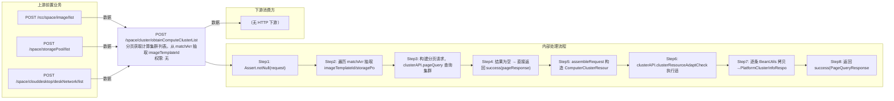

# POST /space/cluster/obtainComputeClusterList

> 分页获取计算集群列表。从 matchArr 抽取 imageTemplateId/storagePoolId/networkId 数组，其余 match 保留后经 PlatformComputeClusterMgmtAPI.pageQuery 分页查询集群；再构造 ComputerClusterResourceAdaptCheckRequest（fromImage=false）调用 clusterResourceAdaptCheck 做资源适配性检查，将 canUsed/canUsedMessage/canInstallDrive 合并进 PlatformClusterInfoResponse 返回。 ｜ 无特殊权限 ｜ 同步分页：计算集群分页 + 资源适配性检查回填 canUsed/canInstallDrive

## 依赖关系全景图

## 接口基本信息

| 项目 | 内容 |
|---|---|
| URL | /space/cluster/obtainComputeClusterList |
| Controller | SpaceClusterController |
| 方法名 | obtainComputeClusterList |
| 权限注解 | 无 |
| 执行方式 | 同步分页：计算集群分页 + 资源适配性检查回填 canUsed/canInstallDrive |
| 业务含义 | 分页获取计算集群列表。从 matchArr 抽取 imageTemplateId/storagePoolId/networkId 数组，其余 match 保留后经 PlatformComputeClusterMgmtAPI.pageQuery 分页查询集群；再构造 ComputerClusterResourceAdaptCheckRequest（fromImage=false）调用 clusterResourceAdaptCheck 做资源适配性检查，将 canUsed/canUsedMessage/canInstallDrive 合并进 PlatformClusterInfoResponse 返回。 |

## 入参详情

### PageQueryRequest（框架类，matchArr 支持 imageTemplateId/storagePoolId/networkId 特殊字段）

| 参数名 | 类型 | 必填 | 约束 | 说明 |
|---|---|---|---|---|
| page | Integer | 是 | 分页页码 | request.getPage() |
| limit | Integer | 是 | 每页条数 | request.getLimit() |
| matchArr[].fieldName=imageTemplateId | UUID[] | 否 | EXACT 匹配 | 镜像模板 id 数组，用于适配性检查 |
| matchArr[].fieldName=storagePoolId | UUID[] | 否 | EXACT 匹配 | 存储池 id 数组 |
| matchArr[].fieldName=networkId | UUID[] | 否 | EXACT 匹配 | 网络策略 id 数组 |
| sortArr | Sort[] | 否 | 排序 | 透传 |

## 出参详情

| 返回类型 | DefaultWebResponse<PageQueryResponse<PlatformClusterInfoResponse>> |
|---|---|

| 字段 | 类型 | 说明 |
|---|---|---|
| itemArr | PlatformClusterInfoResponse[] | 集群列表（元素字段见下） |
| total | long | 总条数 |
| id | UUID | 集群ID |
| computerClusterId | UUID | 计算集群ID |
| clusterName | String | 集群名称 |
| clusterDesc | String | 集群描述 |
| clusterState | CloudClusterStateEnums | 集群状态 |
| totalCpu | long | 总CPU核数 |
| usedCpu | long | 已用CPU核数 |
| totalMemory | long | 总内存（MB） |
| usedMemory | long | 已用内存（MB） |
| architecture | String | CPU架构（x86_64、ARM） |
| platformId | UUID | 平台ID |
| createTime | Date | 创建时间 |
| updateTime | Date | 更新时间 |
| platformName | String | 云平台名称 |
| platformType | CloudPlatformType | 云平台类型 |
| platformStatus | CloudPlatformStatus | 云平台状态 |
| cloudPlatformId | String | 云平台唯一标识 |
| archSet | Set<String> | CPU架构集合 |
| canUsed | Boolean | 适配性检查是否可用（默认true） |
| canUsedMessage | String | 不可用原因 |
| canInstallDrive | Boolean | 是否可安装驱动（适配检查回填，默认false） |

## 上游前置业务

### 前置1：POST /rcc/space/image/list

镜像模板ID筛选（可空），来源为镜像列表（由 field_map 契约映射）

### 前置2：POST /space/storagePool/list

存储池ID筛选（可空）（由 field_map 契约映射）

### 前置3：POST /space/clouddesktop/deskNetwork/list

网络ID筛选（可空）（由 field_map 契约映射）
## 内部处理流程

### 处理流程

1. Assert.notNull(request)
2. 遍历 matchArr 抽取 imageTemplateId/storagePoolId/networkId，其余 match 保留
3. 构建分页请求，clusterAPI.pageQuery 查询集群
4. 结果为空 → 直接返回 success(pageResponse)
5. assembleRequest 构造 ComputerClusterResourceAdaptCheckRequest（fromImage=false，携带 clusterList）
6. clusterAPI.clusterResourceAdaptCheck 执行适配检查，结果转 Map<clusterId, result>
7. 逐条 BeanUtils 拷贝→PlatformClusterInfoResponse，合并 canUsed/canUsedMessage/canInstallDrive
8. 返回 success(PageQueryResponse<PlatformClusterInfoResponse>)

## 下游消费方

### 消费1：POST /space/cluster/obtainComputeClusterList

计算集群ID，被 /space/deskStrategy/vgpu/list、getClusterSupportEnablePersonalConfig、策略 condition/list 消费（由 field_map 契约映射）
## 接口参数约束分析

| 层级 | 参数 | 规则 | 失败结果 |
|---|---|---|---|
| BUSINESS | 集群 | 集群不满足镜像/存储池/网络适配条件时置为不可用 | canUsed=false 并携带 canUsedMessage（接口不报错） |

## 参数取值策略

| 参数 | 策略 | 说明 |
|---|---|---|
| page | user_input/from_query | 按业务构造 |
| limit | user_input/from_query | 按业务构造 |
| matchArr[].fieldName=imageTemplateId | user_input/from_query | 按业务构造 |
| matchArr[].fieldName=storagePoolId | user_input/from_query | 按业务构造 |
| matchArr[].fieldName=networkId | user_input/from_query | 按业务构造 |
| sortArr | user_input/from_query | 按业务构造 |

## 成功/失败断言基准

### 成功场景

| 场景 | 断言点 |
|---|---|
| 有集群且适配通过 | $.content.itemArr 非空 且 $.content.itemArr[0].canUsed==true |
| 无集群数据 | $.content.itemArr 为空 |
| 集群资源不满足条件 | $.content.itemArr[0].canUsed==false 且 $.content.itemArr[0].canUsedMessage 非空 |

### 失败场景

| 场景 | 触发条件 | 断言点 |
|---|---|---|
| request 为 null | 请求体缺失 | $.status==ERROR |

## 环境清理机制

| 接口 | 说明 |
|---|---|
| 无 | 只读查询接口 |

## 前置状态和幂等性标注

| 维度 | 结论 |
|---|---|
| 幂等性 | HIGH |
| 说明 | 只读查询，无副作用 |
