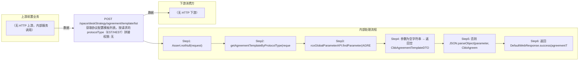

# POST /space/deskStrategy/agreement/template/list

> 获取协议配置模板列表。按请求的 protocolType（EST/HEST）拼接全局参数 key（AGREEMENT_TEMPLATE_LIST + 协议名小写）从 PlatformRcoGlobalParameterAPI.findParameter 读取 JSON 字符串并反序列化为 CbbAgreementTemplateDTO；参数不存在时返回空模板对象。 ｜ 无特殊权限 ｜ 同步查询：按协议类型读取全局参数中的协议配置模板（EST/HEST）

## 依赖关系全景图

## 接口基本信息

| 项目 | 内容 |
|---|---|
| URL | /space/deskStrategy/agreement/template/list |
| Controller | SpaceUsbStrategyController |
| 方法名 | getAgreementTemplate |
| 权限注解 | 无 |
| 执行方式 | 同步查询：按协议类型读取全局参数中的协议配置模板（EST/HEST） |
| 业务含义 | 获取协议配置模板列表。按请求的 protocolType（EST/HEST）拼接全局参数 key（AGREEMENT_TEMPLATE_LIST + 协议名小写）从 PlatformRcoGlobalParameterAPI.findParameter 读取 JSON 字符串并反序列化为 CbbAgreementTemplateDTO；参数不存在时返回空模板对象。 |

## 入参详情

### EstConfigRequest

| 参数名 | 类型 | 必填 | 约束 | 说明 |
|---|---|---|---|---|
| protocolType | CbbEstProtocolType | 是 | @NotNull（支持 EST、HEST） | 协议类型，用于拼接全局参数 key |

## 出参详情

| 返回类型 | DefaultWebResponse<CbbAgreementTemplateDTO> |
|---|---|

| 字段 | 类型 | 说明 |
|---|---|---|
| lanTemplateList | List<CbbHestConfigDTO> | 局域网配置模板列表 |
| wanTemplateList | List<CbbHestConfigDTO> | 广域网配置模板列表（元素结构与 lanTemplateList 一致） |
| lanTemplateList[].templateId | Integer | 模板ID |
| lanTemplateList[].enableCustomTemplate | Boolean | 是否启用自定义模板 |
| lanTemplateList[].name | CbbEstDisplayModeEnum | 显示模式枚举 |
| lanTemplateList[].customize | Integer | 自定义项 |
| lanTemplateList[].transport | Integer | 传输协议 |
| lanTemplateList[].adaptDisplay | Integer | 自适应显示 |
| lanTemplateList[].bitrate | Integer | 码率 |
| lanTemplateList[].videoBitrate | Integer | 视频码率 |
| lanTemplateList[].framerate | Integer | 帧率 |
| lanTemplateList[].minFramerate | Integer | 最小帧率 |
| lanTemplateList[].quality | Integer | 画质 |
| lanTemplateList[].fastStreamMode | Integer | 快速流模式 |
| lanTemplateList[].videoCodec | Integer | 视频编码方式 |
| lanTemplateList[].reencode | Integer | 重编码 |
| lanTemplateList[].adaptSound | Integer | 自适应音质 |
| lanTemplateList[].sndPlayback | Integer | 声音播放 |
| lanTemplateList[].sndUdp | Integer | 声音UDP |
| lanTemplateList[].sndQuality | Integer | 声音质量 |
| lanTemplateList[].enableWebAdvanceSetting | Integer | 是否启用网页高级设置 |
| lanTemplateList[].webAdvanceSettingInfo | JSONObject | 网页高级设置信息 |
| lanTemplateList[].enableSsl | Boolean | 是否启用SSL |
| lanTemplateList[].displayQuality | Integer | 显示质量 |
| lanTemplateList[].samplingRate | Integer | 采样率 |
| lanTemplateList[].globalOperationControl | String | 全局操作控制 |
| lanTemplateList[].enableAppDisplayMode | Boolean | 是否启用应用显示模式 |
| lanTemplateList[].hardware | Boolean | 是否硬件加速 |
| lanTemplateList[].colorAccuracy | Integer | 色彩精度 |
| lanTemplateList[].fullFps | Boolean | 是否满帧率 |
| lanTemplateList[].playOutDelay | Integer | 播放延迟 |
| lanTemplateList[].payload | CbbEstEncodingFormat | 编码格式 |
| lanTemplateList[].alphamode | Integer | alpha模式 |
| lanTemplateList[].enableAudioVideoOptimize | Boolean | 是否启用音视频优化 |
| lanTemplateList[].fecType | Integer | FEC类型 |
| lanTemplateList[].audioQuality | Integer | 音频质量 |
| lanTemplateList[].audioBitrate | Integer | 音频码率 |
| lanTemplateList[].mouseMode | Integer | 鼠标模式 |
| （说明） |  | wanTemplateList[] 元素字段与 lanTemplateList[] 相同（CbbHestConfigDTO） |
## 上游前置业务

> 本接口上游为服务端内部调用（非 HTTP 端点）：
> - 
## 内部处理流程

### 处理流程

1. Assert.notNull(request)
2. getAgreementTemplateByProtocolType(request.getProtocolType())；Assert.notNull(protocolType)
3. rcoGlobalParameterAPI.findParameter(AGREEMENT_TEMPLATE_LIST + protocolType.name().toLowerCase())
4. 参数为空字符串 → 返回空 CbbAgreementTemplateDTO
5. 否则 JSON.parseObject(parameter, CbbAgreementTemplateDTO.class)
6. 返回 DefaultWebResponse.success(agreementTemplate)

## 下游消费方

### 消费1：POST /space/deskStrategy/agreement/template/list

协议配置模板ID，被 VDI 策略创建时 templateId 引用（推断：DTO 来自 clouddesktop 依赖，字段以实际返回为准）（由 field_map 契约映射）
## 接口参数约束分析

| 层级 | 参数 | 规则 | 失败结果 |
|---|---|---|---|
| PARAM | protocolType | 必填且为合法 CbbEstProtocolType 枚举 | Assert.notNull(protocolType) 异常（400） |

## 参数取值策略

| 参数 | 策略 | 说明 |
|---|---|---|
| protocolType | user_input/from_query | 按业务构造 |

## 成功/失败断言基准

### 成功场景

| 场景 | 断言点 |
|---|---|
| 协议模板已配置 | $.content 非空 |
| 协议模板未配置 | $.status==SUCCESS 且 $.content 为空对象 |

### 失败场景

| 场景 | 触发条件 | 断言点 |
|---|---|---|
| protocolType 为空 | 请求缺省 protocolType | $.status==ERROR |

## 环境清理机制

| 接口 | 说明 |
|---|---|
| 无 | 只读查询 |

## 前置状态和幂等性标注

| 维度 | 结论 |
|---|---|
| 幂等性 | HIGH |
| 说明 | 只读查询，无副作用 |
