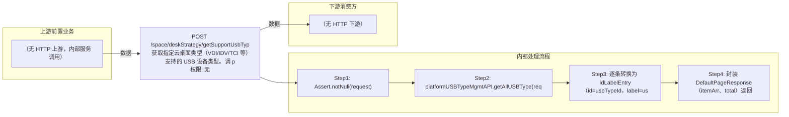

# POST /space/deskStrategy/getSupportUsbTyp

> 获取指定云桌面类型（VDI/IDV/TCI 等）支持的 USB 设备类型。调 platformUSBTypeMgmtAPI.getAllUSBType(cloudDeskType) 获取 CbbUSBTypeDTO 数组，转为 IdLabelEntry[]（id=USB类型id，label=类型名称），封装 DefaultPageResponse 返回。 ｜ 无特殊权限 ｜ 同步查询：按云桌面类型返回支持的 USB 设备类型列表

## 依赖关系全景图

## 接口基本信息

| 项目 | 内容 |
|---|---|
| URL | /space/deskStrategy/getSupportUsbTyp |
| Controller | SpaceUsbStrategyController |
| 方法名 | getSupportUsbTyp |
| 权限注解 | 无 |
| 执行方式 | 同步查询：按云桌面类型返回支持的 USB 设备类型列表 |
| 业务含义 | 获取指定云桌面类型（VDI/IDV/TCI 等）支持的 USB 设备类型。调 platformUSBTypeMgmtAPI.getAllUSBType(cloudDeskType) 获取 CbbUSBTypeDTO 数组，转为 IdLabelEntry[]（id=USB类型id，label=类型名称），封装 DefaultPageResponse 返回。 |

## 入参详情

### UsbTypeRequest

| 参数名 | 类型 | 必填 | 约束 | 说明 |
|---|---|---|---|---|
| cloudDeskType | CbbCloudDeskType | 是 | @NotNull | 云桌面类型，决定返回的 USB 设备类型集合 |

## 出参详情

| 返回类型 | DefaultWebResponse<DefaultPageResponse<IdLabelEntry>> |
|---|---|

| 字段 | 类型 | 说明 |
|---|---|---|
| itemArr | IdLabelEntry[] | 支持的 USB 设备类型列表 |
| total | int | USB 类型数量 |
| itemArr[].id | UUID | USB 类型 id（CbbUSBTypeDTO.id） |
| itemArr[].label | String | USB 类型名称（CbbUSBTypeDTO.usbTypeName） |

## 上游前置业务

> 本接口上游为服务端内部调用（非 HTTP 端点）：
> - 
## 内部处理流程

### 处理流程

1. Assert.notNull(request)
2. platformUSBTypeMgmtAPI.getAllUSBType(request.getCloudDeskType())
3. 逐条转换为 IdLabelEntry（id=usbTypeId，label=usbTypeName）
4. 封装 DefaultPageResponse（itemArr、total）返回 success

## 下游消费方

### 消费1：POST /space/deskStrategy/getSupportUsbTyp

支持的USB设备类型ID数组（IdLabelEntry.id），被 VDI/TCI 策略创建/编辑的 usbTypeIdArr 消费（由 field_map 契约映射）
## 接口参数约束分析

| 层级 | 参数 | 规则 | 失败结果 |
|---|---|---|---|
| PARAM | cloudDeskType | 必填且为合法 CbbCloudDeskType 枚举 | 参数校验失败（400） |

## 参数取值策略

| 参数 | 策略 | 说明 |
|---|---|---|
| cloudDeskType | user_input/from_query | 按业务构造 |

## 成功/失败断言基准

### 成功场景

| 场景 | 断言点 |
|---|---|
| 云桌面类型合法 | $.content.itemArr 非空 |

### 失败场景

| 场景 | 触发条件 | 断言点 |
|---|---|---|
| cloudDeskType 为空 | 请求缺省 cloudDeskType | $.status==ERROR |

## 环境清理机制

| 接口 | 说明 |
|---|---|
| 无 | 只读查询 |

## 前置状态和幂等性标注

| 维度 | 结论 |
|---|---|
| 幂等性 | HIGH |
| 说明 | 只读查询，无副作用 |
