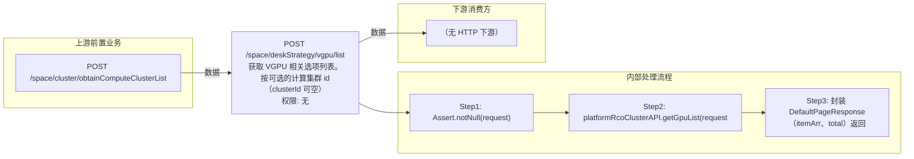

# POST /space/deskStrategy/vgpu/list

> 获取 VGPU 相关选项列表。按可选的计算集群 id（clusterId 可空）调 platformRcoClusterAPI.getGpuList 获取 VgpuVO 列表，封装 DefaultPageResponse 返回，用于策略 vGPU 配置下拉选项。 ｜ 无特殊权限 ｜ 同步查询：按集群查询可用的 VGPU 选项列表

## 依赖关系全景图

## 接口基本信息

| 项目 | 内容 |
|---|---|
| URL | /space/deskStrategy/vgpu/list |
| Controller | SpaceUsbStrategyController |
| 方法名 | getVGpuList |
| 权限注解 | 无 |
| 执行方式 | 同步查询：按集群查询可用的 VGPU 选项列表 |
| 业务含义 | 获取 VGPU 相关选项列表。按可选的计算集群 id（clusterId 可空）调 platformRcoClusterAPI.getGpuList 获取 VgpuVO 列表，封装 DefaultPageResponse 返回，用于策略 vGPU 配置下拉选项。 |

## 入参详情

### GetVgpuListWebRequest

| 参数名 | 类型 | 必填 | 约束 | 说明 |
|---|---|---|---|---|
| clusterId | UUID | 否 | @Nullable | 计算集群 id；不传时查询全部/按平台默认 |

## 出参详情

| 返回类型 | DefaultWebResponse<DefaultPageResponse<VgpuVO>> |
|---|---|

| 字段 | 类型 | 说明 |
|---|---|---|
| itemArr | VgpuVO[] | VGPU 选项列表 |
| total | int | VGPU 选项数量 |
| itemArr[].label | String | GPU标签名称（前端显示文本） |
| itemArr[].value | String | GPU值（唯一标识/配置值） |
## 上游前置业务

### 前置1：POST /space/cluster/obtainComputeClusterList

计算集群ID（可空），来源为集群列表（由 field_map 契约映射）
## 内部处理流程

### 处理流程

1. Assert.notNull(request)
2. platformRcoClusterAPI.getGpuList(request.getClusterId())
3. 封装 DefaultPageResponse（itemArr、total）返回 success

## 下游消费方

### 消费1：POST /space/deskStrategy/vgpu/list

VGPU唯一标识值，被 VDI 策略创建的 vgpuType 引用（由 field_map 契约映射）
## 接口参数约束分析

| 层级 | 参数 | 规则 | 失败结果 |
|---|---|---|---|
| PARAM | clusterId | 可空；非空时必须为合法 UUID | 非法 UUID 序列化失败（400） |

## 参数取值策略

| 参数 | 策略 | 说明 |
|---|---|---|
| clusterId | user_input/from_query | 按业务构造 |

## 成功/失败断言基准

### 成功场景

| 场景 | 断言点 |
|---|---|
| 集群存在 GPU 资源 | $.content.itemArr 非空 |
| 集群无 GPU 资源 | $.content.itemArr 为空 |

### 失败场景

| 场景 | 触发条件 | 断言点 |
|---|---|---|
| request 为 null | 请求体缺失 | $.status==ERROR |

## 环境清理机制

| 接口 | 说明 |
|---|---|
| 无 | 只读查询 |

## 前置状态和幂等性标注

| 维度 | 结论 |
|---|---|
| 幂等性 | HIGH |
| 说明 | 只读查询，无副作用 |
