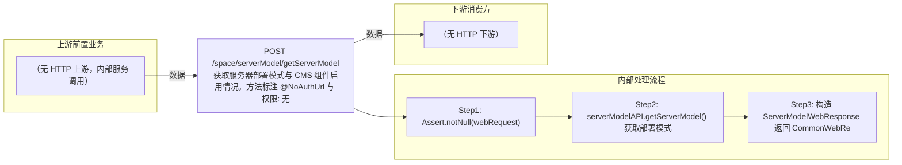

# POST /space/serverModel/getServerModel

> 获取服务器部署模式与 CMS 组件启用情况。方法标注 @NoAuthUrl 与 @NoBusinessMaintenanceUrl（免认证、免业务维护拦截）；直接调 serverModelAPI.getServerModel() 返回部署模式（init/vdi/rcm/mini）封装 ServerModelWebResponse 返回，供前端初始化引导使用。 ｜ 无特殊权限 ｜ 同步查询：获取部署模式（免认证免维护拦截）

## 依赖关系全景图

## 接口基本信息

| 项目 | 内容 |
|---|---|
| URL | /space/serverModel/getServerModel |
| Controller | SpaceServerModelController |
| 方法名 | getServerModel |
| 权限注解 | 无 |
| 执行方式 | 同步查询：获取部署模式（免认证免维护拦截） |
| 业务含义 | 获取服务器部署模式与 CMS 组件启用情况。方法标注 @NoAuthUrl 与 @NoBusinessMaintenanceUrl（免认证、免业务维护拦截）；直接调 serverModelAPI.getServerModel() 返回部署模式（init/vdi/rcm/mini）封装 ServerModelWebResponse 返回，供前端初始化引导使用。 |

## 入参详情

### DefaultWebRequest

| 参数名 | 类型 | 必填 | 约束 | 说明 |
|---|---|---|---|---|
| 无业务入参 | DefaultWebRequest | 否 | Assert.notNull(webRequest) | 框架默认请求对象，无业务字段 |

## 出参详情

| 返回类型 | CommonWebResponse<ServerModelWebResponse> |
|---|---|

| 字段 | 类型 | 说明 |
|---|---|---|
| serverModel | String | 服务器模式：init-未初始化，vdi-VDI部署模式，rcm-IDV部署模式，mini-MINI部署模式 |

## 上游前置业务

（无上游数据依赖）
## 内部处理流程

### 处理流程

1. Assert.notNull(webRequest)
2. serverModelAPI.getServerModel() 获取部署模式
3. 构造 ServerModelWebResponse 返回 CommonWebResponse.success

## 下游消费方

### 消费1：POST /space/serverModel/getServerModel

服务器型号ID（推断字段名 id）（由 field_map 契约映射）
## 接口参数约束分析

| 层级 | 参数 | 规则 | 失败结果 |
|---|---|---|---|
| AUTH | url | @NoAuthUrl 免认证 + @NoBusinessMaintenanceUrl 免维护拦截 | 无（设计上允许未登录访问） |

## 参数取值策略

| 参数 | 策略 | 说明 |
|---|---|---|
| 无业务入参 | user_input/from_query | 按业务构造 |

## 成功/失败断言基准

### 成功场景

| 场景 | 断言点 |
|---|---|
| 系统已初始化部署 | $.content.serverModel 非空 |
| 系统未初始化 | $.content.serverModel==init |

### 失败场景

| 场景 | 触发条件 | 断言点 |
|---|---|---|
| webRequest 为 null | 请求体缺失 | $.status==ERROR |

## 环境清理机制

| 接口 | 说明 |
|---|---|
| 无 | 只读查询 |

## 前置状态和幂等性标注

| 维度 | 结论 |
|---|---|
| 幂等性 | HIGH |
| 说明 | 只读查询，无副作用 |
