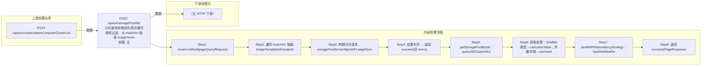

# POST /space/storagePool/list

> 分页查询存储池列表并做可用性过滤。从 matchArr 抽取 imageTemplateId/clusterId/networkId/hasNotAllowRedundancyRAID1，经 storagePoolServerMgmtAPI.pageQuery 分页查询；对每个存储池按类型（SAMBA 不支持、外置存储不支持、SAN 与非 SAN 混布限制）、关联集群、镜像模板 CPU 架构、单版本镜像跨平台/外置/类型不一致等规则计算 canUsed/canUsedMessage；若 hasNotAllowRedundancyRAID1=true 则将 RAID1_1D0B 冗余策略存储池置为不可用。 ｜ 无特殊权限 ｜ 同步分页：存储池分页 + 集群/镜像/冗余策略多重可用性过滤

## 依赖关系全景图

## 接口基本信息

| 项目 | 内容 |
|---|---|
| URL | /space/storagePool/list |
| Controller | SpaceStoragePoolController |
| 方法名 | listStoragePool |
| 权限注解 | 无 |
| 执行方式 | 同步分页：存储池分页 + 集群/镜像/冗余策略多重可用性过滤 |
| 业务含义 | 分页查询存储池列表并做可用性过滤。从 matchArr 抽取 imageTemplateId/clusterId/networkId/hasNotAllowRedundancyRAID1，经 storagePoolServerMgmtAPI.pageQuery 分页查询；对每个存储池按类型（SAMBA 不支持、外置存储不支持、SAN 与非 SAN 混布限制）、关联集群、镜像模板 CPU 架构、单版本镜像跨平台/外置/类型不一致等规则计算 canUsed/canUsedMessage；若 hasNotAllowRedundancyRAID1=true 则将 RAID1_1D0B 冗余策略存储池置为不可用。 |

## 入参详情

### PageQueryRequest（框架类，matchArr 支持 imageTemplateId/clusterId/networkId/hasNotAllowRedundancyRAID1 特殊字段）

| 参数名 | 类型 | 必填 | 约束 | 说明 |
|---|---|---|---|---|
| page | Integer | 是 | 分页页码 | pageQueryRequest.getPage() |
| limit | Integer | 是 | 每页条数 | pageQueryRequest.getLimit() |
| matchArr[].fieldName=imageTemplateId | UUID[] | 否 | EXACT | 镜像模板 id 数组，校验镜像-存储池兼容性 |
| matchArr[].fieldName=clusterId | UUID[] | 否 | EXACT | 计算集群 id 数组，仅返回关联这些集群的存储池 |
| matchArr[].fieldName=networkId | UUID[] | 否 | EXACT | 网络策略 id 数组（当前仅抽取不参与过滤） |
| matchArr[].fieldName=hasNotAllowRedundancyRAID1 | Boolean | 否 | EXACT | true 时 RAID1_1D0B 冗余策略存储池不可用（浮动个性盘限制） |
| sortArr | Sort[] | 否 | 排序 | 透传 |

## 出参详情

| 返回类型 | DefaultWebResponse<PageResponse<StoragePoolDetailResponse>> |
|---|---|

| 字段 | 类型 | 说明 |
|---|---|---|
| itemArr | StoragePoolDetailResponse[] | 存储池详情列表（元素字段见下） |
| total | long | 总条数 |
| id | UUID | 存储池ID |
| storagePoolId | UUID | 存储池ID（业务侧） |
| name | String | 存储池名称 |
| storagePoolType | StoragePoolType | 存储池类型（POS/SAN/SAMBA/RG_PDS 等） |
| redundancyStrategy | RedundancyStrategy | 冗余策略（RAID0/RAID1 等） |
| totalCapacity | Long | 总容量 |
| usedCapacity | Long | 已用容量 |
| storagePoolMgmtState | StoragePoolMgmtState | 存储池管理状态 |
| storagePoolHealthState | StoragePoolHealthState | 存储池健康状态 |
| description | String | 存储池描述 |
| createTime | Date | 创建时间 |
| updateTime | Date | 更新时间 |
| storageClusterId | UUID | 存储集群ID |
| platformId | UUID | 平台ID |
| platformName | String | 云平台名称 |
| platformType | CloudPlatformType | 云平台类型 |
| platformStatus | CloudPlatformStatus | 云平台状态 |
| cloudPlatformId | String | 云平台唯一标识 |
| options | StoragePoolOptionsDTO | 存储扩展参数 |
| canUsed | Boolean | 是否可用（默认true） |
| useInLocalDisk | Boolean | 是否可用于本地磁盘（默认true；SAN 环境非 SAN 存储置 false） |
| canUsedMessage | String | 不可用原因 |

## 上游前置业务

### 前置1：POST /space/cluster/obtainComputeClusterList

计算集群ID筛选（可空），来源为集群列表（由 field_map 契约映射）
## 内部处理流程

### 处理流程

1. Assert.notNull(pageQueryRequest)
2. 遍历 matchArr 抽取 imageTemplateId/clusterId/networkId/hasNotAllowRedundancyRAID1，其余 match 保留
3. 构建分页请求，storagePoolServerMgmtAPI.pageQuery 查询存储池分页
4. 结果为空 → 返回 success(空 items)
5. getStoragePoolByIds：queryAllClusterInfoList 建集群 map；storageRelatedMapByStoragePoolIdList 取存储池-集群关联；mapImageTemplateByIdList 取镜像详情；getDefaultStoragePoolDetail 判 SAN
6. 逐条处理：SAMBA 类型→canUsed=false；外置存储→canUsed=false；SAN 环境非 SAN 存储→useInLocalDisk=false；有镜像筛选时校验单版本镜像跨平台/外置/类型与 CPU 架构；有集群筛选时校验存储池是否关联所选集群
7. dealWithRedundancyStrategy：hasNotAllowRedundancyRAID1=true 时 RAID1_1D0B → canUsed=false
8. 返回 success(PageResponse<StoragePoolDetailResponse>)

## 下游消费方

### 消费1：POST /space/storagePool/list

存储池ID，被空间编辑存储池配置消费（推断字段名 id/storagePoolId）（由 field_map 契约映射）
## 接口参数约束分析

| 层级 | 参数 | 规则 | 失败结果 |
|---|---|---|---|
| BUSINESS | storagePoolType | SAMBA 类型不支持 | canUsed=false（RCDC_RCC_STORAGE_POOL_SAMBA_TYPE_NOT_SUPPORT） |
| BUSINESS | storagePoolType | 外置存储类型不支持 | canUsed=false（RCDC_RCC_STORAGE_POOL_EXTERNAL_TYPE_NOT_SUPPORT） |
| BUSINESS | storagePoolType | 默认存储为 SAN 时非 SAN 存储不用于本地磁盘 | useInLocalDisk=false（RCDC_RCC_STORAGE_POOL_POS_TYPE_NOT_SUPPORT） |
| BUSINESS | redundancyStrategy | hasNotAllowRedundancyRAID1=true 时 RAID1_1D0B 不可用 | canUsed=false（RCDC_RCC_STORAGE_POOL_LIMIT_RAID1） |
| BUSINESS | clusterId | 存储池必须关联所选集群 | canUsed=false（RCDC_RCC_STORAGE_NOT_CLUSTER，携带集群名） |
| BUSINESS | imageTemplateId | 单版本镜像与存储池平台/存储位置/类型一致 | canUsed=false（RCDC_RCC_STORAGE_POOL_CLUSTER_NOT_SUPPORT_SELECT） |

## 参数取值策略

| 参数 | 策略 | 说明 |
|---|---|---|
| page | user_input/from_query | 按业务构造 |
| limit | user_input/from_query | 按业务构造 |
| matchArr[].fieldName=imageTemplateId | user_input/from_query | 按业务构造 |
| matchArr[].fieldName=clusterId | user_input/from_query | 按业务构造 |
| matchArr[].fieldName=networkId | user_input/from_query | 按业务构造 |
| matchArr[].fieldName=hasNotAllowRedundancyRAID1 | user_input/from_query | 按业务构造 |
| sortArr | user_input/from_query | 按业务构造 |

## 成功/失败断言基准

### 成功场景

| 场景 | 断言点 |
|---|---|
| 存储池全部兼容 | $.content.itemArr 非空 |
| 存在不可用存储池 | $.content.itemArr 非空 且 itemArr 中存在 canUsed==false 的记录 |

### 失败场景

| 场景 | 触发条件 | 断言点 |
|---|---|---|
| pageQueryRequest 为 null | 请求体缺失 | $.status==ERROR |

## 环境清理机制

| 接口 | 说明 |
|---|---|
| 无 | 只读查询接口 |

## 前置状态和幂等性标注

| 维度 | 结论 |
|---|---|
| 幂等性 | HIGH |
| 说明 | 只读查询，无副作用 |
