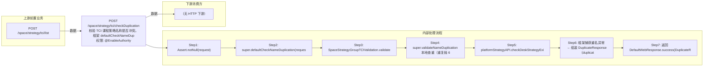

# POST /space/strategy/tci/checkDuplication

> 校验 TCI 课程策略名称是否冲突。框架 defaultCheckNameDuplication → SpaceStrategyGroupTCIValidation.validateNameDuplication(name, id)：先调 super.validateNameDuplication 本地查重（重复抛 62100317 RCDC_SPACE_STRAGETY_GROUP_EXIST），再按 id 反查 TCI 实体取 strategyGroupId（编辑时用平台策略组 id 排除自身）调 platformStrategyAPI.checkDeskStrategyExist(name, strategyGroupId) 校验平台策略组名称（重复抛 62100220 RCDC_STRAGETY_GROUP_EXIST）；框架捕获重名异常组装 DuplicateResponse 返回。 ｜ @EnableAuthority ｜ 同步校验：本地名称查重 + 平台策略组名称查重（@EnableAuthority 操作权限校验）

## 依赖关系全景图

## 接口基本信息

| 项目 | 内容 |
|---|---|
| URL | /space/strategy/tci/checkDuplication |
| Controller | SpaceDeskStrategyGroupTCIController |
| 方法名 | checkNameDuplication |
| 权限注解 | @EnableAuthority |
| 执行方式 | 同步校验：本地名称查重 + 平台策略组名称查重（@EnableAuthority 操作权限校验） |
| 业务含义 | 校验 TCI 课程策略名称是否冲突。框架 defaultCheckNameDuplication → SpaceStrategyGroupTCIValidation.validateNameDuplication(name, id)：先调 super.validateNameDuplication 本地查重（重复抛 62100317 RCDC_SPACE_STRAGETY_GROUP_EXIST），再按 id 反查 TCI 实体取 strategyGroupId（编辑时用平台策略组 id 排除自身）调 platformStrategyAPI.checkDeskStrategyExist(name, strategyGroupId) 校验平台策略组名称（重复抛 62100220 RCDC_STRAGETY_GROUP_EXIST）；框架捕获重名异常组装 DuplicateResponse 返回。 |

## 入参详情

### DuplicateRequest（框架类）

| 参数名 | 类型 | 必填 | 约束 | 说明 |
|---|---|---|---|---|
| name | String | 是 | 非空（validateNameDuplication 内 Assert.hasText） | 待校验的策略名称 |
| id | UUID | 否 | 可空（@Nullable） | 当前策略 id，编辑场景排除自身重名 |

## 出参详情

| 返回类型 | DefaultWebResponse<DuplicateResponse> |
|---|---|

| 字段 | 类型 | 说明 |
|---|---|---|
| hasDuplication | Boolean | 名称是否重复（DuplicateResponse 框架字段，重复为 true） |

## 上游前置业务

### 前置1：POST /space/strategy/tci/list

编辑时传入策略ID排除自身（由 field_map 契约映射）
## 内部处理流程

### 处理流程

1. Assert.notNull(request)
2. super.defaultCheckNameDuplication(request)（框架）
3. SpaceStrategyGroupTCIValidation.validateNameDuplication：Assert.hasText(name)；按 id 查 TCI 实体取 strategyGroupId
4. super.validateNameDuplication 本地查重（重复抛 62100317）
5. platformStrategyAPI.checkDeskStrategyExist(name, strategyGroupId) 平台查重（重复抛 62100220）
6. 框架捕获重名异常 → 组装 DuplicateResponse（hasDuplication=true）
7. 返回 DefaultWebResponse.success(DuplicateResponse)

## 下游消费方

（本接口数据主要被自身/关联接口消费，或经 SPI 通知）

> 📖 错误码/状态码对照表见 **code_map_all.md**（工程级全量）与 **error_code_map_tci_strategy.md**（TCI 接口级，含触发条件）。

## 接口参数约束分析

| 层级 | 参数 | 规则 | 失败结果 |
|---|---|---|---|
| AUTH | 接口 | @EnableAuthority 需操作权限 | 无权限时 401/403 |
| BUSINESS | name | 与本地 TCI 课程策略重名（编辑排除自身） | 62100317 RCDC_SPACE_STRAGETY_GROUP_EXIST |
| BUSINESS | name | 与平台策略组重名 | 62100220 RCDC_STRAGETY_GROUP_EXIST |
| PARAM | name | 名称非空 | Assert.hasText 断言异常 |

## 参数取值策略

| 参数 | 策略 | 说明 |
|---|---|---|
| name | user_input/from_query | 按业务构造 |
| id | user_input/from_query | 按业务构造 |

## 成功/失败断言基准

### 成功场景

| 场景 | 断言点 |
|---|---|
| 名称唯一 | $.content.hasDuplication==false |
| 编辑时传入自身 id 且名称未变 | $.content.hasDuplication==false |

### 失败场景

| 场景 | 触发条件 | 断言点 |
|---|---|---|
| 本地存在同名 TCI 策略 | 查重命中 | $.content.hasDuplication==true（业务返回，非 HTTP ERROR） |
| 平台策略组存在同名 | checkDeskStrategyExist 命中 | $.content.hasDuplication==true（业务返回，非 HTTP ERROR） |

## 环境清理机制

| 接口 | 说明 |
|---|---|
| 无 | 只读校验接口 |

## 前置状态和幂等性标注

| 维度 | 结论 |
|---|---|
| 幂等性 | HIGH |
| 说明 | 只读校验，相同入参结果一致 |
