# POST /space/strategy/tci/condition/list

> 根据指定条件返回 TCI 课程策略列表并标注可用性。从 matchArr 提取 lessonImageId/imageId 特殊字段，其余条件分页查询 SpaceTCIViewStrategyDTO 视图（追加数据权限过滤 deskStrategyId）；若传入 lessonImageId（编辑课程镜像场景）查 TCILessonImageAPI.getByLessonImageId 取旧策略做系统盘/数据盘递增校验；若传入 imageId（新增课程镜像场景）取镜像模板详情按镜像系统盘/数据盘校验，不满足则置 canUsed=false 并附消息（62110006/62110007/62110008/62110053/62110054）。 ｜ @EnableAuthority ｜ 同步分页：按课程镜像/镜像模板条件返回 TCI 策略列表并计算可用性（@EnableAuthority）

## 依赖关系全景图

```mermaid
graph LR
    subgraph 上游前置业务
        A1["POST /spacetci/lessonImage/getLessonImageList"]
        A2["POST /rcc/deskStrategy/getClassroomImageList"]
    end
    B["POST /space/strategy/tci/condition/list<br>根据指定条件返回 TCI 课程策略列表并标注可用性。从 matchArr 提取 <br>权限: @EnableAuthority"]
    A1 -->|数据| B
    A2 -->|数据| B
    subgraph 内部处理流程
        C1["Step1: Assert.notNull(pageQueryRequest/sessionC"]
        C2["Step2: getMatchResult 提取 lessonImageId/imageId "]
        C3["Step3: 构建分页请求，getDataPermissionPageQueryRequest"]
        C4["Step4: PageQueryViewHelper.pageQuery 查询 SpaceTC"]
        C5["Step5: 结果为空 → 直接返回 success"]
        C6["Step6: 若传入 lessonImageId：tciLessonImageAPI.getB"]
        C1 --> C2
        C7["Step7: 否则若传入 imageId：tciLessonImageAPI.getImage"]
        C8["Step8: 返回 success(PageQueryResponse)"]
        C6 --> C7
        C7 --> C8
        C2 --> C3
        C3 --> C4
        C4 --> C5
        C5 --> C6
    end
    B --> C1
    subgraph 下游消费方
        D1["（无 HTTP 下游）"]
    end
    B -->|数据| D1
```

## 接口基本信息

| 项目 | 内容 |
|---|---|
| URL | /space/strategy/tci/condition/list |
| Controller | SpaceDeskStrategyGroupTCIController |
| 方法名 | getPageLessonStrategyWithUsed |
| 权限注解 | @EnableAuthority |
| 执行方式 | 同步分页：按课程镜像/镜像模板条件返回 TCI 策略列表并计算可用性（@EnableAuthority） |
| 业务含义 | 根据指定条件返回 TCI 课程策略列表并标注可用性。从 matchArr 提取 lessonImageId/imageId 特殊字段，其余条件分页查询 SpaceTCIViewStrategyDTO 视图（追加数据权限过滤 deskStrategyId）；若传入 lessonImageId（编辑课程镜像场景）查 TCILessonImageAPI.getByLessonImageId 取旧策略做系统盘/数据盘递增校验；若传入 imageId（新增课程镜像场景）取镜像模板详情按镜像系统盘/数据盘校验，不满足则置 canUsed=false 并附消息（62110006/62110007/62110008/62110053/62110054）。 |

## 入参详情

### PageQueryRequest（框架类，matchArr 支持 lessonImageId/imageId 特殊字段）

| 参数名 | 类型 | 必填 | 约束 | 说明 |
|---|---|---|---|---|
| page | Integer | 是 | 分页页码 | pageQueryRequest.getPage() |
| limit | Integer | 是 | 每页条数 | pageQueryRequest.getLimit() |
| matchArr[].fieldName=lessonImageId | UUID | 否 | EXACT（最多一个） | 课程镜像 id，编辑课程镜像时传入，用于对比旧策略 |
| matchArr[].fieldName=imageId | UUID | 否 | EXACT（最多一个） | 镜像模板 id，新增课程镜像时传入，校验策略规格 |
| sortArr | Sort[] | 否 | 排序 | 透传 |

## 出参详情

| 返回类型 | DefaultWebResponse<PageQueryResponse<SpaceTCIViewStrategyDTO>> |
|---|---|

| 字段 | 类型 | 说明 |
|---|---|---|
| itemArr | SpaceTCIViewStrategyDTO[] | TCI 策略列表 |
| total | long | 总条数 |
| id | UUID | 课程策略 id |
| strategyName | String | 策略名称 |
| deskStrategyId | UUID | 云桌面策略组 id（数据权限过滤字段） |
| desktopType | CbbCloudDeskPattern | 桌面类型 |
| systemDisk | Integer | 系统盘大小 GB |
| enableDiskConfig | Boolean | 数据盘开关 |
| diskSize | Integer | 数据盘大小 GB |
| canUsed | Boolean | 是否可用（视图 computed，条件校验不满足置 false） |
| canUsedMessage | String | 不可用原因 |
| deskStrategyState | CbbDeskStrategyState | 策略状态 |
| classroomUsedCount | Integer | 关联教室数 |
| enablePersonalConfig | Boolean | 是否启用浮动个性盘 |
| creatorUserName | String | 创建者 |
| createTime | Date | 创建时间 |

## 上游前置业务

### 前置1：POST /spacetci/lessonImage/getLessonImageList

课程镜像ID（编辑课程镜像策略时传入），来源为课程镜像列表（由 field_map 契约映射）

### 前置2：POST /rcc/deskStrategy/getClassroomImageList

镜像模板ID（添加课程镜像时传入）（由 field_map 契约映射）
## 内部处理流程

### 处理流程

1. Assert.notNull(pageQueryRequest/sessionContext)
2. getMatchResult 提取 lessonImageId/imageId 并保留其余 match
3. 构建分页请求，getDataPermissionPageQueryRequest 追加数据权限过滤（deskStrategyId）
4. PageQueryViewHelper.pageQuery 查询 SpaceTCIViewStrategyDTO 视图
5. 结果为空 → 直接返回 success
6. 若传入 lessonImageId：tciLessonImageAPI.getByLessonImageId → setResponseInfo(旧策略)：系统盘小→62110006；数据盘开关不一致→62110007；数据盘小→62110008
7. 否则若传入 imageId：tciLessonImageAPI.getImageByImageId → setResponseInfo(镜像)：过滤非系统盘磁盘计算镜像数据盘；系统盘不足→62110053；数据盘状态不一致→62110007；数据盘不足→62110054
8. 返回 success(PageQueryResponse)

## 下游消费方

### 消费1：POST /space/strategy/tci/condition/list

可用TCI课程策略ID列表（含 canUsed 标记）（由 field_map 契约映射）

> 📖 错误码/状态码对照表见 **code_map_all.md**（工程级全量）与 **error_code_map_tci_strategy.md**（TCI 接口级，含触发条件）。

## 接口参数约束分析

| 层级 | 参数 | 规则 | 失败结果 |
|---|---|---|---|
| AUTH | 接口 | @EnableAuthority 需操作权限 | 无权限 401/403 |
| BUSINESS | systemDisk | 策略系统盘须不小于课程镜像/旧策略系统盘 | canUsed=false（62110006/62110053） |
| BUSINESS | enableDiskConfig | 策略数据盘开关须与课程镜像/旧策略一致 | canUsed=false（62110007） |
| BUSINESS | diskSize | 策略数据盘须不小于课程镜像/旧策略数据盘 | canUsed=false（62110008/62110054） |

## 参数取值策略

| 参数 | 策略 | 说明 |
|---|---|---|
| page | user_input/from_query | 按业务构造 |
| limit | user_input/from_query | 按业务构造 |
| matchArr[].fieldName=lessonImageId | user_input/from_query | 按业务构造 |
| matchArr[].fieldName=imageId | user_input/from_query | 按业务构造 |
| sortArr | user_input/from_query | 按业务构造 |

## 成功/失败断言基准

### 成功场景

| 场景 | 断言点 |
|---|---|
| 无课程镜像/镜像条件 | $.content.itemArr 非空 |
| 策略规格满足课程镜像要求 | $.content.itemArr 非空 且 canUsed==true |

### 失败场景

| 场景 | 触发条件 | 断言点 |
|---|---|---|
| 策略系统盘小于镜像系统盘 | 镜像 100G、策略 60G | $.content.itemArr[0].canUsed==false 且 canUsedMessage 非空（业务返回，非 HTTP ERROR） |
| 数据盘开关不一致 | 镜像开启数据盘、策略关闭 | $.content.itemArr[0].canUsed==false 且 canUsedMessage 非空（业务返回，非 HTTP ERROR） |

## 环境清理机制

| 接口 | 说明 |
|---|---|
| 无 | 只读查询接口 |

## 前置状态和幂等性标注

| 维度 | 结论 |
|---|---|
| 幂等性 | HIGH |
| 说明 | 只读查询，无副作用 |
