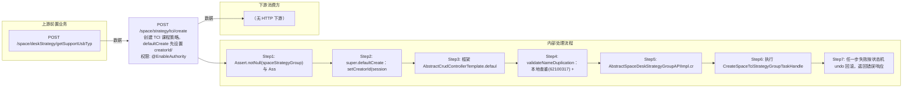

# POST /space/strategy/tci/create

> 创建 TCI 课程策略。defaultCreate 先设置 creatorId/creatorName，框架调用 SpaceStrategyGroupTCIValidation.validateBeforeCreate：校验策略类型必须 VOI(62110001)、策略名称规则(62110016/62110017/62110002)、磁盘还原策略(62110012~62110015)、自动编辑(62110018)、数据盘大小(62110012，⚠️ 非 62110019)，再 validateNameDuplication（本地 62100317 + 平台 62100220）；随后生成策略 id、convertPlatformStrategyGroup 填充平台策略组信息，执行 CreateSpaceTciStrategyGroupTaskHandle 状态机（创建平台策略组关联→创建平台策略组→创建本地主数据→添加数据权限）。 ｜ @EnableAuthority ｜ 异步任务流：创建平台策略组关联→创建平台策略组→创建本地策略→添加数据权限

## 依赖关系全景图



## 接口基本信息

| 项目 | 内容 |
|---|---|
| URL | /space/strategy/tci/create |
| Controller | SpaceDeskStrategyGroupTCIController |
| 方法名 | create |
| 权限注解 | @EnableAuthority |
| 执行方式 | 异步任务流：创建平台策略组关联→创建平台策略组→创建本地策略→添加数据权限 |
| 业务含义 | 创建 TCI 课程策略。defaultCreate 先设置 creatorId/creatorName，框架调用 SpaceStrategyGroupTCIValidation.validateBeforeCreate：校验策略类型必须 VOI(62110001)、策略名称规则(62110016/62110017/62110002)、磁盘还原策略(62110012~62110015)、自动编辑(62110018)、数据盘大小(62110012，⚠️ 非 62110019)，再 validateNameDuplication（本地 62100317 + 平台 62100220）；随后生成策略 id、convertPlatformStrategyGroup 填充平台策略组信息，执行 CreateSpaceTciStrategyGroupTaskHandle 状态机（创建平台策略组关联→创建平台策略组→创建本地主数据→添加数据权限）。 |

## 入参详情

### SpaceDeskStrategyGroupTCI（继承 AbstractSpaceDeskStrategyGroup）

| 参数名 | 类型 | 必填 | 约束 | 说明 |
|---|---|---|---|---|
| id | UUID | 否 | 可空，不传自动生成 | 策略主键 |
| name | String | 是 | 非空、≤32、正则（中英文数字._-@，不以_开头） | 策略名称，唯一 |
| note | String | 否 | @Nullable | 备注 |
| pattern | CbbCloudDeskPattern | 是 | @NotNull | 桌面类型（还原/个性） |
| strategyType | DeskVirtualizationType | 是 | @NotNull，必须 VOI | 策略类型 |
| enablePersonalConfig | Boolean | 是 | @NotNull，默认 false | 是否启用浮动个性配置 |
| deskPersonalConfigStrategyType | CbbDeskPersonalConfigStrategyType | 否 | @Nullable | 浮动个性配置类型 |
| personalConfigDiskSize | Integer | 否 | @Range(1,2048) | 浮动个性盘大小 |
| systemSize | Integer | 是 | @NotNull @Range(0,2048) | 系统盘大小 GB |
| platformStrategyGroup | PlatformStrategyGroup | 是 | @NotNull | 平台策略组（创建时回填 id/strategyType/creatorName/name） |
| enableInternet | Boolean | 是 | @NotNull | 是否联网 |
| enableDiskConfig | Boolean | 是 | @NotNull | 数据盘开关 |
| diskSize | Integer | 否 | @Nullable（开启数据盘时必填） | 数据盘大小 GB，开启时为空抛 62110012（DISK_STRATEGY_EMPTY，源码 validDiskSize 实际抛 DISK_STRATEGY_EMPTY；62110019 定义未抛） |
| enableScheduleStrategy | Boolean | 是 | @NotNull | 磁盘定期策略开关 |
| diskRestoreStrategyArr | TCIDiskStrategyDTO[] | 否 | @Nullable（开启定期时非空） | 个性模式下还原周期设置，元素需含 scheduleType/scheduleExecuteTime/period |
| enableAutoEdit | Boolean | 是 | @NotNull，默认 false | 自动编辑镜像（仅还原模式可开启） |
| enableForceAutoEdit | Boolean | 是 | @NotNull，默认 true | 适配驱动后自动退出云桌面 |
| enableAdaptiveResolution | Boolean | 是 | @NotNull，默认 true | 分辨率自适应 |

## 出参详情

| 返回类型 | DefaultWebResponse |
|---|---|

### 外层响应（SK 框架统一包装）

| 字段 | 类型 | 说明 |
|---|---|---|
| status | String | SUCCESS / ERROR |
| msgKey | String | 错误消息key（成功时为空） |
| msgArgArr | String[] | 消息参数数组 |
| message | String | 提示消息 |
| content | SpaceDeskStrategyGroupTCI | 创建的策略组对象（含入参回显+服务端填充字段） |

### content 业务字段（SpaceDeskStrategyGroupTCI，含继承）

**自有字段（SpaceDeskStrategyGroupTCI）**

| 字段 | 类型 | 说明 |
|---|---|---|
| enableDiskConfig | Boolean | 是否开启数据盘 |
| diskSize | Integer | 数据盘大小 GB |
| enableScheduleStrategy | Boolean | 是否开启定时还原策略 |
| diskRestoreStrategyArr | TCIDiskStrategyDTO[] | 磁盘还原策略数组 |
| enableAutoEdit | Boolean | 启用自动编辑（默认 false） |
| enableForceAutoEdit | Boolean | 强制自动编辑（默认 true） |
| enableAdaptiveResolution | Boolean | 自适应分辨率（默认 true） |

**继承字段（AbstractSpaceDeskStrategyGroup）**

| 字段 | 类型 | 说明 |
|---|---|---|
| id | UUID | 自动生成或使用传入ID（断言非空） |
| note | String | 备注 |
| state | SpaceStrategyGroupState | 服务端设为 AVAILABLE |
| pattern | CbbCloudDeskPattern | 桌面类型（RECOVERABLE/PERSONAL） |
| strategyType | DeskVirtualizationType | 策略类型（VOI） |
| enablePersonalConfig | Boolean | 是否开启个人配置 |
| deskPersonalConfigStrategyType | CbbDeskPersonalConfigStrategyType | 个人配置策略类型 |
| personalConfigDiskSize | Integer | 个人配置盘大小 |
| systemSize | Integer | 系统盘大小 |
| platformStrategyGroup | PlatformStrategyGroup | 平台策略组（strategyGroupFacadeStr 含 voi 节点） |
| desktopOccupyDriveArr | String[] | 第三方盘符 I~Z |
| enableInternet | Boolean | 联网开关 |

> 依据：SpaceDeskStrategyGroupTCIController.create(#101) → 框架 AbstractCrudControllerTemplate.defaultCreate 成功返回创建的策略对象（同 vdi/create，已验证 content.id 非空）；失败经框架异常处理器转 status==ERROR + msgKey（见断言节）。

## 上游前置业务

### 前置1：POST /space/deskStrategy/getSupportUsbTyp

USB设备类型ID数组（在 platformStrategyGroup 内部配置，推断）（由 field_map 契约映射）
## 内部处理流程

### 批量处理器：CreateSpaceTciStrategyGroupTaskHandle（StateTaskHandle，同步状态机，无独立批量 handler）

| 步骤 | 说明 |
|---|---|
| 1 | CreatePlatformStrategyGroupRelatedProcessor：platformSubSysResRelationAPI.addOrUpdate 建立关联 |
| 2 | CreatePlatformStrategyGroupProcessor：platformStrategyGroupAPI.create 创建平台策略组 |
| 3 | CreateLocalStrategyGroupProcessor：repository.create 写本地主数据 |
| 4 | AddStrategyGroupDataPermissionProcessor：adminDataPermissionAPI.create 添加创建者数据权限 |

### 处理流程

1. Assert.notNull(spaceStrategyGroup) 与 Assert.notNull(sessionContext)
2. super.defaultCreate：setCreatorId(sessionContext.getUserId())/setCreatorName(sessionContext.getUserName())
3. 框架 AbstractCrudControllerTemplate.defaultCreate → SpaceStrategyGroupTCIValidation.validateBeforeCreate：validStrategyType(62110001)、validStrategyName(62110016/17/02)、checkStrategyRestoreDiskInfo(62110012~15)、validAutoEdit(62110018)、validDiskSize(62110012)
4. validateNameDuplication：本地查重(62100317) + platformStrategyAPI.checkDeskStrategyExist(62100220)
5. AbstractSpaceDeskStrategyGroupAPIImpl.create：state 缺省置 AVAILABLE、生成/复用 id、convertPlatformStrategyGroup
6. 执行 CreateSpaceTciStrategyGroupTaskHandle：a) CreatePlatformStrategyGroupRelatedProcessor（建立平台-子系统关联）b) CreatePlatformStrategyGroupProcessor（创建平台策略组）c) CreateLocalStrategyGroupProcessor（写本地 t_space_tci_lesson_strategy）d) AddStrategyGroupDataPermissionProcessor（添加数据权限）
7. 任一步失败时平台侧状态机 undo 回滚已创建数据并返回错误响应（此为内部失败机制；自动化测试环境清理仍走 POST /space/strategy/tci/delete）

## 下游消费方

### 消费1：POST /space/strategy/tci/create

新建TCI课程策略ID，被 /spacetci/lessonImage/student/create、teacher/create 的 lessonStrategyId 及 strategy edit/delete 消费（由 field_map 契约映射）
## 接口参数约束分析

> 错误码完整对照表（错误码→常量名→触发条件）见 **error_code_map_tci_strategy.md**（本地交付物，脱离 Java 代码可查）。
>
> 以下 8 条约束依据参考文档（PFNYW...PantN「space/strategy/tci/create 入参约束」）+ 源码验证。

| 层级 | 参数 | 规则 | 失败结果 |
|---|---|---|---|
| AUTH | 接口 | @EnableAuthority 需操作权限 | 无权限 401/403 |
| PARAM | name | 非空且≤32且满足名称正则 | 62110016/62110017/62110002 |
| BUSINESS | strategyType | 必须为 VOI | 62110001 |
| BUSINESS | enableDiskConfig/diskSize | ① enableDiskConfig=true 时 diskSize 必填可编辑；② false 时 diskSize 不可编辑 | 62110012 |
| BUSINESS | desktopType/enableScheduleStrategy | 仅 desktopType=PERSONAL（个性）时可修改 enableScheduleStrategy（系统盘/数据盘还原计划）；desktopType=RECOVERABLE（还原）时不可修改 | 62110012~62110015 |
| BUSINESS | desktopType/enableAutoEdit | 仅 desktopType=RECOVERABLE（还原）时可修改 enableAutoEdit（启用自动编辑）；desktopType=PERSONAL（个性）时不可修改 | 62110018 |
| BUSINESS | enablePeripheral/usbTypeIdArr | enablePeripheral=true 时**先调用 POST /rcc/space/deskStrategy/getSupportUsbTyp**，从返回值 content.itemArr[].id 取外设策略ID，写入 platformStrategyGroup.strategyGroupFacadeStr + strategyType；enablePeripheral=false 时不调用 | 外设接口异常 |
| BUSINESS | enableScheduleStrategy/diskRestoreStrategyArr | 开启时还原策略各模式参数（参考文档样例）：NO_RECOVER（不还原，partition）；MONTH（monthDay=1~12）；WEEK（weekDayArr 周日=7 可多选）；DAY（每日）；EVERYTIME（每次）；CUSTOM（everyFewDays=间隔天数）；均含 scheduleExecuteTime（毫秒时间戳）+ diskType(SYSTEM/DATA)+lessonStrategyId+partition | 62110012~62110015 |
| PARAM | desktopOccupyDriveArr | 第三方盘符 I~Z 可配置多个，可为空 | 6211000x |
| BUSINESS | id | 可传前端 id（使用指定 id 创建，幂等场景） | id 冲突 |
| BUSINESS | platformStrategyGroup.strategyGroupFacadeStr.voi | 外设配置写入 voi 节点（enablePeripheral + usbTypeIdArr），参考请求样例：{"voi":{"enablePeripheral":true,"usbTypeIdArr":[...]}} | 平台策略组校验失败 |

## 参数取值策略

| 参数 | 策略 | 说明 |
|---|---|---|
| id | user_input/from_query | 按业务构造 |
| name | user_input/from_query | 按业务构造 |
| note | user_input/from_query | 按业务构造 |
| pattern | user_input/from_query | 按业务构造 |
| strategyType | user_input/from_query | 按业务构造 |
| enablePersonalConfig | user_input/from_query | 按业务构造 |
| deskPersonalConfigStrategyType | user_input/from_query | 按业务构造 |
| personalConfigDiskSize | user_input/from_query | 按业务构造 |
| systemSize | user_input/from_query | 按业务构造 |
| platformStrategyGroup | user_input/from_query | 按业务构造 |
| enableInternet | user_input/from_query | 按业务构造 |
| enableDiskConfig | user_input/from_query | 按业务构造 |
| diskSize | user_input/from_query | 按业务构造 |
| enableScheduleStrategy | user_input/from_query | 按业务构造 |
| diskRestoreStrategyArr | user_input/from_query | 按业务构造 |
| enableAutoEdit | user_input/from_query | 按业务构造 |
| enableForceAutoEdit | user_input/from_query | 按业务构造 |
| enableAdaptiveResolution | user_input/from_query | 按业务构造 |

## 成功/失败断言基准

> 判断依据：读取 HTTP 响应的 **body JSON**，按 `$.status` 字段区分成功/失败，`$.msgKey` 区分具体错误。响应结构为 SK 框架 `DefaultWebResponse` 五件套（字段名已确认：status/msgKey/msgArgArr/message/content）。

### 响应结构（自动化读 response 的入口）

**成功响应（HTTP 200）**：
```json
{
  "status": "SUCCESS",
  "msgKey": "",
  "msgArgArr": [],
  "message": "成功",
  "content": null
}
```

**失败响应（HTTP 200，业务异常经框架异常处理器包装，HTTP 状态码仍是 200）**：
```json
{
  "status": "ERROR",
  "msgKey": "62110001",
  "msgArgArr": [],
  "message": "策略类型错误",
  "content": null
}
```

> ⚠️ 关键：该接口业务校验失败时 **HTTP 状态码仍是 200**，必须读 body 的 `$.status`（SUCCESS/ERROR）判断成败，不能只看 HTTP 状态码。

### 判断步骤（自动化执行顺序）

1. 发送 POST 请求，取响应 body
2. 读 `$.status`：
   - `"SUCCESS"` → 创建成功，可继续（取 `$.content` 若回显则含策略对象）
   - `"ERROR"` → 创建失败，读 `$.msgKey` 定位错误码，对照下表
3. （可选）读 `$.message` 获取错误提示文案

### 成功断言（JSONPath 级）

| 场景 | 触发条件 | 断言表达式 |
|---|---|---|
| 入参合法且名称唯一 | 策略类型 VOI + 名称合法 + 约束通过 | `$.status == "SUCCESS"` |
| 外设策略开启 | enablePeripheral=true 且 getSupportUsbTyp 正常 | `$.status == "SUCCESS"`；且前置接口 `POST /rcc/space/deskStrategy/getSupportUsbTyp` 返回 `$.content.itemArr[].id` 非空 |
| 传入 id | 使用前端 id 创建 | `$.status == "SUCCESS"` |

### 失败断言（JSONPath 级）

| 场景 | 触发条件 | 断言表达式 |
|---|---|---|
| 策略类型非法 | strategyType != VOI | `$.status == "ERROR"` 且 `$.msgKey == "62110001"` |
| 名称重复（本地） | 已存在同名本地策略 | `$.status == "ERROR"` 且 `$.msgKey == "62100317"` |
| 名称重复（平台） | 平台策略组重名 | `$.status == "ERROR"` 且 `$.msgKey == "62100220"` |
| 数据盘开启但大小为 null | enableDiskConfig=true、diskSize 缺省 | `$.status == "ERROR"` 且 `$.msgKey == "62110012"`（⚠️ 非 62110019，源码 validDiskSize 抛 DISK_STRATEGY_EMPTY） |
| 还原周期配置不完整 | enableScheduleStrategy=true 但 diskRestoreStrategyArr 缺失/元素不完整 | `$.status == "ERROR"` 且 `$.msgKey ∈ {"62110012","62110013","62110014","62110015"}` |
| 非还原模式开启自动编辑 | pattern=个性化、enableAutoEdit=true | `$.status == "ERROR"` 且 `$.msgKey == "62110018"` |
| 参数校验 | name 为空/超长/格式非法 | `$.status == "ERROR"` 且 `$.msgKey ∈ {"62110016","62110017","62110002"}` |

> 源码依据：SpaceDeskStrategyGroupTCIController.create(#101) → AbstractSpaceDeskStrategyGroupController.defaultCreate → 框架 AbstractCrudControllerTemplate.defaultCreate。成功返回 DefaultWebResponse.Builder.success()；校验失败抛 BusinessException，由框架异常处理器统一转 DefaultWebResponse（HTTP 200 + status=ERROR + msgKey=业务错误码）。

## 环境清理机制

| 接口 | 说明 |
|---|---|
| POST /space/strategy/tci/delete | 删除创建的 TCI 策略（自动化清理主路径，需先取创建返回的策略 id） |
| POST /rcc/space/deskStrategy/getSupportUsbTyp | 只读前置（enablePeripheral=true 时调用取外设ID），无资源创建，无需清理 |

> 说明：状态机失败时框架会通过 processor innerUnDoProcess 回滚已创建数据（内部机制），但**自动化测试的环境清理必须走 HTTP 接口**（POST /space/strategy/tci/delete），不能依赖内部状态机回滚。

## 前置状态和幂等性标注

| 维度 | 结论 |
|---|---|
| 幂等性 | LOW |
| 说明 | 重复提交同名策略会因名称重复校验失败；不保证幂等 |
