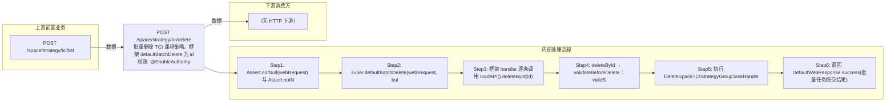

# POST /space/strategy/tci/delete

> 批量删除 TCI 课程策略。框架 defaultBatchDelete 为 idArr 中每个 id 注册批量删除任务；每条 processItem 先做数据权限校验（checkAdminDataPermission），再调 loadAPI().deleteById → SpaceStrategyGroupTCIValidation.validateBeforeDelete：策略状态必须 AVAILABLE(62110005)，且未被课程镜像关联使用（被使用抛 62110009 SPACETCI_LESSONSTRATEGY_STRATEGY_USED_BY_CLASSROOM）；通过后执行 DeleteSpaceTCIStrategyGroupTaskHandle 状态机（置 DELETING→删平台策略组→删平台关联→删数据权限→删本地主数据+失效缓存）。 ｜ @EnableAuthority ｜ 异步批量任务：批量注册删除任务，逐条校验+删除状态机（不可撤销）

## 依赖关系全景图

## 接口基本信息

| 项目 | 内容 |
|---|---|
| URL | /space/strategy/tci/delete |
| Controller | SpaceDeskStrategyGroupTCIController |
| 方法名 | batchDelete |
| 权限注解 | @EnableAuthority |
| 执行方式 | 异步批量任务：批量注册删除任务，逐条校验+删除状态机（不可撤销） |
| 业务含义 | 批量删除 TCI 课程策略。框架 defaultBatchDelete 为 idArr 中每个 id 注册批量删除任务；每条 processItem 先做数据权限校验（checkAdminDataPermission），再调 loadAPI().deleteById → SpaceStrategyGroupTCIValidation.validateBeforeDelete：策略状态必须 AVAILABLE(62110005)，且未被课程镜像关联使用（被使用抛 62110009 SPACETCI_LESSONSTRATEGY_STRATEGY_USED_BY_CLASSROOM）；通过后执行 DeleteSpaceTCIStrategyGroupTaskHandle 状态机（置 DELETING→删平台策略组→删平台关联→删数据权限→删本地主数据+失效缓存）。 |

## 入参详情

### IdArrWebRequest（框架类）

| 参数名 | 类型 | 必填 | 约束 | 说明 |
|---|---|---|---|---|
| idArr | UUID[] | 是 | 非空（Assert.notNull(webRequest)） | 待删除 TCI 课程策略 id 数组 |

## 出参详情

| 返回类型 | DefaultWebResponse<BatchTaskSubmitResult> |
|---|---|

| 字段 | 类型 | 说明 |
|---|---|---|
| taskId | String | 批量任务 id |
| result | String | 任务提交结果/状态 |

## 上游前置业务

### 前置1：POST /space/strategy/tci/list

TCI课程策略ID数组，来源为策略列表（由 field_map 契约映射）
## 内部处理流程

### 批量处理器：SK 框架默认批量删除 handler（AbstractCrudControllerTemplate.defaultBatchDelete 内部实现）+ DeleteSpaceTCIStrategyGroupTaskHandle

| 步骤 | 说明 |
|---|---|
| 1 | 取 DefaultBatchTaskItem.itemId（策略 id） |
| 2 | checkAdminDataPermission(id)：非全权限管理员校验数据权限 |
| 3 | loadAPI().deleteById(id) → validateBeforeDelete（状态 62110005 / 被使用 62110009） |
| 4 | DeleteSpaceTCIStrategyGroupTaskHandle 状态机 5 步（置 DELETING→删平台→删关联→删权限→删本地+失效缓存） |

### 处理流程

1. Assert.notNull(webRequest) 与 Assert.notNull(builder)
2. super.defaultBatchDelete(webRequest, builder)：逐条构建 DefaultBatchTaskItem 注册批量删除任务
3. 框架 handler 逐条调用 loadAPI().deleteById(id)（先 checkAdminDataPermission 数据权限校验）
4. deleteById → validateBeforeDelete：validState（非 AVAILABLE 抛 62110005）、validUsedWhenDelete（关联课程镜像抛 62110009）
5. 执行 DeleteSpaceTCIStrategyGroupTaskHandle 状态机：DeleteInitStrategyGroupProcessor（置 DELETING）→ DeletePlatformStrategyGroupProcessor（删平台策略组，幂等）→ DeletePlatformStrategyGroupRelatedProcessor（删平台-课程关联，幂等）→ RemoveStrategyGroupDataPermissionProcessor（删数据权限）→ DeleteLocalStrategyGroupProcessor（删本地主数据+失效缓存）
6. 返回 DefaultWebResponse.success(批量任务提交结果)

## 下游消费方

（本接口数据主要被自身/关联接口消费，或经 SPI 通知）

> 📖 错误码/状态码对照表见 **code_map_all.md**（工程级全量）与 **error_code_map_tci_strategy.md**（TCI 接口级，含触发条件）。

## 接口参数约束分析

| 层级 | 参数 | 规则 | 失败结果 |
|---|---|---|---|
| AUTH | 接口 | @EnableAuthority 需操作权限 | 无权限 401/403 |
| BUSINESS | state | 仅 AVAILABLE 状态可删除 | 62110005 SPACETCI_LESSONSTRATEGY_STRATEGY_STATE_NOT_AVAILABLE |
| BUSINESS | 策略-课程镜像关联 | 被课程镜像使用的策略不可删除 | 62110009 SPACETCI_LESSONSTRATEGY_STRATEGY_USED_BY_CLASSROOM |
| DATA_PERMISSION | 策略 id | 非全权限管理员仅可删除授权策略 | checkPermission 抛权限异常，该条任务失败 |

## 参数取值策略

| 参数 | 策略 | 说明 |
|---|---|---|
| idArr | user_input/from_query | 按业务构造 |

## 成功/失败断言基准

### 成功场景

| 场景 | 断言点 |
|---|---|
| 策略未被课程镜像使用 | $.content.taskId 非空 |
| 多条 id 部分失败 | 轮询 content.taskId 至终态 batchTaskItemStatus∈["FAILURE"] |

### 失败场景

| 场景 | 触发条件 | 断言点 |
|---|---|---|
| 策略已被课程镜像绑定 | t_space_tci_lesson_image 关联该策略 | 轮询 content.taskId 至终态 batchTaskItemStatus∈["FAILURE"]，任务项提示 62110009 |
| 策略状态非 AVAILABLE | 策略处于 DELETING | 轮询 content.taskId 至终态 batchTaskItemStatus∈["FAILURE"]，任务项提示 62110005 |

## 环境清理机制

| 接口 | 说明 |
|---|---|
| 内部调用 / PlatformSubSysResRelationAPI#deleteById / PlatformAdminDataPermissionAPI#deleteByPermissionDataId / repository.deleteById | 删除状态机为不可撤销任务，失败时由框架永久重试直到成功或人工介入 |

## 前置状态和幂等性标注

| 维度 | 结论 |
|---|---|
| 幂等性 | HIGH |
| 说明 | 删除任务流各 processor 均做幂等处理；重复提交已删 id 无副作用 |
