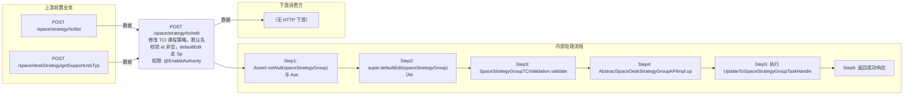

# POST /space/strategy/tci/edit

> 修改 TCI 课程策略。默认先校验 id 非空，defaultEdit 走 SpaceStrategyGroupTCIValidation.validateBeforeUpdate：执行创建期全部校验（validStrategy + 名称查重 62100317/62100220），校验旧策略状态 AVAILABLE(62110005)，若策略已关联课程镜像则校验系统盘不得缩小(62110006)、数据盘开关不得变化(62110007)、数据盘不得缩小(62110008)，最后通过 SPI 校验策略变更合法；随后 AbstractSpaceDeskStrategyGroupAPIImpl.update 维护旧数据并转换平台策略组，执行 UpdateTciSpaceStrategyGroupTaskHandle（更新平台策略组 → 更新本地主数据+失效缓存）。 ｜ @EnableAuthority ｜ 异步任务流：更新平台策略组 → 更新本地策略+失效缓存

## 依赖关系全景图

## 接口基本信息

| 项目 | 内容 |
|---|---|
| URL | /space/strategy/tci/edit |
| Controller | SpaceDeskStrategyGroupTCIController |
| 方法名 | edit |
| 权限注解 | @EnableAuthority |
| 执行方式 | 异步任务流：更新平台策略组 → 更新本地策略+失效缓存 |
| 业务含义 | 修改 TCI 课程策略。默认先校验 id 非空，defaultEdit 走 SpaceStrategyGroupTCIValidation.validateBeforeUpdate：执行创建期全部校验（validStrategy + 名称查重 62100317/62100220），校验旧策略状态 AVAILABLE(62110005)，若策略已关联课程镜像则校验系统盘不得缩小(62110006)、数据盘开关不得变化(62110007)、数据盘不得缩小(62110008)，最后通过 SPI 校验策略变更合法；随后 AbstractSpaceDeskStrategyGroupAPIImpl.update 维护旧数据并转换平台策略组，执行 UpdateTciSpaceStrategyGroupTaskHandle（更新平台策略组 → 更新本地主数据+失效缓存）。 |

## 入参详情

### SpaceDeskStrategyGroupTCI（继承 AbstractSpaceDeskStrategyGroup）

| 参数名 | 类型 | 必填 | 约束 | 说明 |
|---|---|---|---|---|
| id | UUID | 是 | 必填（Assert.notNull(id)） | 待修改策略 id |
| name | String | 是 | 非空、≤32、名称正则 | 策略名称（允许修改，需查重） |
| pattern | CbbCloudDeskPattern | 是 | @NotNull | 桌面类型 |
| strategyType | DeskVirtualizationType | 是 | 必须 VOI | 策略类型 |
| systemSize | Integer | 是 | @NotNull @Range(0,2048) | 系统盘大小（关联镜像时只可扩大） |
| enableDiskConfig | Boolean | 是 | @NotNull | 数据盘开关（关联镜像时不可变化） |
| diskSize | Integer | 否 | 开启数据盘时必填 | 数据盘大小（关联镜像时只可扩大） |
| enableScheduleStrategy | Boolean | 是 | @NotNull | 磁盘定期策略开关 |
| diskRestoreStrategyArr | TCIDiskStrategyDTO[] | 否 | 开启定期时非空 | 还原周期设置 |
| enableAutoEdit | Boolean | 是 | @NotNull | 自动编辑 |
| enableForceAutoEdit | Boolean | 是 | @NotNull | 强制自动退出 |
| enableAdaptiveResolution | Boolean | 是 | @NotNull | 分辨率自适应 |
| platformStrategyGroup | PlatformStrategyGroup | 是 | @NotNull | 平台策略组（更新时回填） |
| enableInternet | Boolean | 是 | @NotNull | 联网 |
| enablePersonalConfig | Boolean | 否 |  | 浮动个性配置（enablePersonalConfig） |
| deskPersonalConfigStrategyType | String | 否 |  | 浮动个性配置（deskPersonalConfigStrategyType） |
| personalConfigDiskSize | Integer | 否 |  | 浮动个性配置（personalConfigDiskSize） |## 出参详情

| 返回类型 | DefaultWebResponse |
|---|---|

| 字段 | 类型 | 说明 |
|---|---|---|
| content | null | 修改成功返回空 content |

## 上游前置业务

### 前置1：POST /space/strategy/tci/list

TCI课程策略ID，来源为策略列表（由 field_map 契约映射）

### 前置2：POST /space/deskStrategy/getSupportUsbTyp

USB设备类型ID数组（推断）（由 field_map 契约映射）
## 内部处理流程

### 批量处理器：UpdateTciSpaceStrategyGroupTaskHandle（StateTaskHandle，同步状态机）

| 步骤 | 说明 |
|---|---|
| 1 | UpdatePlatformStrategyGroupProcessor：platformStrategyGroupAPI.update 更新平台策略组（失败不 undo） |
| 2 | UpdateLocalStrategyGroupProcessor：repository.update 更新本地主数据并失效 SpaceStrategyGroupCaches 缓存 |

### 处理流程

1. Assert.notNull(spaceStrategyGroup) 与 Assert.notNull(id)
2. super.defaultEdit(spaceStrategyGroup)（AbstractSpaceDeskStrategyGroupController → 框架 defaultEdit）
3. SpaceStrategyGroupTCIValidation.validateBeforeUpdate：先 validateBeforeCreate（validStrategy + 名称查重），再 validState(62110005)，关联课程镜像时 validDisk（系统盘 62110006、数据盘开关 62110007、数据盘 62110008），最后 validateBeforeLessonStrategyChange（SPI）
4. AbstractSpaceDeskStrategyGroupAPIImpl.update：findById 取旧策略维护旧数据；convertPlatformStrategyGroup 回填平台策略组
5. 执行 UpdateTciSpaceStrategyGroupTaskHandle：a) UpdatePlatformStrategyGroupProcessor（平台更新，无 undo）b) UpdateLocalStrategyGroupProcessor（本地更新 + invalidateCache 失效缓存）
6. 返回成功响应

## 下游消费方

（本接口数据主要被自身/关联接口消费，或经 SPI 通知）

> 📖 错误码/状态码对照表见 **code_map_all.md**（工程级全量）与 **error_code_map_tci_strategy.md**（TCI 接口级，含触发条件）。

## 接口参数约束分析

| 层级 | 参数 | 规则 | 失败结果 |
|---|---|---|---|
| AUTH | 接口 | @EnableAuthority 需操作权限 | 无权限 401/403 |
| BUSINESS | state | 旧策略必须 AVAILABLE | 62110005 |
| BUSINESS | systemSize | 关联镜像时系统盘不得缩小 | 62110006 |
| BUSINESS | enableDiskConfig | 关联镜像时数据盘开关不得变化 | 62110007 |
| BUSINESS | diskSize | 关联镜像时数据盘不得缩小 | 62110008 |
| BUSINESS | name | 名称不得重复 | 62100317/62100220 |

## 参数取值策略

| 参数 | 策略 | 说明 |
|---|---|---|
| id | user_input/from_query | 按业务构造 |
| name | user_input/from_query | 按业务构造 |
| pattern | user_input/from_query | 按业务构造 |
| strategyType | user_input/from_query | 按业务构造 |
| systemSize | user_input/from_query | 按业务构造 |
| enableDiskConfig | user_input/from_query | 按业务构造 |
| diskSize | user_input/from_query | 按业务构造 |
| enableScheduleStrategy | user_input/from_query | 按业务构造 |
| diskRestoreStrategyArr | user_input/from_query | 按业务构造 |
| enableAutoEdit | user_input/from_query | 按业务构造 |
| enableForceAutoEdit | user_input/from_query | 按业务构造 |
| enableAdaptiveResolution | user_input/from_query | 按业务构造 |
| platformStrategyGroup | user_input/from_query | 按业务构造 |
| enablePersonalConfig/deskPersonalConfigStrategyType/personalConfigDiskSize | user_input/from_query | 按业务构造 |
| enableInternet | user_input/from_query | 按业务构造 |

## 成功/失败断言基准

### 成功场景

| 场景 | 断言点 |
|---|---|
| 入参合法且无关联镜像限制 | $.status==SUCCESS |
| 关联镜像且规格只增不减 | $.status==SUCCESS |

### 失败场景

| 场景 | 触发条件 | 断言点 |
|---|---|---|
| 关联镜像时缩小系统盘 | 系统盘由 100G 改 60G | $.status==ERROR 且 $.msgKey==62110006 |
| 关联镜像时关闭数据盘 | enableDiskConfig true→false | $.status==ERROR 且 $.msgKey==62110007 |
| 旧策略状态非 AVAILABLE | 策略正在删除 | $.status==ERROR 且 $.msgKey==62110005 |

## 环境清理机制

| 接口 | 说明 |
|---|---|
| 无 | 更新状态机不实现 undo（平台与本地无耦合，失败由乐观锁/重试处理） |

## 前置状态和幂等性标注

| 维度 | 结论 |
|---|---|
| 幂等性 | MEDIUM |
| 说明 | 依赖乐观锁 version，重复提交相同数据会因版本冲突失败；相同内容重复提交结果一致 |
