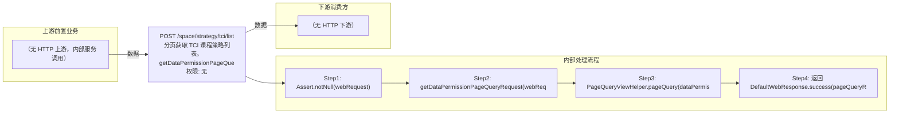

# POST /space/strategy/tci/list

> 分页获取 TCI 课程策略列表。getDataPermissionPageQueryRequest 为请求追加数据权限过滤（非全权限管理员按 deskStrategyId ∈ 授权策略过滤），PageQueryViewHelper 基于 @PageQueryDTOConfig(dmql="v_rcc_tci_lesson_strategy.dmql") 查询视图（主表 t_space_tci_lesson_strategy LEFT JOIN t_space_tci_lesson_image 统计 classroom_used_count）返回 SpaceTCIViewStrategyDTO 分页。 ｜ 无特殊权限 ｜ 同步分页：DMQL 视图分页查询 TCI 课程策略列表（数据权限过滤）

## 依赖关系全景图

## 接口基本信息

| 项目 | 内容 |
|---|---|
| URL | /space/strategy/tci/list |
| Controller | SpaceDeskStrategyGroupTCIController |
| 方法名 | pageQuery |
| 权限注解 | 无 |
| 执行方式 | 同步分页：DMQL 视图分页查询 TCI 课程策略列表（数据权限过滤） |
| 业务含义 | 分页获取 TCI 课程策略列表。getDataPermissionPageQueryRequest 为请求追加数据权限过滤（非全权限管理员按 deskStrategyId ∈ 授权策略过滤），PageQueryViewHelper 基于 @PageQueryDTOConfig(dmql="v_rcc_tci_lesson_strategy.dmql") 查询视图（主表 t_space_tci_lesson_strategy LEFT JOIN t_space_tci_lesson_image 统计 classroom_used_count）返回 SpaceTCIViewStrategyDTO 分页。 |

## 入参详情

### PageQueryRequest（框架类）

| 参数名 | 类型 | 必填 | 约束 | 说明 |
|---|---|---|---|---|
| page | Integer | 是 | 分页页码（0 基） | pageQueryRequest.getPage() |
| limit | Integer | 是 | 每页条数上限 | pageQueryRequest.getLimit() |
| matchArr | Match[] | 否 | 精确匹配条件 | 框架 DMQL 视图过滤条件 |
| sortArr | Sort[] | 否 | 排序条件 | 框架透传 |

## 出参详情

| 返回类型 | DefaultWebResponse<PageQueryResponse<SpaceTCIViewStrategyDTO>> |
|---|---|

| 字段 | 类型 | 说明 |
|---|---|---|
| itemArr | SpaceTCIViewStrategyDTO[] | 策略列表 |
| total | long | 总条数 |
| id | UUID | 课程策略 id |
| strategyName | String | 策略名称 |
| deskStrategyId | UUID | 云桌面策略组 id（数据权限过滤字段） |
| desktopType | CbbCloudDeskPattern | 桌面类型 |
| systemDisk | Integer | 系统盘大小 GB |
| enableDiskConfig | Boolean | 数据盘开关 |
| diskSize | Integer | 数据盘大小 GB |
| canUsed | Boolean | 是否可用（state='AVAILABLE'） |
| deskStrategyState | CbbDeskStrategyState | 策略状态 |
| strategyType | CbbStrategyType | 策略类型 |
| classroomUsedCount | Integer | 关联教室数（COUNT(DISTINCT classroom_id)） |
| enablePersonalConfig | Boolean | 是否启用浮动个性盘 |
| creatorUserName | String | 创建者 |
| createTime | Date | 创建时间 |
| version | Integer | 乐观锁版本 |

## 上游前置业务

> 本接口上游为服务端内部调用（非 HTTP 端点）：
> - 
## 内部处理流程

### 处理流程

1. Assert.notNull(webRequest)
2. getDataPermissionPageQueryRequest(webRequest)：adminPermissionHelper.addPermissionFileter 追加数据权限过滤（PERMISSION_TYPE_STRATEGY_GROUP）
3. PageQueryViewHelper.pageQuery(dataPermissionPageQueryRequest, SpaceTCIViewStrategyDTO.class) 查询视图
4. 返回 DefaultWebResponse.success(pageQueryResponse)

## 下游消费方

### 消费1：POST /space/strategy/tci/list

TCI课程策略ID，被 delete/edit/detail/condition/list、lessonImage create 的 lessonStrategyId 消费（由 field_map 契约映射）
## 接口参数约束分析

| 层级 | 参数 | 规则 | 失败结果 |
|---|---|---|---|
| DATA_PERMISSION | deskStrategyId | 非全权限管理员仅返回授权策略 | 未授权策略被过滤（不报错） |

## 参数取值策略

| 参数 | 策略 | 说明 |
|---|---|---|
| page | user_input/from_query | 按业务构造 |
| limit | user_input/from_query | 按业务构造 |
| matchArr | user_input/from_query | 按业务构造 |
| sortArr | user_input/from_query | 按业务构造 |

## 成功/失败断言基准

### 成功场景

| 场景 | 断言点 |
|---|---|
| 存在策略数据 | 返回 200，itemArr 为策略分页列表 |
| 无策略数据 | 返回 200，itemArr 为空 |

### 失败场景

| 场景 | 触发条件 | 断言点 |
|---|---|---|
| webRequest 为 null | 请求体缺失 | Assert.notNull 异常（400） |

## 环境清理机制

| 接口 | 说明 |
|---|---|
| 无 | 只读查询接口 |

## 前置状态和幂等性标注

| 维度 | 结论 |
|---|---|
| 幂等性 | HIGH |
| 说明 | 只读分页查询，无副作用 |
