# POST /space/strategygroup/vdi/condition/list

> 根据指定条件返回课程 VDI 云桌面策略列表并标注可用性。从 matchArr 提取 lessonImageId/imageId/clusterId，其余条件分页查询 ViewRccDeskStrategyDTO 视图（追加数据权限过滤）；若传入 lessonImageId（编辑教室课程镜像场景）查 ClassroomImageAPI.getClassroomImageById 取旧策略 id 与镜像信息，setUsedByDeskStrategy 校验桌面类型一致(RCDC_RCC_IMAGE_STRATEGY_NOT_SAME_TYPE)与系统盘不小于旧策略(RCO_CLOUDDESKTOP_RCC_STRATEGY_SYSTEM_DISK_LESS_THEN_OLD)；再 buildByParam/buildByImage 校验策略 CPU 不超镜像(RCDC_RCC_DESK_STRATEGY_CPU_HAS_MORETHEN_IMAGE)、系统盘不小于镜像(RCDC_RCC_DESK_STRATEGY_SYSTEM_DISK_HAS_LESS_IMAGE)、镜像-策略类型匹配(checkDeskPatternImageIdMatch)、其它教室镜像占用(validateCanAddByOtherClassroomImage)、vGPU 支持(validateSupportGpuForImageSterategy)，不满足则 canUsed=false 附消息。 ｜ 无特殊权限 ｜ 同步分页：按课程镜像/镜像模板/集群条件返回 VDI 策略列表并计算可用性

## 依赖关系全景图

```mermaid
graph LR
    subgraph 上游前置业务
        A1["POST /rcc/space/image/list"]
        A2["POST /rcc/deskStrategy/getClassroomImageList"]
        A3["POST /space/cluster/obtainComputeClusterList"]
    end
    B["POST /space/strategygroup/vdi/condition/list<br>根据指定条件返回课程 VDI 云桌面策略列表并标注可用性。从 matchArr <br>权限: 无"]
    A1 -->|数据| B
    A2 -->|数据| B
    A3 -->|数据| B
    subgraph 内部处理流程
        C1["Step1: Assert.notNull(pageQueryRequest/sessionC"]
        C2["Step2: getMatchResult 提取 lessonImageId/imageId/"]
        C3["Step3: 构建分页请求，getDataPermissionPageQueryRequest"]
        C4["Step4: PageQueryViewHelper.pageQuery 查询 ViewRcc"]
        C5["Step5: 结果为空 → 直接返回 success"]
        C6["Step6: 若传入 lessonImageId：classroomImageAPI.getC"]
        C1 --> C2
        C7["Step7: buildByParam：传入 imageId 时 cbbImageTempla"]
        C8["Step8: 校验异常 catch 转为 canUsedMessage，设置 canUsed="]
        C9["Step9: 返回 success(PageQueryResponse)"]
        C6 --> C7
        C7 --> C8
        C8 --> C9
        C2 --> C3
        C3 --> C4
        C4 --> C5
        C5 --> C6
    end
    B --> C1
    subgraph 下游消费方
        D1["（无 HTTP 下游）"]
    end
    B -->|数据| D1
```

## 接口基本信息

| 项目 | 内容 |
|---|---|
| URL | /space/strategygroup/vdi/condition/list |
| Controller | SpaceDeskStrategyGroupVDIController |
| 方法名 | getPageDeskStrategyWithUsed |
| 权限注解 | 无 |
| 执行方式 | 同步分页：按课程镜像/镜像模板/集群条件返回 VDI 策略列表并计算可用性 |
| 业务含义 | 根据指定条件返回课程 VDI 云桌面策略列表并标注可用性。从 matchArr 提取 lessonImageId/imageId/clusterId，其余条件分页查询 ViewRccDeskStrategyDTO 视图（追加数据权限过滤）；若传入 lessonImageId（编辑教室课程镜像场景）查 ClassroomImageAPI.getClassroomImageById 取旧策略 id 与镜像信息，setUsedByDeskStrategy 校验桌面类型一致(RCDC_RCC_IMAGE_STRATEGY_NOT_SAME_TYPE)与系统盘不小于旧策略(RCO_CLOUDDESKTOP_RCC_STRATEGY_SYSTEM_DISK_LESS_THEN_OLD)；再 buildByParam/buildByImage 校验策略 CPU 不超镜像(RCDC_RCC_DESK_STRATEGY_CPU_HAS_MORETHEN_IMAGE)、系统盘不小于镜像(RCDC_RCC_DESK_STRATEGY_SYSTEM_DISK_HAS_LESS_IMAGE)、镜像-策略类型匹配(checkDeskPatternImageIdMatch)、其它教室镜像占用(validateCanAddByOtherClassroomImage)、vGPU 支持(validateSupportGpuForImageSterategy)，不满足则 canUsed=false 附消息。 |

## 入参详情

### PageQueryRequest（框架类，matchArr 支持 lessonImageId/imageId/clusterId 特殊字段）

| 参数名 | 类型 | 必填 | 约束 | 说明 |
|---|---|---|---|---|
| page | Integer | 是 | 分页页码 | pageQueryRequest.getPage() |
| limit | Integer | 是 | 每页条数 | pageQueryRequest.getLimit() |
| matchArr[].fieldName=lessonImageId | UUID | 否 | EXACT | 教室课程镜像 id（编辑场景），用于取旧策略做匹配校验 |
| matchArr[].fieldName=imageId | UUID | 否 | EXACT | 镜像模板 id，按镜像规格校验策略可用性 |
| matchArr[].fieldName=clusterId | UUID | 否 | EXACT | 计算集群 id，用于 vGPU 校验 |
| sortArr | Sort[] | 否 | 排序 | 透传 |

## 出参详情

| 返回类型 | DefaultWebResponse<PageQueryResponse<ViewRccDeskStrategyDTO>> |
|---|---|

| 字段 | 类型 | 说明 |
|---|---|---|
| itemArr | ViewRccDeskStrategyDTO[] | 策略列表（元素字段见下） |
| total | long | 总条数 |
| id | UUID | 课程策略ID |
| strategyName | String | 策略名称 |
| desktopType | CbbCloudDeskPattern | 桌面类型 |
| systemDisk | Integer | 系统盘大小（GB） |
| cpu | Integer | CPU核数 |
| memory | Integer | 内存大小（MB） |
| canUsed | Boolean | 是否可用（条件校验不满足置 false） |
| canUsedMessage | String | 不可用原因 |
| deskCreateMode | DeskCreateMode | 创建方式 |
| deskStrategyState | CbbDeskStrategyState | 策略状态 |
| strategyType | CbbStrategyType | 策略类型 |
| classroomUsedCount | Integer | 引用策略的教室数 |
| vgpuType | VgpuType | vGPU类型 |
| vgpuExtraInfo | String | vGPU附加信息JSON |
| enablePersonalConfig | Boolean | 是否启用浮动个性 |
| creatorUserName | String | 创建者 |
| createTime | Date | 创建时间 |
| version | Integer | 版本号 |
| deskStrategyId | UUID | 云桌面策略组ID（数据权限过滤字段） |

## 上游前置业务

### 前置1：POST /rcc/space/image/list

镜像模板ID（推断：用于可用性校验），来源为镜像列表（由 field_map 契约映射）

### 前置2：POST /rcc/deskStrategy/getClassroomImageList

课堂镜像ID（编辑教室课程策略时传入）（由 field_map 契约映射）

### 前置3：POST /space/cluster/obtainComputeClusterList

计算集群ID（可空）（由 field_map 契约映射）
## 内部处理流程

### 处理流程

1. Assert.notNull(pageQueryRequest/sessionContext)
2. getMatchResult 提取 lessonImageId/imageId/clusterId，其余 match 保留
3. 构建分页请求，getDataPermissionPageQueryRequest 追加数据权限过滤
4. PageQueryViewHelper.pageQuery 查询 ViewRccDeskStrategyDTO 视图
5. 结果为空 → 直接返回 success
6. 若传入 lessonImageId：classroomImageAPI.getClassroomImageById → 取 clusterId/oldStrategyId/imageId；setUsedByDeskStrategy：桌面类型不一致→RCDC_RCC_IMAGE_STRATEGY_NOT_SAME_TYPE；新策略系统盘<旧策略→RCO_CLOUDDESKTOP_RCC_STRATEGY_SYSTEM_DISK_LESS_THEN_OLD
7. buildByParam：传入 imageId 时 cbbImageTemplateMgmtAPI.findById 取镜像；buildByImage：CPU 超镜像→CPU_HAS_MORETHEN_IMAGE；系统盘<镜像→SYSTEM_DISK_HAS_LESS_IMAGE；checkDeskPatternImageIdMatch；validateCanAddByOtherClassroomImage；validateSupportGpuForImageSterategy
8. 校验异常 catch 转为 canUsedMessage，设置 canUsed=false
9. 返回 success(PageQueryResponse)

## 下游消费方

### 消费1：POST /space/strategygroup/vdi/condition/list

可用VDI课程策略ID列表（含 canUsed 标记）（由 field_map 契约映射）
## 接口参数约束分析

| 层级 | 参数 | 规则 | 失败结果 |
|---|---|---|---|
| BUSINESS | cpu | 策略 CPU 不得超过镜像模板 CPU | canUsed=false（RCDC_RCC_DESK_STRATEGY_CPU_HAS_MORETHEN_IMAGE） |
| BUSINESS | systemDisk | 策略系统盘不得小于镜像模板系统盘 | canUsed=false（RCDC_RCC_DESK_STRATEGY_SYSTEM_DISK_HAS_LESS_IMAGE） |
| BUSINESS | desktopType | 与教室旧策略桌面类型一致 | canUsed=false（RCDC_RCC_IMAGE_STRATEGY_NOT_SAME_TYPE） |
| BUSINESS | systemDisk | 不得小于教室旧策略系统盘 | canUsed=false（RCO_CLOUDDESKTOP_RCC_STRATEGY_SYSTEM_DISK_LESS_THEN_OLD） |
| BUSINESS | vgpu | 策略 vGPU 需与镜像/集群匹配 | canUsed=false（vGPU 校验异常消息） |

## 参数取值策略

| 参数 | 策略 | 说明 |
|---|---|---|
| page | user_input/from_query | 按业务构造 |
| limit | user_input/from_query | 按业务构造 |
| matchArr[].fieldName=lessonImageId | user_input/from_query | 按业务构造 |
| matchArr[].fieldName=imageId | user_input/from_query | 按业务构造 |
| matchArr[].fieldName=clusterId | user_input/from_query | 按业务构造 |
| sortArr | user_input/from_query | 按业务构造 |

## 成功/失败断言基准

### 成功场景

| 场景 | 断言点 |
|---|---|
| 无镜像条件 | $.content.itemArr 非空 |
| 策略满足镜像规格 | $.content.itemArr 非空 且 canUsed==true |

### 失败场景

| 场景 | 触发条件 | 断言点 |
|---|---|---|
| 策略 CPU 大于镜像 CPU | 镜像 8 核、策略 16 核 | $.content.itemArr[0].canUsed==false 且 canUsedMessage 非空（业务返回，非 HTTP ERROR） |
| 策略系统盘小于镜像 | 镜像 120G、策略 60G | $.content.itemArr[0].canUsed==false 且 canUsedMessage 非空（业务返回，非 HTTP ERROR） |
| 桌面类型与旧策略不一致 | 个性→还原 | $.content.itemArr[0].canUsed==false 且 canUsedMessage 非空（业务返回，非 HTTP ERROR） |

## 环境清理机制

| 接口 | 说明 |
|---|---|
| 无 | 只读查询接口 |

## 前置状态和幂等性标注

| 维度 | 结论 |
|---|---|
| 幂等性 | HIGH |
| 说明 | 只读查询，无副作用 |
