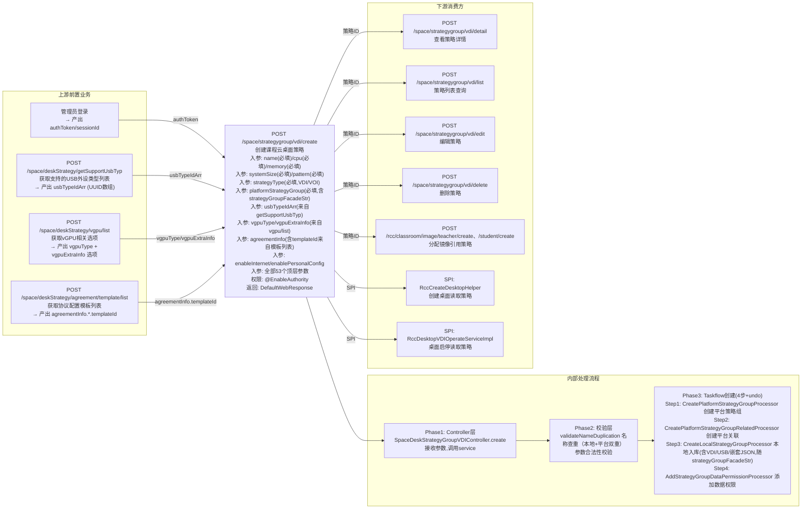

# POST /space/strategygroup/vdi/create

> 创建VDI课程云桌面策略组，包含CPU/内存/vGPU/学生账号等配置，同时在平台层和本地层创建记录 ｜ @EnableAuthority ｜ 异步Taskflow（4步处理器，每步带undo）

## 依赖关系全景图

## 接口基本信息

| 项目 | 内容 |
|---|---|
| URL | /space/strategygroup/vdi/create |
| Controller | SpaceDeskStrategyGroupVDIController.java |
| 方法名 | create |
| 权限注解 | @EnableAuthority |
| 返回值 | WebResponse（创建的SpaceDeskStrategyGroupVDI） |
| 执行方式 | 异步Taskflow（4步处理器，每步带undo） |
| 业务含义 | 创建VDI课程云桌面策略组，包含CPU/内存/vGPU/学生账号等配置，同时在平台层和本地层创建记录 |
| 数据表 | t_space_vdi_lesson_strategy（本地） + 平台策略组表 |

## 入参详情

> **本表以实际请求 JSON 为准**（真实线上请求体，53 个顶层字段 + platformStrategyGroup）。字段同时出现在顶层与 `strategyGroupFacadeStr.vdi` 节点时，顶层为请求主字段，vdi 节点见下方「VDI 策略嵌套参数」节（19 字段，为镜像子集）。

| 参数名 | 类型 | 必填 | 约束 | 说明 |
|---|---|---|---|---|
| name | String | 是 | | 示例: d2 |
| strategyType | String | 是 | | 示例: VDI |
| note | String | 否 | | 示例:  |
| desktopType | String | 否 | | 示例: RECOVERABLE |
| cpu | Integer | 是 | | 示例: 2 |
| memory | Integer | 是 | | 示例: 2048 |
| systemDisk | Integer | 否 | | 示例: 40 |
| enableNested | Boolean | 否 | | 示例: False |
| enableHa | Boolean | 否 | | 示例: False |
| enableInternet | Boolean | 是 | | 示例: True |
| enablePersonalConfig | Boolean | 是 | | 示例: False |
| openUsbReadOnly | Boolean | 否 | | 示例: False |
| keyboardEmulationType | String | 否 | | 示例: PS2 |
| enablePeripheral | Boolean | 否 | | 示例: True |
| usbTypeIdArr | list | 否 | | 数组（示例 1 项，如外设UUID列表） |
| enableClipboard | Boolean | 否 | | 示例: True |
| pcToAppTransfer | Boolean | 否 | | 示例: True |
| localToRemoteCopyChar | dict | 否 | | 嵌套对象（见对应说明） |
| localToRemoteEnableCopyFile | list | 否 | | 数组（示例 1 项，如外设UUID列表） |
| appToPcTransfer | Boolean | 否 | | 示例: True |
| remoteToLocalCopyChar | dict | 否 | | 嵌套对象（见对应说明） |
| remoteToLocalEnableCopyFile | list | 否 | | 数组（示例 1 项，如外设UUID列表） |
| diskMappingType | String | 否 | | 示例: CLOSED |
| netDiskMappingType | String | 否 | | 示例: CLOSED |
| cdRomMappingType | String | 否 | | 示例: CLOSED |
| usbStorageDeviceMappingMode | String | 否 | | 示例: CLOSED |
| forbidCatchScreen | Boolean | 否 | | 示例: False |
| needHideFloatBar | Boolean | 否 | | 示例: False |
| enableShowLocalDisk | Boolean | 否 | | 示例: True |
| powerPlan | String | 否 | | 示例: SLEEP |
| powerPlanTimeSwitch | Integer | 否 | | 示例: 0 |
| estIdleOverTime | Integer | 否 | | 示例: 0 |
| enableAdaptiveResolution | Boolean | 否 | | 示例: True |
| enableDoubleScreen | Boolean | 否 | | 示例: False |
| enableGpu | Boolean | 否 | | 示例: False |
| enableSoftwareDecode | Boolean | 否 | | 示例: True |
| agreementAgencyLimitMode | String | 否 | | 示例: NO_LIMIT |
| enableWebClient | Boolean | 否 | | 示例: True |
| estProtocolType | String | 否 | | 示例: EST |
| vgpuType | String | 否 | | 示例: QXL |
| enableStudentAccount | Boolean | 否 | | 示例: False |
| agreementInfo | dict | 否 | | 嵌套对象（见对应说明） |
| computerName | String | 否 | | 示例: listen |
| personalDisk | Integer | 否 | | 示例: 0 |
| enableOpenDesktopRedirect | Boolean | 否 | | 示例: False |
| desktopOccupyDriveArr | list | 否 | | 数组（示例 0 项，如外设UUID列表） |
| enableHyperVisorImprove | Boolean | 否 | | 示例: True |
| watermarkInfo | dict | 否 | | 嵌套对象（见对应说明） |
| pattern | String | 是 | | 示例: RECOVERABLE |
| systemSize | Integer | 是 | | 示例: 40 |
| clipBoardSupportTypeArr | list | 否 | | 数组（示例 2 项，如外设UUID列表） |
| powerPlanTime | Integer | 否 | | 示例: 0 |
| business | String | 是 | | 示例: RCC |
| platformStrategyGroup | PlatformStrategyGroup | 是 | @NotNull | 平台策略组数据，含 strategyGroupFacadeStr（JSON字符串） |
## VDI 策略嵌套参数（platformStrategyGroup.strategyGroupFacadeStr → vdi）

> **本小节以实际请求 JSON 为准**：`strategyGroupFacadeStr` 反序列化后的 `vdi` 节点共 **19 个字段**（真实线上请求）。
>
> **反序列化目标**：`strategyGroupFacadeStr` → `StrategyGroupFacadeDTO`（外部依赖）→ `vdi` 字段类型为 **`VDIStrategyDTO`**（证据：SpaceDeskStrategyGroupVDIAPIImpl.java:103-105 `JSON.parseObject(..., StrategyGroupFacadeDTO.class); return getVdi()`；TestDataFactory.java:84 `setVdi(new VDIStrategyDTO())`）。⚠️ 注意不是 `VDIDeskStrategyDTO`（rcdc-space-module 另一套课程策略 DTO，8 个真实 vdi 字段在其中不存在）。
>
> **键名规则**：真实请求 JSON 全部字段为 camelCase（如 `usbTypeIdArr`、`enableClipboard`），自动化构造请求体必须用 camelCase 键名，服务端 Jackson/fastjson 才能正确映射。

### 外设/USB映射参数

| 参数名 | 类型 | 实际值 | 说明 |
|---|---|---|---|
| enablePeripheral | bool | true | 真实请求示例值 |
| usbTypeIdArr | list | 数组(1项) | 真实请求示例值 |
| openUsbReadOnly | bool | false | 真实请求示例值 |
| usbStorageDeviceMappingMode | str | 'CLOSED' | 真实请求示例值 |
| diskMappingType | str | 'CLOSED' | 真实请求示例值 |

### 剪贴板映射参数

| 参数名 | 类型 | 实际值 | 说明 |
|---|---|---|---|
| enableClipboard | bool | true | 真实请求示例值 |
| clipBoardSupportTypeArr | list | 数组(2项) | 真实请求示例值 |

### 磁盘/光驱映射参数

| 参数名 | 类型 | 实际值 | 说明 |
|---|---|---|---|
| netDiskMappingType | str | 'CLOSED' | 真实请求示例值 |
| cdRomMappingType | str | 'CLOSED' | 真实请求示例值 |

### 截屏/电源/超时参数

| 参数名 | 类型 | 实际值 | 说明 |
|---|---|---|---|
| forbidCatchScreen | bool | false | 真实请求示例值 |
| powerPlan | str | 'SLEEP' | 真实请求示例值 |
| powerPlanTime | int | 0 | 真实请求示例值 |
| estIdleOverTime | int | 0 | 真实请求示例值 |

### 水印配置参数

| 参数名 | 类型 | 实际值 | 说明 |
|---|---|---|---|
| enableWatermark | bool | false | 真实请求示例值 |

### 网关接入限制参数

| 参数名 | 类型 | 实际值 | 说明 |
|---|---|---|---|
| agreementAgencyLimitMode | str | 'NO_LIMIT' | 真实请求示例值 |
| agreementAgencyInfo | dict | 嵌套对象 | 真实请求示例值 |

### 协议/Web客户端参数

| 参数名 | 类型 | 实际值 | 说明 |
|---|---|---|---|
| enableWebClient | bool | true | 真实请求示例值 |
| estProtocolType | str | 'EST' | 真实请求示例值 |
| agreementInfo | dict | 嵌套对象 | 真实请求示例值 |
## 出参详情

### 外层响应（CommonWebResponse 包装）

| 字段 | 类型 | 说明 |
|---|---|---|
| status | String | SUCCESS / ERROR |
| msgKey | String | 错误消息key（成功时为空） |
| msgArgArr | String[] | 消息参数数组 |
| message | String | 提示消息 |
| content | SpaceDeskStrategyGroupVDI | 创建的策略组对象（含入参回显+服务端填充字段） |

### content 业务字段（SpaceDeskStrategyGroupVDI）

| 字段 | 类型 | 说明 |
|---|---|---|
| id | UUID | 自动生成或使用传入ID（断言非空） |
| state | SpaceStrategyGroupState | 服务端设为AVAILABLE |
| stateAvailable | Boolean | state==AVAILABLE时为true（计算属性） |
| creatorId | UUID | 从SessionContext获取 |
| creatorName | String | 从SessionContext获取 |
| createTime | Long | 创建时间戳 |
| updateTime | Long | 更新时间戳 |
| platformStrategyGroup.id | UUID | 设为策略组ID（清理/关联用） |
| platformStrategyGroup.strategyType | DeskVirtualizationType | 设为VDI |
| platformStrategyGroup.creatorName | String | 设为创建者名 |
| platformStrategyGroup.name | String | 设为策略组名 |

## 上游前置业务

### 前置1：管理员登录

产出：SessionContext（creatorId、creatorName） 说明：@EnableAuthority需要管理员权限，SessionContext在Controller层注入

### 前置2：POST /space/deskStrategy/getSupportUsbTyp — 获取USB外设类型列表

产出：usbTypeIdArr（UUID数组，标识允许的USB外设类型） 说明：usbTypeIdArr参数的可选值来自此接口，包含摄像头/存储/打印机/输入设备/音频/手机/网卡/蓝牙等类型

### 前置3：POST /space/deskStrategy/vgpu/list — 获取vGPU相关选项

产出：vgpuType枚举值 + vgpuExtraInfo配置选项（model/parentGpuModel/vgpuModelType/graphicsMemorySize/memory） 说明：当vgpuType非QXL时，vgpuExtraInfo必填且值需从此接口获取的可用选项中选择

### 前置4：POST /space/deskStrategy/agreement/template/list — 获取协议配置模板列表

产出：agreementInfo.wanEstConfig.templateId + agreementInfo.lanEstConfig.templateId 说明：协议配置agreementInfo中的templateId（如templateId=1局域网、templateId=2广域网）从此接口获取，framerate/bitrate/quality等参数为用户自定义 本接口不需要classroomId/clusterId/storagePoolId/networkId等桌面池相关ID（这些属于/rcc/space/publish桌面池创建接口的前置，不属于策略创建）。上游仅需管理员登录 + 上述3个查询接口获取参数可选值。

### 前置状态要求

## 内部处理流程（Taskflow 4 处理器 + undo）

### Phase 1：Controller层

断言入参非空 解密studentAccountPassword（如非空）：AesUtil.descrypt(encryptedPassword, adminRedLine) 断言解密后密码长度&lt;=16 设置creatorId和creatorName 调用super.defaultCreate()

### Phase 2：校验层

名称查重（本地）：validateNameDuplication查询本地DB 名称查重（平台）：platformStrategyAPI.checkDeskStrategyExist(name, id) CPU范围校验：1-64，超出抛62100331 内存范围校验：1024-262144MB，超出抛62100332 学生账号校验（如enableStudentAccount=true）：studentAccountPreName非空且&lt;=15位且正则匹配 studentAccountPassword&lt;=16位且正则匹配 VGPU校验（如vgpuType非QXL）：resolveVgpuInfo解析VGPU信息 validateVgpu校验GPU配置

### Phase 3：Taskflow创建（4步，每步带undo）

创建平台策略组：platformStrategyGroupAPI.create()转换为StrategyGroupFacadeDTO 校验VDI策略 平台查重 调用strategyGroupFacadeAPI.create() undo：删除平台策略组 创建子系统资源关系：platformSubSysResRelationAPI.addOrUpdate()SPACE拥有STRATEGY_GROUP资源 undo：幂等删除关系（存在则删） 保存本地策略组：repository.create()DTO转Entity，设置createTime/updateTime 保存到t_space_vdi_lesson_strategy表 undo：删除本地实体 创建数据权限：adminDataPermissionAPI.create()关联管理员到策略组 undo：删除数据权限

## 下游消费方

### 消费1：POST /space/strategygroup/vdi/detail — 查看策略详情

说明：返回策略完整信息，studentAccountPassword重新AES加密返回

### 消费2：POST /space/strategygroup/vdi/list — 策略列表

说明：分页查询，返回ViewRccDeskStrategyDTO（含策略名、类型、CPU、内存等摘要字段）

### 消费3：POST /space/strategygroup/vdi/edit — 编辑策略

说明：编辑前校验状态为AVAILABLE、无运行中桌面、不能修改pattern/strategyType/systemSize降级

### 消费4：POST /space/strategygroup/vdi/delete — 删除策略

说明：删除前校验无关联镜像（validateBindByImage），有则抛62100324

### 消费5：POST /rcc/classroom/image/teacher/create — 分配镜像引用策略

说明：分配教室镜像时验证策略兼容性（原 /rcc/classroomImage/assign 路径不存在，画板与正文已一致修正）

### 消费6：RccCreateDesktopHelper — 创建桌面读取策略

说明：通过findByStrategy()读取策略配置，按CPU/内存/vGPU创建VDI桌面

### 消费7：RccDesktopVDIOperateServiceImpl — 桌面启停读取策略

说明：桌面启动/关闭/重启操作中读取策略配置

## 分层接口参数约束

> ⚠️ 源码核实：Controller `create()` 无 `@Valid` 注解（仅 `Assert.notNull`），DTO 上的 `@NotNull`/`@Range`/`@Nullable` 实际**不生效**。以下按真实生效的校验分层：

| 层级 | 参数 | 规则 | 说明/失败结果 |
|---|---|---|---|
| controller | spaceStrategyGroup | not_null | `Assert.notNull` #102，失败抛 IllegalArgumentException |
| service | name | 本地+平台双重查重 | `validateNameDuplication`，失败 62100317/62100220 |
| service | cpu | range 1-64 | `checkVDIParamAvailable` 校验，失败 62100331 |
| service | memory | range 1024-262144 | `checkVDIParamAvailable` 校验，失败 62100332 |
| service | systemSize | **创建期无校验** | 20/1024 常量仅用于变更时防降级比对（validStrategyChange）；创建不校验 |
| service | preName | 正则 ≤15位 | enableStudentAccount=true 时校验，失败 62100304/62100305 |
| service | personalConfigDiskSize | **创建期无校验** | DTO @Range(1-2048) 因无 @Valid 不生效 |
| service | haPriority | **创建期无校验** | DTO @Range(0-10) 因无 @Valid 不生效 |

## 参数取值策略

| 参数名 | 取值策略 | 取值方式 | 示例值 |
|---|---|---|---|
| id | random_uuid | UUID.randomUUID()，或前端传入 | 自动生成 |
| name | user_input | 用户指定，需唯一 | "VDI策略01" |
| pattern | enum_value | 从CbbCloudDeskPattern枚举选择 | RECOVERABLE |
| strategyType | fixed_value | 固定为VDI | VDI |
| enablePersonalConfig | user_input | 布尔值 | false |
| systemSize | user_input | 范围0-2048 | 50 |
| cpu | user_input | 范围1-64 | 4 |
| memory | user_input | 范围1024-262144(MB) | 4096 |
| vgpuType | from_query | POST /space/deskStrategy/vgpu/list 获取可用vGPU类型列表 | QXL |
| vgpuExtraInfo | from_query | POST /space/deskStrategy/vgpu/list 获取vGPU配置(model/graphicsMemorySize等)，vgpuType非QXL时必填 | {model,graphicsMemorySize,memory} |
| usbTypeIdArr | from_query | POST /space/deskStrategy/getSupportUsbTyp 获取USB外设类型UUID列表 | ["e3f8d1ee-...","476cf4dd-..."] |
| agreementInfo | from_query + constructed | POST /space/deskStrategy/agreement/template/list 获取templateId；framerate/bitrate等用户配置 | {wanEstConfig:{templateId:2,...}} |
| enableStudentAccount | user_input | 布尔值，true触发条件校验 | false |
| studentAccountPreName | constructed | enableStudentAccount=true时必填，正则匹配 | "student" |
| studentAccountPassword | constructed | AES加密传入，解密后≤16位 | AES加密串 |
| platformStrategyGroup | constructed | 含strategyGroupFacadeStr(JSON嵌套19参数)+business | JSON对象 |
| enableInternet | user_input | 布尔值 | true |

## 成功/失败断言基准

### 成功场景

| 场景 | 请求条件 | 断言点 |
|---|---|---|
| 创建基础VDI策略 | name唯一，CPU/内存合法，无vGPU | status==SUCCESS, content.id非空 |
| 创建带vGPU策略 | vgpuType非QXL，vgpuExtraInfo有效 | status==SUCCESS, VGPU信息已解析 |
| 创建带学生账号策略 | enableStudentAccount=true，账号密码格式正确 | status==SUCCESS |
| 创建带个人配置策略 | enablePersonalConfig=true，personalConfigDiskSize合法 | status==SUCCESS |

### 失败场景

| 场景 | 触发条件 | 断言点 |
|---|---|---|
| 策略名重复（本地） | name在本地DB已存在 | status==ERROR, msgKey含62100317 |
| 策略名重复（平台） | name在平台已存在 | status==ERROR, msgKey含62100220 |
| CPU超范围 | cpu&lt;1或cpu&gt;64 | status==ERROR, msgKey含62100331 |
| 内存超范围 | memory&lt;1024或memory&gt;262144 | status==ERROR, msgKey含62100332 |
| 系统盘超范围 | systemSize&lt;20或systemSize&gt;1024 | ⚠️ 创建期无此校验（checkVDIParamAvailable 只校验 cpu/memory；20/1024 常量仅用于变更时防降级比对；DTO @Range 因无 @Valid 不生效） |
| 个人配置磁盘超范围 | personalConfigDiskSize&lt;1或&gt;2048（enablePersonalConfig=true时） | status==ERROR, @Range(1-2048)校验 |
| HA优先级超范围 | haPriority&lt;0或haPriority&gt;10 | status==ERROR, @Range(0-10)校验 |
| 学生账号前缀为空 | enableStudentAccount=true但preName为空 | status==ERROR, msgKey含62100305 |
| 学生账号前缀超长 | preName&gt;15位 | status==ERROR, msgKey含62100304 |
| 学生账号前缀正则不匹配 | preName不匹配^[a-zA-Z-z0-9]*[a-zA-Z-z]+[a-zA-Z-z0-9\-]*$ | status==ERROR, 正则校验失败 |
| 学生密码超长 | 解密后password&gt;16位 | 抛IllegalStateException |
| 学生密码格式错误 | password不匹配^[A-Za-z0-9`~!@#$%^&amp;*()_-=+{}[]\|:;"'&lt;&gt;,.?/\]+$ | status==ERROR, msgKey含62100325 |
| VGPU校验失败 | vgpuType非QXL但VGPU信息无效 | BusinessException(平台错误码) |
| 平台创建失败 | strategyGroupFacadeAPI.create()抛异常 | status==ERROR |
| 权限不足 | 无@EnableAuthority权限 | 403/权限拦截 |

## 环境清理机制

### 清理接口

| 接口 | URL | 入参 | 前置条件 | 校验逻辑 |
|---|---|---|---|---|
| 删除策略 | POST /space/strategygroup/vdi/delete | idArr=[策略ID] | 策略存在 + 无关联镜像 | validateBindByImage检查镜像关联，有则抛62100324 |

### 清理失败处理

| 失败场景 | 原因 | 处理方式 |
|---|---|---|
| 策略关联了镜像 | 有classroomImage引用此策略 | 先解除镜像关联或删除镜像，再重试 |
| 平台策略组删除失败 | 平台不可用或策略组被平台其他模块引用 | 重试，或检查平台状态 |
| 本地策略组已删除但平台未删 | 网络中断导致部分步骤失败 | Taskflow不支持undo，需手动清理平台残留数据 |

## 前置状态和幂等性标注

### 前置状态要求

| 前置条件 | 要求 | 校验位置 | 失败结果 |
|---|---|---|---|
| 管理员登录 | SessionContext有效 | Controller层 | 401 |
| 创建权限 | @EnableAuthority通过 | 框架拦截 | 403 |
| 名称唯一 | name在本地和平台都不存在 | Validation层 | 62100317/62100220 |
| 无状态检查 | 不需要桌面池处于特定状态 | - | 顶层资源创建，无前置状态 |

### 幂等性分析

| 幂等维度 | 结论 | 代码证据 |
|---|---|---|
| 重复创建同名策略 | 非幂等（报错） | validateNameDuplication本地+平台双重查重 |
| 重复创建同ID策略 | 非幂等（DB主键冲突） | UUID如传入则使用，DB主键唯一约束 |
| Taskflow中途失败 | 非幂等（部分创建） | 每步带undo处理器，但DeleteTaskflow不支持undo |
| 并发创建 | 无分布式锁 | 无锁机制，依赖名称唯一约束兜底 |

### 幂等性标注

| 幂等级别 | 说明 |
|---|---|
| 非幂等 | 重复调用同名/同ID会报错。无幂等token机制。Taskflow失败后需人工检查并清理残留数据 |