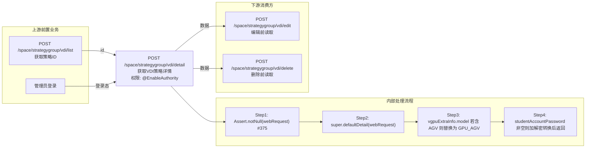

---
api:
  url: /space/strategygroup/vdi/detail
  method: POST
  name: 获取课程云桌面策略详情
  controller: SpaceDeskStrategyGroupVDIController
  method_ref: detail
  permission: 无
  exec_mode: sync
  async: false
  description: 获取VDI策略组详情（getInfo 为同一方法的别名 @RequestMapping({"detail","getInfo"})）
request:
  body:
    id:
      type: UUID
      required: true
      description: 策略组ID（来自 /space/strategygroup/vdi/list 或 create）
      value: ${param.id}
  dto: IdWebRequest
response:
  wrapper:
    status: String
    message: String
    msgKey: String
    msgArgArr: String[]
    content: Object
  body:
    content:
      type: SpaceDeskStrategyGroupVDI
      description: 策略组详情对象（含入参回显+服务端填充字段）
      fields:
        id:
          type: UUID
          description: 策略组ID（继承 AbstractDomainObject）
        name:
          type: String
          description: 策略组名称（继承 AbstractDomainObject）
        cpu: Integer
        memory: Integer
        vgpuType: VgpuType
        vgpuExtraInfo: VgpuExtraInfo
        deskCreateMode: DeskCreateMode
        enableHyperVisorImprove: Boolean
        enableNested: Boolean
        enableDoubleScreen: Boolean
        enableHa: Boolean
        haPriority: Integer
        desktopOccupyDriveArr: String[]
        keyboardEmulationType: CbbKeyboardEmulationType
        needHideFloatBar: Boolean
        enableShowLocalDisk: Boolean
        enableStudentAccount: Boolean
        studentAccountPreName: String
        studentAccountPassword: String
        enableAdaptiveResolution: Boolean
        enableSoftwareDecode: Boolean
        shutDownDeleteSystemDisk: Boolean
        note: String
        state: SpaceStrategyGroupState
        pattern: CbbCloudDeskPattern
        strategyType: DeskVirtualizationType
        enablePersonalConfig: Boolean
        deskPersonalConfigStrategyType: CbbDeskPersonalConfigStrategyType
        personalConfigDiskSize: Integer
        systemSize: Integer
        platformStrategyGroup: PlatformStrategyGroup
        enableInternet: Boolean
upstream:
- api: POST /space/strategygroup/vdi/list
  purpose: 获取策略ID（出参 $.content.itemArr[].id → 入参 id）
- api: 管理员登录
  purpose: '@EnableAuthority 前置'
downstream:
- api: POST /space/strategygroup/vdi/edit
  purpose: 编辑前读取详情
- api: POST /space/strategygroup/vdi/delete
  purpose: 删除前读取详情
constraints:
- level: controller
  field: id
  rule: not_null
  failure: Assert.notNull (#375)
assertions:
  success:
  - scenario: 正常查询
    expect: status==SUCCESS；content.id==传入id
  failure:
  - scenario: 策略不存在
    trigger: id 无效
    expect: status==ERROR；msgKey 相关
cleanup: []
idempotency:
  level: fully_idempotent
  note: 只读查询，可安全重试
setup:
- name: login
  api: POST /rco/admin/loginAdmin
  purpose: 管理员登录（框架内置，引擎自动处理）
---
# POST /space/strategygroup/vdi/detail

> 获取课程云桌面策略详情 ｜ @EnableAuthority ｜ 同步

## 依赖关系全景图

## 接口基本信息

| 项目 | 内容 |
|---|---|
| URL | /space/strategygroup/vdi/detail |
| Controller | SpaceDeskStrategyGroupVDIController |
| 方法名 | detail |
| 权限注解 | @EnableAuthority |
| 执行方式 | 同步 |
| 业务含义 | 获取VDI策略组详情（getInfo 为别名） |

## 入参详情

### IdWebRequest（框架类）

| 参数名 | 类型 | 必填 | 约束 | 说明 |
|---|---|---|---|---|
| id | UUID | 是 | @NotNull | 策略组ID |

## 出参详情

| 返回类型 | DefaultWebResponse\<SpaceDeskStrategyGroupVDI\> |
|---|---|

### 外层响应（SK 框架统一包装）

| 字段 | 类型 | 说明 |
|---|---|---|
| status | String | SUCCESS/ERROR |
| message | String | 提示消息 |
| msgKey | String | 错误消息key（成功时为空） |
| msgArgArr | String[] | 消息参数数组 |
| content | SpaceDeskStrategyGroupVDI | 策略组详情对象 |

### content 业务字段（SpaceDeskStrategyGroupVDI，完整 31 字段）

**自有字段（SpaceDeskStrategyGroupVDI，20）**

| 字段 | 类型 | 说明 |
|---|---|---|
| cpu | Integer | 桌面CPU核数（VDI生效），1~64 |
| memory | Integer | 桌面内存MB（VDI生效），1024~262144 |
| vgpuType | VgpuType | vGPU类型 |
| vgpuExtraInfo | VgpuExtraInfo | vGPU配置信息（detail 返回时 model 含 AGV 前缀替换为 GPU_AGV 标题） |
| deskCreateMode | DeskCreateMode | 云桌面创建方式 |
| enableHyperVisorImprove | Boolean | 是否配置开启虚机特性提升，默认开启 true |
| enableNested | Boolean | 是否启用嵌套虚拟化（VDI\IDV 生效） |
| enableDoubleScreen | Boolean | 是否启用双屏 |
| enableHa | Boolean | 是否启用高可用特性 |
| haPriority | Integer | 配置HA优先级，0~10 |
| desktopOccupyDriveArr | String[] | 第三方应用盘符（VDI\IDV\TCI 生效） |
| keyboardEmulationType | CbbKeyboardEmulationType | 键盘模拟类型 |
| needHideFloatBar | Boolean | 隐藏学生端浮动条 |
| enableShowLocalDisk | Boolean | 显示VDI数据盘 |
| enableStudentAccount | Boolean | 启用学生端用户名和密码 |
| studentAccountPreName | String | 学生端用户名前缀，1~15 位 |
| studentAccountPassword | String | 学生端密码（detail 出参返回加密后的密文） |
| enableAdaptiveResolution | Boolean | 云桌面分辨率自适应 |
| enableSoftwareDecode | Boolean | 启用3D软解 |
| shutDownDeleteSystemDisk | Boolean | VDI还原类型桌面关机后是否删除系统盘 |

**继承字段（AbstractSpaceDeskStrategyGroup，11）**

| 字段 | 类型 | 说明 |
|---|---|---|
| note | String | 备注 |
| state | SpaceStrategyGroupState | 策略状态（AVAILABLE 等） |
| pattern | CbbCloudDeskPattern | 桌面类型 |
| strategyType | DeskVirtualizationType | 策略类型（VDI/TCI） |
| enablePersonalConfig | Boolean | 是否启用浮动个性配置（默认 false） |
| deskPersonalConfigStrategyType | CbbDeskPersonalConfigStrategyType | 浮动个性配置类型 |
| personalConfigDiskSize | Integer | 浮动个性盘大小 GB，1~2048 |
| systemSize | Integer | 系统盘大小 GB，0~2048 |
| platformStrategyGroup | PlatformStrategyGroup | 平台策略组 |
| desktopOccupyDriveArr | String[] | 第三方应用盘符（父类声明，VDI 子类同名覆盖） |
| enableInternet | Boolean | 联网开关 |

> 源码依据：SpaceDeskStrategyGroupVDIController.detail(#372，@RequestMapping({"detail","getInfo"})) → super.defaultDetail，返回 DefaultWebResponse\<SpaceDeskStrategyGroupVDI\> 完整对象（31 字段）。

## 上游前置业务

### 前置1：POST /space/strategygroup/vdi/list — 获取策略ID

- 产出：$.content.itemArr[].id
- 说明：策略ID由列表/创建接口产出

### 前置2：管理员登录

- 产出：SessionContext
- 说明：@EnableAuthority 前置

## 内部处理流程

1. Assert.notNull(webRequest) 校验入参非空
2. super.defaultDetail(webRequest) 查询策略详情
3. vgpuExtraInfo.model 若含 AGV 前缀则替换为 GPU_AGV 标题
4. studentAccountPassword 若非空：先用 space 红线解密、再用 admin 红线加密后返回（联调过渡逻辑，todo 待删除）

## 下游消费方

### 消费1：POST /space/strategygroup/vdi/edit — 编辑前读取当前详情

### 消费2：POST /space/strategygroup/vdi/delete — 删除前读取详情校验

## 接口参数约束分析

| 层级 | 参数 | 规则 | 失败结果 |
|---|---|---|---|
| controller | id | not_null | Assert.notNull (#375) |

## 参数取值策略

| 参数 | 策略 | 说明 |
|---|---|---|
| id | from_upstream | /space/strategygroup/vdi/list 或 create 产出 |

## 成功/失败断言基准

### 成功场景

| 场景 | 断言点 |
|---|---|
| 正常查询 | status==SUCCESS；content.id==传入id |

### 失败场景

| 场景 | 触发条件 | 断言点 |
|---|---|---|
| 策略不存在 | id 无效 | status==ERROR |
| 入参为空 | id 未传 | $.status==ERROR（Assert.notNull 异常，HTTP 400） |

## 环境清理机制

| 接口 | 说明 |
|---|---|
| （查询接口无清理） | 只读 |

## 前置状态和幂等性标注

| 维度 | 结论 |
|---|---|
| 幂等性 | fully_idempotent（只读查询） |
| 说明 | 可安全重试 |
